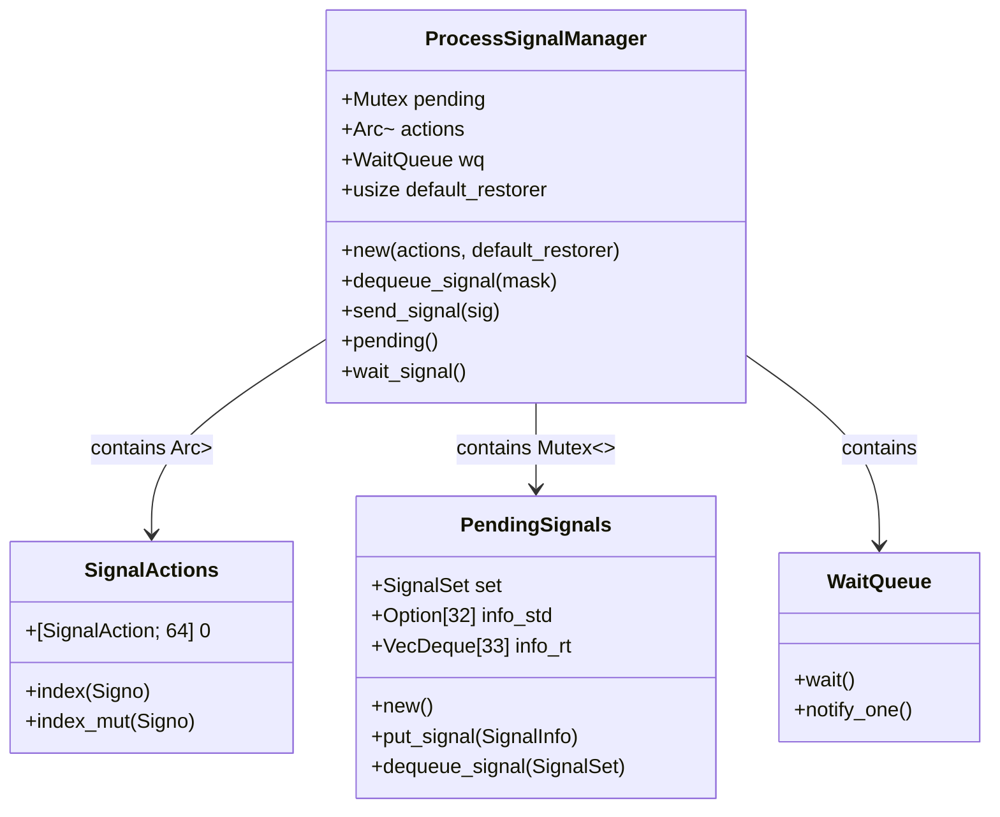
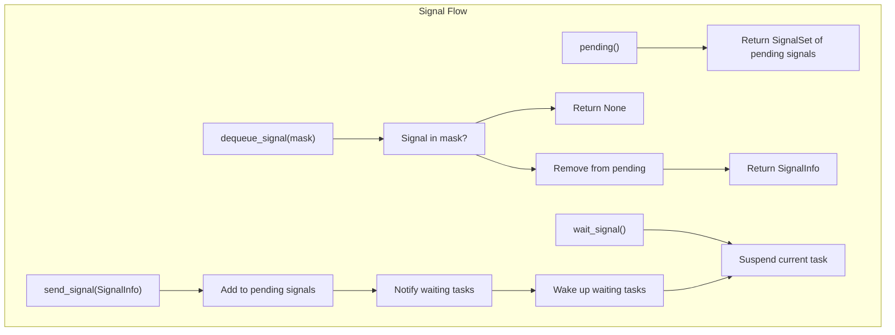
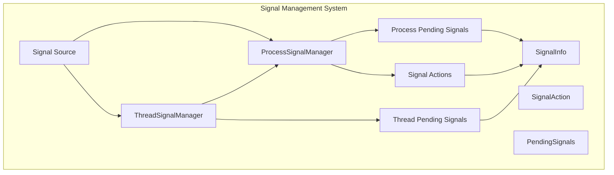

# Process Signal Manager

> **Relevant source files**
> * [src/api/process.rs](https://github.com/Starry-OS/axsignal/blob/b5b6089c/src/api/process.rs)
> * [src/lib.rs](https://github.com/Starry-OS/axsignal/blob/b5b6089c/src/lib.rs)

## Purpose and Scope

The Process Signal Manager is a core component of the `axsignal` crate that handles signal management at the process level. It provides mechanisms for managing, queuing, and delivering signals to processes in a Unix-like manner. This component serves as the foundation for process-wide signal operations while working alongside thread-specific signal handling. For thread-level signal management, see [Thread Signal Manager](/Starry-OS/axsignal/2.1-thread-signal-manager).

Sources: [src/api/process.rs(L32 - L82)&emsp;](https://github.com/Starry-OS/axsignal/blob/b5b6089c/src/api/process.rs#L32-L82)

## Structure and Components

The Process Signal Manager consists of several key components that work together to manage signals at the process level.



**Diagram: Process Signal Manager Structure**

Sources: [src/api/process.rs(L32 - L48)&emsp;](https://github.com/Starry-OS/axsignal/blob/b5b6089c/src/api/process.rs#L32-L48) [src/api/process.rs(L13 - L30)&emsp;](https://github.com/Starry-OS/axsignal/blob/b5b6089c/src/api/process.rs#L13-L30)

### Core Components

1. **Pending Signals**: A mutex-protected `PendingSignals` instance that stores signals queued for the process.
2. **Signal Actions**: An atomic reference counted, mutex-protected `SignalActions` that defines how the process responds to different signals.
3. **Wait Queue**: Provides synchronization for tasks waiting on signals, used in operations like `rt_sigtimedwait`.
4. **Default Restorer**: A function pointer (as `usize`) that serves as the default signal handler restorer.

Sources: [src/api/process.rs(L32 - L48)&emsp;](https://github.com/Starry-OS/axsignal/blob/b5b6089c/src/api/process.rs#L32-L48)

### Signal Actions

The `SignalActions` structure maintains an array of 64 signal actions, providing indexed access to actions for each signal number.

```
SignalActions[1] -> Action for SIGHUP
SignalActions[2] -> Action for SIGINT
...
SignalActions[64] -> Action for signal 64
```

The structure implements `Index` and `IndexMut` traits to allow convenient access to signal actions by their signal number (`Signo`).

Sources: [src/api/process.rs(L13 - L30)&emsp;](https://github.com/Starry-OS/axsignal/blob/b5b6089c/src/api/process.rs#L13-L30)

## Signal Flow and Management

The Process Signal Manager plays a central role in the signal handling flow, serving as an intermediary between signal sources and handler execution.



**Diagram: Process Signal Manager Operations**

Sources: [src/api/process.rs(L60 - L81)&emsp;](https://github.com/Starry-OS/axsignal/blob/b5b6089c/src/api/process.rs#L60-L81)

### Key Operations

1. **Signal Queueing**: When a signal is sent to a process using `send_signal()`, it's added to the pending signals queue and triggers a notification on the wait queue.
2. **Signal Retrieval**: The `dequeue_signal()` method allows retrieving a pending signal if it's not blocked by the provided mask.
3. **Pending Signal Management**: The `pending()` method returns the set of signals currently pending for the process.
4. **Signal Waiting**: The `wait_signal()` method suspends the current task until a signal is delivered to the process.

Sources: [src/api/process.rs(L60 - L81)&emsp;](https://github.com/Starry-OS/axsignal/blob/b5b6089c/src/api/process.rs#L60-L81)

## Integration with Signal Management System

The Process Signal Manager integrates with the broader signal management system, particularly with the Thread Signal Manager and other signal handling components.



**Diagram: Process Signal Manager in the Signal System**

Sources: [src/api/process.rs(L32 - L82)&emsp;](https://github.com/Starry-OS/axsignal/blob/b5b6089c/src/api/process.rs#L32-L82)

### Key Relationships

1. **Thread Signal Manager**: Thread Signal Managers reference a Process Signal Manager, allowing them to check for process-level signals when no thread-specific signals are pending.
2. **Signal Actions**: The Process Signal Manager maintains the signal actions table that defines how signals are handled. This table is shared across all threads in the process.
3. **Wait Queue**: The Process Signal Manager provides a wait queue that allows tasks to wait for signals, with potential false wakeups due to its shared nature.
4. **Signal Delivery**: When signals are sent to a process, they're queued in the Process Signal Manager's pending signals queue. Threads can then dequeue these signals based on their signal masks.

Sources: [src/api/process.rs(L32 - L82)&emsp;](https://github.com/Starry-OS/axsignal/blob/b5b6089c/src/api/process.rs#L32-L82)

## Implementation Details

The Process Signal Manager is a generic structure parameterized by two types:

* `M`: A type that implements the `RawMutex` trait, used for synchronization
* `WQ`: A type that implements the `WaitQueue` trait, used for signal waiting

This allows flexibility in the underlying synchronization mechanisms while maintaining a consistent API.

### Constructor

```rust
pub fn new(actions: Arc<Mutex<M, SignalActions>>, default_restorer: usize) -> Self
```

Creates a new Process Signal Manager with the given signal actions and default restorer function.

### Signal Handling

The `send_signal` method adds a signal to the pending queue and notifies waiting tasks:

```rust
pub fn send_signal(&self, sig: SignalInfo) {
    self.pending.lock().put_signal(sig);
    self.wq.notify_one();
}
```

This simple mechanism ensures that signals are properly queued and waiting tasks are notified, allowing them to check for and potentially handle the new signal.

Sources: [src/api/process.rs(L49 - L82)&emsp;](https://github.com/Starry-OS/axsignal/blob/b5b6089c/src/api/process.rs#L49-L82)

## Usage Considerations

When using the Process Signal Manager, consider these important points:

1. **Shared Access**: The Process Signal Manager is shared across all threads in a process, requiring proper synchronization (provided by the mutex implementations).
2. **Wait Queue Behavior**: The wait queue may cause false wakeups since it's shared by all threads in the process. Applications should be designed to handle this case.
3. **Default Restorer**: The default restorer function is architecture-specific and is used when a signal handler doesn't provide its own restorer.
4. **Signal Actions**: Signal actions define the behavior for each signal and are shared across the process, ensuring consistent handling regardless of which thread receives a signal.

Sources: [src/api/process.rs(L32 - L82)&emsp;](https://github.com/Starry-OS/axsignal/blob/b5b6089c/src/api/process.rs#L32-L82)