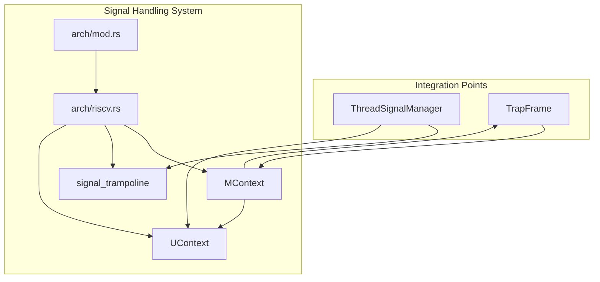
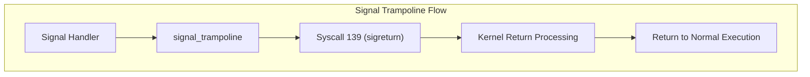
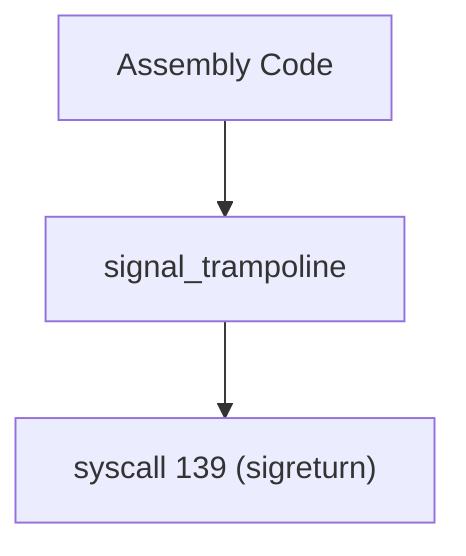
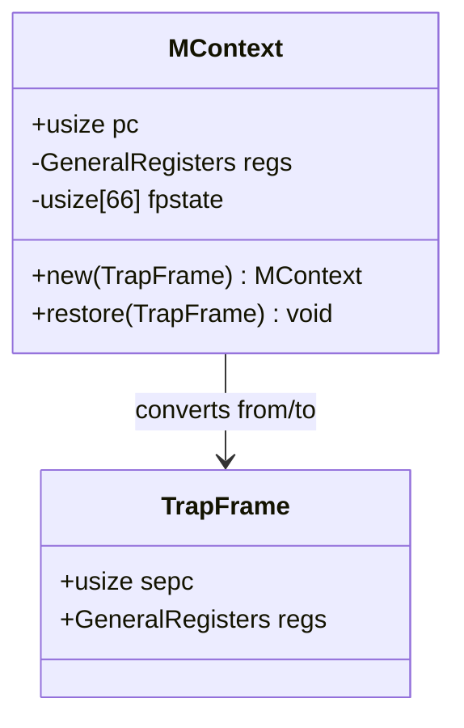
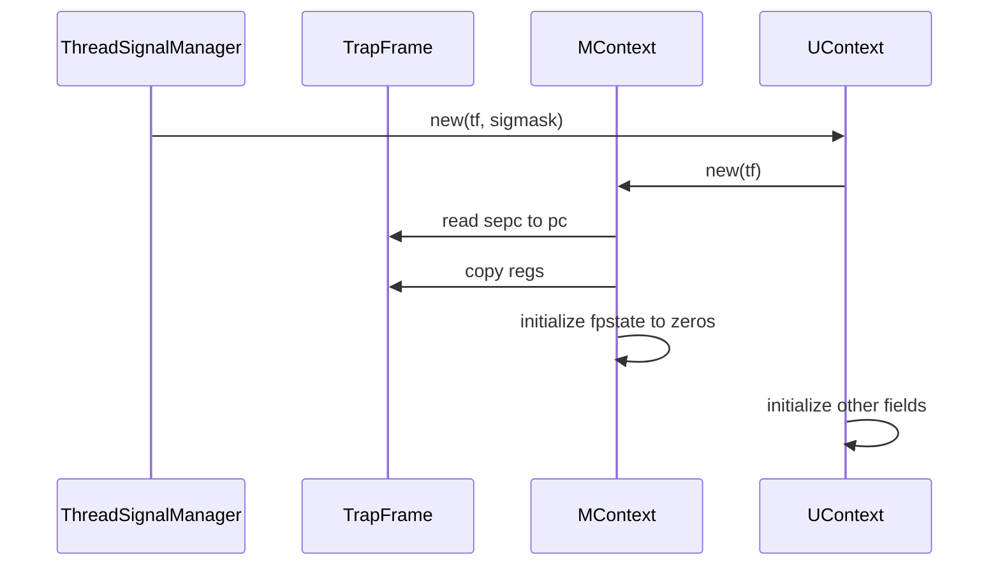
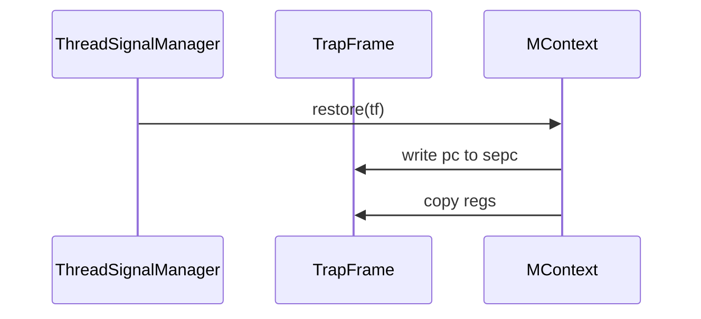
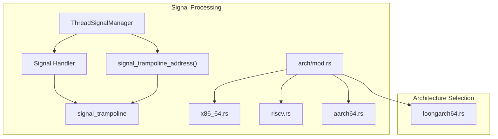

# RISC-V Implementation

> **Relevant source files**
> * [src/arch/mod.rs](https://github.com/Starry-OS/axsignal/blob/b5b6089c/src/arch/mod.rs)
> * [src/arch/riscv.rs](https://github.com/Starry-OS/axsignal/blob/b5b6089c/src/arch/riscv.rs)

This document details the RISC-V architecture-specific implementation of signal handling in the `axsignal` crate. It covers the signal trampoline mechanism, context saving/restoring operations, and the data structures specific to RISC-V processors. For information about other architectures, see the corresponding implementation pages: [x86_64 Implementation](/Starry-OS/axsignal/4.1-x86_64-implementation), [ARM64 Implementation](/Starry-OS/axsignal/4.2-arm64-implementation), and [LoongArch64 Implementation](/Starry-OS/axsignal/4.4-loongarch64-implementation).

## RISC-V Signal Handling Architecture

The RISC-V signal handling implementation provides the architecture-specific components needed to save CPU state before executing a signal handler and to restore that state afterward. It consists of two main components:

1. A signal trampoline implementation in assembly language
2. Data structures for storing CPU context

The implementation supports both 32-bit (riscv32) and 64-bit (riscv64) RISC-V architectures through a unified module.



Sources: [src/arch/mod.rs(L1 - L26)&emsp;](https://github.com/Starry-OS/axsignal/blob/b5b6089c/src/arch/mod.rs#L1-L26) [src/arch/riscv.rs(L1 - L64)&emsp;](https://github.com/Starry-OS/axsignal/blob/b5b6089c/src/arch/riscv.rs#L1-L64)

## Signal Trampoline Implementation

The signal trampoline is a small piece of assembly code that serves as the bridge between signal handler execution and returning to normal execution. In RISC-V, it's implemented as a simple syscall wrapper that invokes syscall number 139 (sigreturn).



The trampoline is defined in assembly and aligned to a 4096-byte page boundary:



Sources: [src/arch/riscv.rs(L5 - L16)&emsp;](https://github.com/Starry-OS/axsignal/blob/b5b6089c/src/arch/riscv.rs#L5-L16) [src/arch/mod.rs(L19 - L25)&emsp;](https://github.com/Starry-OS/axsignal/blob/b5b6089c/src/arch/mod.rs#L19-L25)

## Context Data Structures

The RISC-V implementation defines two key structures for context management:

### MContext Structure

`MContext` stores the essential machine context that needs to be saved and restored during signal handling.



The structure contains:

* `pc`: Program counter (stored as `sepc` in the trap frame)
* `regs`: General-purpose registers from the `GeneralRegisters` structure
* `fpstate`: Floating-point state (66 words of storage)

### UContext Structure

`UContext` is a higher-level structure that encapsulates `MContext` along with additional signal-related information.

```

```

The structure contains:

* `flags`: Context flags (not currently used, set to 0)
* `link`: Link to another context (not currently used, set to 0)
* `stack`: Signal stack information (type `SignalStack`)
* `sigmask`: Signal mask (type `SignalSet`)
* `__unused`: Padding to ensure proper structure alignment
* `mcontext`: The machine context described above

Sources: [src/arch/riscv.rs(L18 - L63)&emsp;](https://github.com/Starry-OS/axsignal/blob/b5b6089c/src/arch/riscv.rs#L18-L63)

## Context Operations

The RISC-V implementation provides two primary operations on context:

1. **Context Creation**: Converting from a trap frame to an `MContext`/`UContext`
2. **Context Restoration**: Restoring a trap frame from an `MContext`

### Context Creation

When a signal is delivered, the current CPU state (represented by a `TrapFrame`) is saved into an `MContext` and then into a `UContext`.



### Context Restoration

After signal handler execution, the saved context is restored to continue normal execution.



Sources: [src/arch/riscv.rs(L27 - L38)&emsp;](https://github.com/Starry-OS/axsignal/blob/b5b6089c/src/arch/riscv.rs#L27-L38) [src/arch/riscv.rs(L53 - L62)&emsp;](https://github.com/Starry-OS/axsignal/blob/b5b6089c/src/arch/riscv.rs#L53-L62)

## Integration with Signal Handling System

The RISC-V implementation integrates with the rest of the signal handling system through the architecture abstraction layer defined in `arch/mod.rs`. This layer selects the appropriate architecture-specific implementation at compile time based on the target architecture.



Key integration points:

1. The `signal_trampoline_address()` function provides the address of the architecture-specific trampoline implementation
2. `ThreadSignalManager` uses the context structures to save and restore CPU state

Sources: [src/arch/mod.rs(L1 - L26)&emsp;](https://github.com/Starry-OS/axsignal/blob/b5b6089c/src/arch/mod.rs#L1-L26)

## Technical Details

### Signal Trampoline Memory Layout

The signal trampoline is carefully aligned to a 4096-byte page boundary and padded to fill an entire page. This is important for security and memory protection:

```yaml
.section .text
.balign 4096
.global signal_trampoline
signal_trampoline:
    li a7, 139     # Load syscall number 139 (sigreturn) into a7
    ecall          # Execute syscall
.fill 4096 - (. - signal_trampoline), 1, 0  # Fill remainder of page with zeros
```

The trampoline simply loads the sigreturn syscall number (139) into register a7 and executes the syscall instruction.

### RISC-V Register Handling

The `MContext` structure saves the program counter (PC) separately from the general registers. During restoration:

* The program counter is restored to the `sepc` (Supervisor Exception Program Counter) field of the trap frame
* The general registers are copied directly between the trap frame and `MContext`

The floating-point state (`fpstate`) is currently initialized to zeros but provides space for future implementations to save floating-point registers.

Sources: [src/arch/riscv.rs(L5 - L16)&emsp;](https://github.com/Starry-OS/axsignal/blob/b5b6089c/src/arch/riscv.rs#L5-L16) [src/arch/riscv.rs(L27 - L38)&emsp;](https://github.com/Starry-OS/axsignal/blob/b5b6089c/src/arch/riscv.rs#L27-L38)

## Summary

The RISC-V implementation in the `axsignal` crate provides the architecture-specific components needed for signal handling on RISC-V processors. It defines the data structures for saving and restoring CPU context (`MContext` and `UContext`) and implements the signal trampoline needed to return from signal handlers. The implementation supports both 32-bit and 64-bit RISC-V architectures through a single module.

The architecture-specific implementation is selected at compile time based on the target architecture, ensuring that the appropriate code is used without runtime overhead.

Sources: [src/arch/mod.rs(L1 - L26)&emsp;](https://github.com/Starry-OS/axsignal/blob/b5b6089c/src/arch/mod.rs#L1-L26) [src/arch/riscv.rs(L1 - L64)&emsp;](https://github.com/Starry-OS/axsignal/blob/b5b6089c/src/arch/riscv.rs#L1-L64)