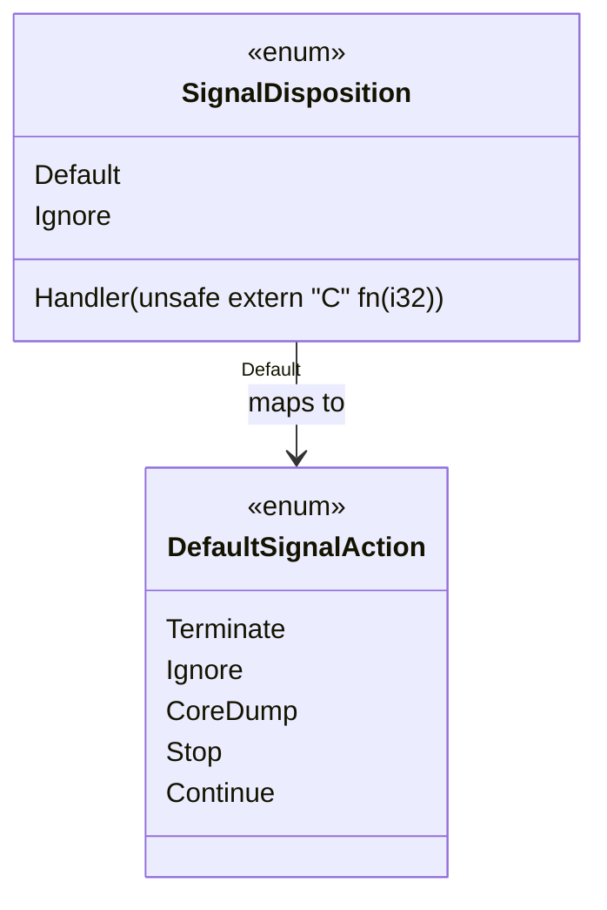
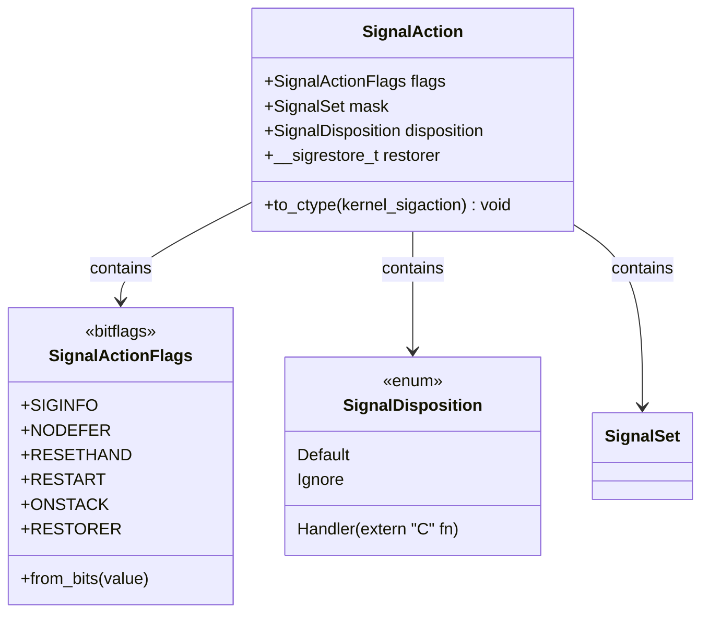
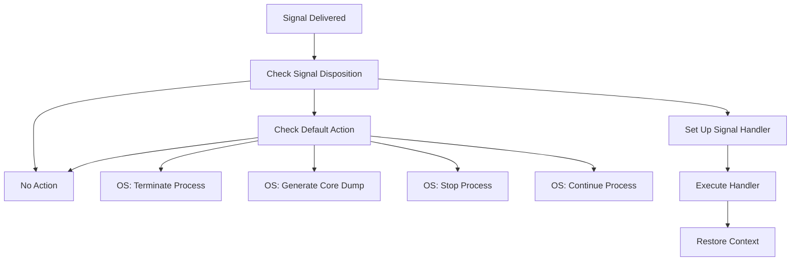
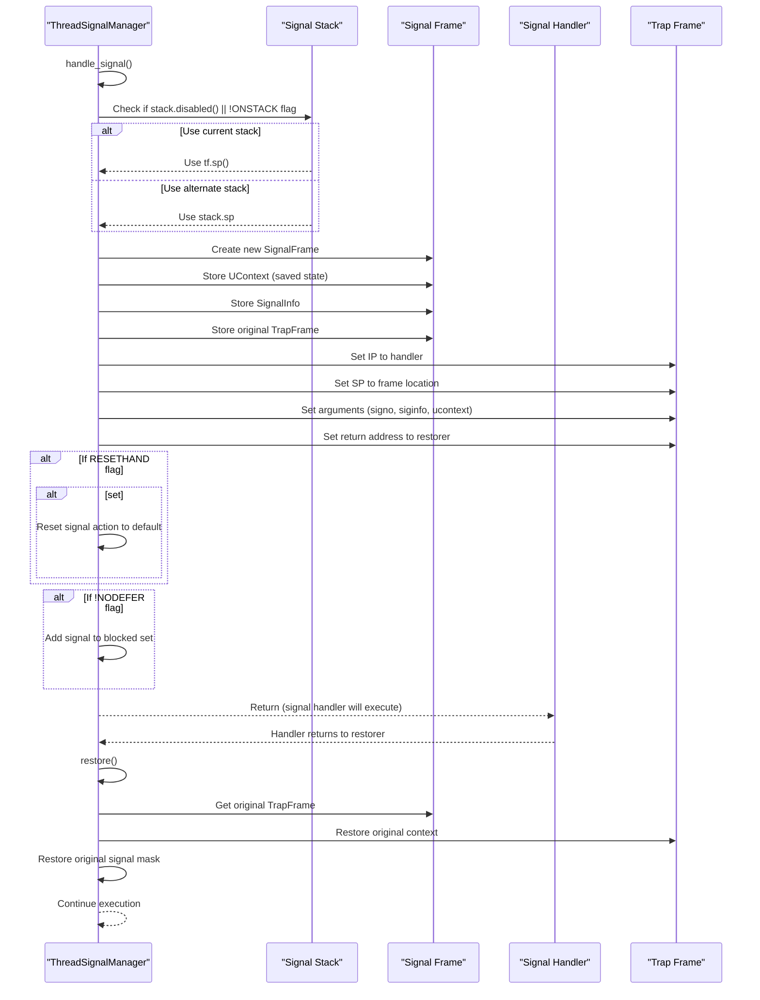

# Signal Actions and Dispositions

> **Relevant source files**
> * [src/action.rs](https://github.com/Starry-OS/axsignal/blob/b5b6089c/src/action.rs)
> * [src/api/thread.rs](https://github.com/Starry-OS/axsignal/blob/b5b6089c/src/api/thread.rs)

This document describes the signal action and disposition system in the `axsignal` crate, which determines how signals are handled when they are delivered to processes or threads. It covers the core data structures that represent signal handling behaviors and how they interact with the signal processing flow.

For information about the signal numbers and signal sets, see [Signal Numbers and Sets](/Starry-OS/axsignal/3.1-signal-numbers-and-sets). For details about how pending signals are queued, see [Pending Signals](/Starry-OS/axsignal/3.3-pending-signals).

## Signal Disposition Types

The `SignalDisposition` enum defines what happens when a signal is received:

* **Default**: Uses the predefined action for the signal (terminate, ignore, etc.)
* **Ignore**: The signal is completely ignored
* **Handler**: A custom function is called when the signal is delivered

When `Default` is selected, the actual behavior depends on the signal's default action as defined by the `DefaultSignalAction` enum.

Sources: [src/action.rs(L15 - L31)&emsp;](https://github.com/Starry-OS/axsignal/blob/b5b6089c/src/action.rs#L15-L31) [src/action.rs(L73 - L82)&emsp;](https://github.com/Starry-OS/axsignal/blob/b5b6089c/src/action.rs#L73-L82)

## Signal Action Structure

The `SignalAction` structure represents the complete configuration for how a signal should be handled:

* **flags**: Bitflags that modify the behavior of signal handlers
* **mask**: Set of signals to block while the handler is running
* **disposition**: What to do with the signal (default, ignore, or handle)
* **restorer**: Function to restore context after signal handler returns

Sources: [src/action.rs(L84 - L112)&emsp;](https://github.com/Starry-OS/axsignal/blob/b5b6089c/src/action.rs#L84-L112)

## Signal Action Flags

The `SignalActionFlags` bitflags control aspects of signal handling behavior:

|Flag|Description|
| --- | --- |
|SIGINFO|Handler uses the SA_SIGINFO interface (3 arguments instead of 1)|
|NODEFER|Don't block the signal when handling it|
|RESETHAND|Reset to default action after handling the signal once|
|RESTART|Automatically restart certain system calls interrupted by the signal|
|ONSTACK|Use the alternate signal stack for the handler|
|RESTORER|Therestorerfield inSignalActionis valid|

Sources: [src/action.rs(L50 - L60)&emsp;](https://github.com/Starry-OS/axsignal/blob/b5b6089c/src/action.rs#L50-L60)

## OS Actions for Signal Handling

When a signal is delivered, the system must take one of several actions based on the signal disposition:

The `SignalOSAction` enum represents the actions that the OS should take after signal disposition is determined:

* **Terminate**: End the process
* **CoreDump**: Generate a core dump and terminate the process
* **Stop**: Suspend the process execution
* **Continue**: Resume a stopped process
* **Handler**: A handler function has been set up (no OS action needed)

Sources: [src/action.rs(L36 - L48)&emsp;](https://github.com/Starry-OS/axsignal/blob/b5b6089c/src/action.rs#L36-L48)

## Signal Handler Execution Flow

When a signal with a custom handler is delivered, the system performs these steps:

This diagram shows the complete lifecycle of signal handling, from determining the disposition to executing the handler and restoring the original context.

Sources: [src/api/thread.rs(L50 - L117)&emsp;](https://github.com/Starry-OS/axsignal/blob/b5b6089c/src/api/thread.rs#L50-L117) [src/api/thread.rs(L145 - L155)&emsp;](https://github.com/Starry-OS/axsignal/blob/b5b6089c/src/api/thread.rs#L145-L155)

## Converting Between C and Rust Types

The `SignalAction` structure provides methods to convert to and from the Linux kernel's `kernel_sigaction` structure:

### From Rust to C Type

The `to_ctype` method converts a `SignalAction` to a `kernel_sigaction`:

* Copies flags
* Converts the signal mask
* Sets the handler based on disposition
* Sets the restorer function if supported

### From C to Rust Type

The `TryFrom<kernel_sigaction>` implementation converts a `kernel_sigaction` to a `SignalAction`:

* Validates flags
* Interprets the handler value (None for Default, 1 for Ignore, others as Handler)
* Extracts the signal mask
* Extracts the restorer function if supported

Sources: [src/action.rs(L93 - L112)&emsp;](https://github.com/Starry-OS/axsignal/blob/b5b6089c/src/action.rs#L93-L112) [src/action.rs(L115 - L156)&emsp;](https://github.com/Starry-OS/axsignal/blob/b5b6089c/src/action.rs#L115-L156)

## Signal Handler Function Execution Context

When a signal handler executes, it receives:

1. Signal number (`signo`) as the first argument
2. Pointer to a `SignalInfo` structure as the second argument (if `SIGINFO` flag is set)
3. Pointer to a `UContext` structure as the third argument (if `SIGINFO` flag is set)

The `UContext` contains:

* The machine context (`MContext`) with saved CPU registers
* The signal mask that was in effect before the handler was called
* Information about the signal stack

Sources: [src/api/thread.rs(L14 - L18)&emsp;](https://github.com/Starry-OS/axsignal/blob/b5b6089c/src/api/thread.rs#L14-L18) [src/api/thread.rs(L85 - L95)&emsp;](https://github.com/Starry-OS/axsignal/blob/b5b6089c/src/api/thread.rs#L85-L95)