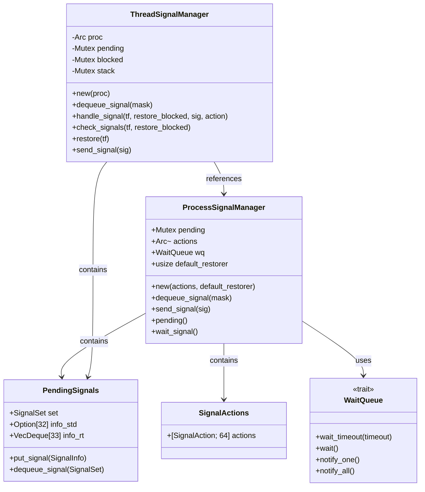
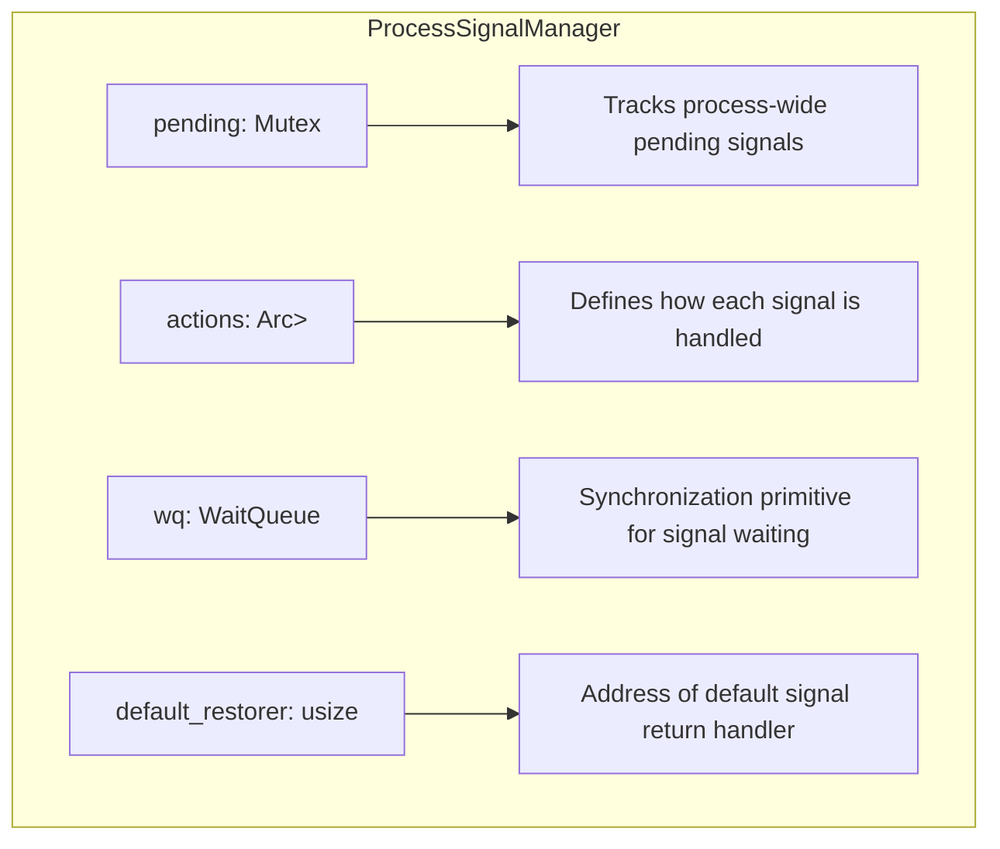
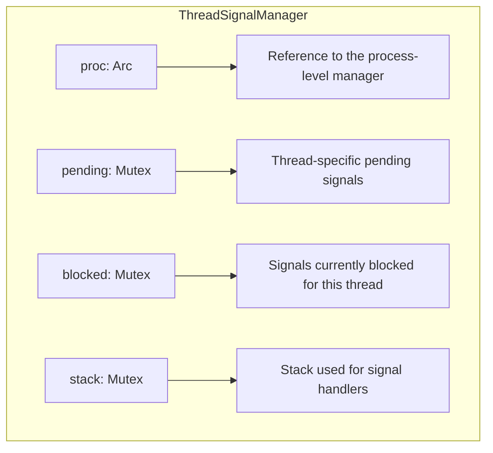
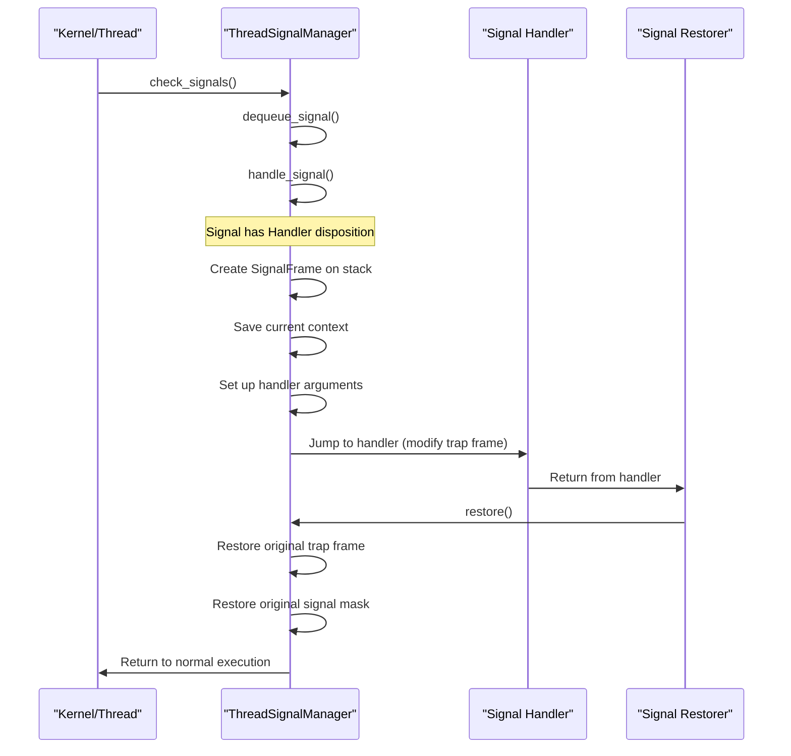
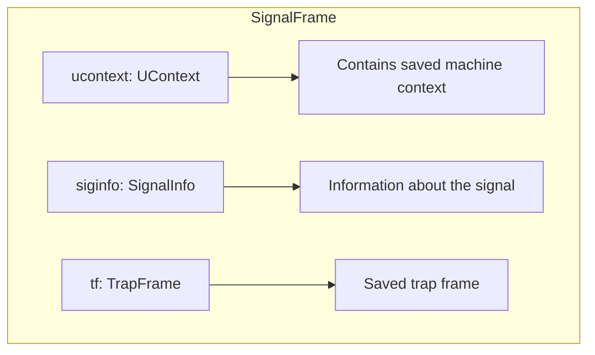

# Signal Management System

> **Relevant source files**
> * [src/api/mod.rs](https://github.com/Starry-OS/axsignal/blob/b5b6089c/src/api/mod.rs)
> * [src/api/process.rs](https://github.com/Starry-OS/axsignal/blob/b5b6089c/src/api/process.rs)
> * [src/api/thread.rs](https://github.com/Starry-OS/axsignal/blob/b5b6089c/src/api/thread.rs)

## Purpose and Scope

This page documents the signal management architecture in the `axsignal` crate, focusing on the core components that handle signal delivery, queuing, and processing at both process and thread levels. The system implements a Unix-like signal handling framework that coordinates signal delivery across multiple threads within a process.

For information about specific signal types and structures, see [Signal Types and Structures](/Starry-OS/axsignal/3-signal-types-and-structures). For details on architecture-specific implementations, see [Architecture Support](/Starry-OS/axsignal/4-architecture-support).

## Signal Management Architecture

The signal management system in `axsignal` adopts a two-level architecture, consisting of:

1. **Process Signal Manager**: Handles signals at the process level, maintaining process-wide pending signals and signal actions
2. **Thread Signal Manager**: Manages signals at the thread level, with per-thread signal masks, stacks, and pending signals

This design allows signals to be directed either to a specific thread or to the process as a whole, following the standard Unix signal model.

Sources: [src/api/thread.rs(L20 - L240)&emsp;](https://github.com/Starry-OS/axsignal/blob/b5b6089c/src/api/thread.rs#L20-L240) [src/api/process.rs(L32 - L82)&emsp;](https://github.com/Starry-OS/axsignal/blob/b5b6089c/src/api/process.rs#L32-L82) [src/api/mod.rs(L9 - L30)&emsp;](https://github.com/Starry-OS/axsignal/blob/b5b6089c/src/api/mod.rs#L9-L30)

## Process Signal Manager

The `ProcessSignalManager` is responsible for managing signals at the process level. It's a shared resource accessible by all threads within a process.

### Structure and Components

Sources: [src/api/process.rs(L32 - L48)&emsp;](https://github.com/Starry-OS/axsignal/blob/b5b6089c/src/api/process.rs#L32-L48)

### Key Methods

|Method|Purpose|
| --- | --- |
|new|Creates a new process signal manager with given actions and default restorer|
|dequeue_signal|Removes and returns a pending signal that matches the given mask|
|send_signal|Sends a signal to the process and notifies waiting threads|
|pending|Returns the set of pending signals for the process|
|wait_signal|Suspends the current thread until a signal is delivered|

Sources: [src/api/process.rs(L49 - L82)&emsp;](https://github.com/Starry-OS/axsignal/blob/b5b6089c/src/api/process.rs#L49-L82)

## Thread Signal Manager

The `ThreadSignalManager` handles signals targeted at specific threads, maintaining thread-specific signal state while coordinating with the process-level manager.

### Structure and Components

Sources: [src/api/thread.rs(L21 - L31)&emsp;](https://github.com/Starry-OS/axsignal/blob/b5b6089c/src/api/thread.rs#L21-L31)

### Key Methods

|Method|Purpose|
| --- | --- |
|new|Creates a new thread signal manager with reference to the process manager|
|dequeue_signal|Dequeues a signal from thread or process pending queues|
|handle_signal|Processes a signal based on its action (default, ignore, handler)|
|check_signals|Checks and handles pending signals for the thread|
|restore|Restores the execution context after a signal handler returns|
|send_signal|Sends a signal to the thread|
|wait_timeout|Waits for a signal with optional timeout|

Sources: [src/api/thread.rs(L33 - L240)&emsp;](https://github.com/Starry-OS/axsignal/blob/b5b6089c/src/api/thread.rs#L33-L240)

## Signal Processing Flow

The signal handling flow involves coordination between the process and thread signal managers, checking signal masks, and executing the appropriate actions based on signal dispositions.

```mermaid
flowchart TD
subgraph subGraph0["Signal Delivery (check_signals)"]
    CheckSignals["ThreadSignalManager::check_signals()"]
    GetBlocked["Get thread's blocked signals"]
    Mask["Create mask of unblocked signals"]
    DequeueLoop["Start dequeue loop"]
    TryDequeue["Try dequeue signal from thread, then process"]
    SignalFound["Signal found?"]
    Done["No signal to handle"]
    GetAction["Get SignalAction for this signal"]
    HandleSignal["handle_signal()"]
    CheckDisposition["Check disposition"]
    DefaultAction["Execute default action"]
    NextSignal["Continue to next signal"]
    SetupHandler["Set up signal handler"]
    CreateFrame["Create SignalFrame"]
    SetupTrapFrame["Modify trap frame"]
    UpdateBlocked["Update blocked signals"]
    Result["Return signal and action"]
end
Start["Signal Generated"]
SendDecision["Send to Thread or Process?"]
ThreadSend["ThreadSignalManager::send_signal()"]
ProcessSend["ProcessSignalManager::send_signal()"]
ThreadPending["Add to Thread's pending signals"]
ProcessPending["Add to Process's pending signals"]
NotifyWQ["Notify process wait queue"]

CheckDisposition --> DefaultAction
CheckDisposition --> NextSignal
CheckDisposition --> SetupHandler
CheckSignals --> GetBlocked
CreateFrame --> SetupTrapFrame
DequeueLoop --> TryDequeue
GetAction --> HandleSignal
GetBlocked --> Mask
HandleSignal --> CheckDisposition
Mask --> DequeueLoop
NextSignal --> DequeueLoop
ProcessPending --> NotifyWQ
ProcessSend --> ProcessPending
SendDecision --> ProcessSend
SendDecision --> ThreadSend
SetupHandler --> CreateFrame
SetupTrapFrame --> UpdateBlocked
SignalFound --> Done
SignalFound --> GetAction
Start --> SendDecision
ThreadPending --> NotifyWQ
ThreadSend --> ThreadPending
TryDequeue --> SignalFound
UpdateBlocked --> Result
```

Sources: [src/api/thread.rs(L119 - L143)&emsp;](https://github.com/Starry-OS/axsignal/blob/b5b6089c/src/api/thread.rs#L119-L143) [src/api/thread.rs(L43 - L48)&emsp;](https://github.com/Starry-OS/axsignal/blob/b5b6089c/src/api/thread.rs#L43-L48) [src/api/thread.rs(L50 - L117)&emsp;](https://github.com/Starry-OS/axsignal/blob/b5b6089c/src/api/thread.rs#L50-L117) [src/api/thread.rs(L157 - L163)&emsp;](https://github.com/Starry-OS/axsignal/blob/b5b6089c/src/api/thread.rs#L157-L163) [src/api/process.rs(L64 - L70)&emsp;](https://github.com/Starry-OS/axsignal/blob/b5b6089c/src/api/process.rs#L64-L70)

## Signal Handler Execution

When a signal with a custom handler is processed, the system prepares a special execution environment for the handler:

Sources: [src/api/thread.rs(L50 - L117)&emsp;](https://github.com/Starry-OS/axsignal/blob/b5b6089c/src/api/thread.rs#L50-L117) [src/api/thread.rs(L145 - L155)&emsp;](https://github.com/Starry-OS/axsignal/blob/b5b6089c/src/api/thread.rs#L145-L155)

## SignalFrame Structure

When preparing to execute a signal handler, the system creates a special `SignalFrame` structure on the stack:

Sources: [src/api/thread.rs(L14 - L18)&emsp;](https://github.com/Starry-OS/axsignal/blob/b5b6089c/src/api/thread.rs#L14-L18)

## Wait Queue Interface

The `WaitQueue` trait provides a synchronization mechanism for threads waiting on signals. It defines methods for waiting with an optional timeout and for notifying waiting threads.

|Method|Description|
| --- | --- |
|wait_timeout|Waits for a notification with optional timeout, returns whether notification came|
|wait|Waits indefinitely for a notification|
|notify_one|Notifies a single waiting thread, returns whether a thread was notified|
|notify_all|Notifies all waiting threads|

This interface is used by both the process and thread signal managers to coordinate waiting for and receiving signals.

Sources: [src/api/mod.rs(L9 - L30)&emsp;](https://github.com/Starry-OS/axsignal/blob/b5b6089c/src/api/mod.rs#L9-L30)

## Signal Handling Process

The signal handling process from generation to execution follows this sequence:

1. A signal is generated and sent via `send_signal()` to either a thread or process
2. The signal is added to the appropriate pending queue
3. Waiting threads are notified via the wait queue
4. When a thread checks for signals, it:
* Determines which signals are not blocked
* Dequeues pending signals from thread and process queues
* For each signal, checks its action (disposition)
* Executes the appropriate handler or default action
5. For custom handlers, the system:
* Creates a `SignalFrame` to save the current execution context
* Sets up the stack and arguments for the handler
* Modifies the trap frame to transfer control to the handler
* When the handler returns, restores the original context

This comprehensive system allows for Unix-like signal handling with support for default actions, custom handlers, and signal masking at both process and thread levels.

Sources: [src/api/thread.rs(L50 - L117)&emsp;](https://github.com/Starry-OS/axsignal/blob/b5b6089c/src/api/thread.rs#L50-L117) [src/api/thread.rs(L119 - L143)&emsp;](https://github.com/Starry-OS/axsignal/blob/b5b6089c/src/api/thread.rs#L119-L143) [src/api/thread.rs(L157 - L163)&emsp;](https://github.com/Starry-OS/axsignal/blob/b5b6089c/src/api/thread.rs#L157-L163) [src/api/process.rs(L64 - L70)&emsp;](https://github.com/Starry-OS/axsignal/blob/b5b6089c/src/api/process.rs#L64-L70)