# Signal Numbers and Sets

> **Relevant source files**
> * [src/types.rs](https://github.com/Starry-OS/axsignal/blob/b5b6089c/src/types.rs)

This document details the signal numbers and signal sets implementation in the axsignal crate, which provides the foundation for signal handling in ArceOS. For information about signal actions and handling, see [Signal Actions and Dispositions](/Starry-OS/axsignal/3.2-signal-actions-and-dispositions). For information about pending signal management, see [Pending Signals](/Starry-OS/axsignal/3.3-pending-signals).

## Overview

The signal system in axsignal implements Unix-compatible signal numbers and sets that are used throughout the signal handling framework. Signal numbers (represented by the `Signo` enum) identify specific signals, while signal sets (represented by the `SignalSet` struct) provide an efficient way to manage collections of signals.


Sources: [src/types.rs(L9 - L182)&emsp;](https://github.com/Starry-OS/axsignal/blob/b5b6089c/src/types.rs#L9-L182)

## Signal Numbers (Signo)

The `Signo` enum defines all standard Unix signals and real-time signals. It is implemented as a `u8` enum with explicit numeric values that correspond to standard Unix signal numbers.

### Signal Categories

Signal numbers in axsignal are divided into two main categories:

1. **Standard Signals (1-31)**: Traditional Unix signals with predefined behaviors
2. **Real-time Signals (32-64)**: Extended signals for application-defined purposes


Sources: [src/types.rs(L9 - L77)&emsp;](https://github.com/Starry-OS/axsignal/blob/b5b6089c/src/types.rs#L9-L77) [src/types.rs(L79 - L120)&emsp;](https://github.com/Starry-OS/axsignal/blob/b5b6089c/src/types.rs#L79-L120)

### Standard Signals

Standard signals (1-31) represent traditional Unix signals, each with a specific purpose and default behavior:

|Signal Number|Name|Default Action|Description|
| --- | --- | --- | --- |
|1|SIGHUP|Terminate|Hangup detected on controlling terminal|
|2|SIGINT|Terminate|Interrupt from keyboard (Ctrl+C)|
|3|SIGQUIT|CoreDump|Quit from keyboard (Ctrl+\)|
|4|SIGILL|CoreDump|Illegal instruction|
|5|SIGTRAP|CoreDump|Trace/breakpoint trap|
|6|SIGABRT|CoreDump|Abort signal|
|7|SIGBUS|CoreDump|Bus error|
|8|SIGFPE|CoreDump|Floating-point exception|
|9|SIGKILL|Terminate|Kill signal (cannot be caught or ignored)|
|10|SIGUSR1|Terminate|User-defined signal 1|
|11|SIGSEGV|CoreDump|Invalid memory reference|
|12|SIGUSR2|Terminate|User-defined signal 2|
|13|SIGPIPE|Terminate|Broken pipe|
|14|SIGALRM|Terminate|Timer signal|
|15|SIGTERM|Terminate|Termination signal|
|16|SIGSTKFLT|Terminate|Stack fault|
|17|SIGCHLD|Ignore|Child stopped or terminated|
|18|SIGCONT|Continue|Continue if stopped|
|19|SIGSTOP|Stop|Stop process (cannot be caught or ignored)|
|20|SIGTSTP|Stop|Stop typed at terminal (Ctrl+Z)|
|21|SIGTTIN|Stop|Terminal input for background process|
|22|SIGTTOU|Stop|Terminal output for background process|
|23|SIGURG|Ignore|Urgent condition on socket|
|24|SIGXCPU|CoreDump|CPU time limit exceeded|
|25|SIGXFSZ|CoreDump|File size limit exceeded|
|26|SIGVTALRM|Terminate|Virtual alarm clock|
|27|SIGPROF|Terminate|Profiling timer expired|
|28|SIGWINCH|Ignore|Window resize signal|
|29|SIGIO|Terminate|I/O now possible|
|30|SIGPWR|Terminate|Power failure|
|31|SIGSYS|CoreDump|Bad system call|

Sources: [src/types.rs(L12 - L43)&emsp;](https://github.com/Starry-OS/axsignal/blob/b5b6089c/src/types.rs#L12-L43) [src/types.rs(L84 - L118)&emsp;](https://github.com/Starry-OS/axsignal/blob/b5b6089c/src/types.rs#L84-L118)

### Real-time Signals

Real-time signals (32-64) are numbered from `SIGRTMIN` (32) to `SIGRT32` (64) and are primarily for application-defined purposes. Unlike standard signals, real-time signals:

* Have no predefined meanings
* Default to the `Ignore` action
* Are queued (multiple instances of the same signal can be pending)


Sources: [src/types.rs(L44 - L76)&emsp;](https://github.com/Starry-OS/axsignal/blob/b5b6089c/src/types.rs#L44-L76) [src/types.rs(L80 - L82)&emsp;](https://github.com/Starry-OS/axsignal/blob/b5b6089c/src/types.rs#L80-L82) [src/types.rs(L117 - L118)&emsp;](https://github.com/Starry-OS/axsignal/blob/b5b6089c/src/types.rs#L117-L118)

### Signo Implementation

The `Signo` enum provides two key methods:

1. **`is_realtime()`**: Determines if a signal is a real-time signal by checking if its value is greater than or equal to `SIGRTMIN` (32).

```rust
pub fn is_realtime(&self) -> bool {
    *self >= Signo::SIGRTMIN
}
```
2. **`default_action()`**: Returns the default action for a signal (as a `DefaultSignalAction` enum).

```rust
pub fn default_action(&self) -> DefaultSignalAction {
    match self {
        Signo::SIGHUP => DefaultSignalAction::Terminate,
        // ... other cases ...
        _ => DefaultSignalAction::Ignore, // For real-time signals
    }
}
```

Sources: [src/types.rs(L79 - L120)&emsp;](https://github.com/Starry-OS/axsignal/blob/b5b6089c/src/types.rs#L79-L120)

## Signal Sets (SignalSet)

A `SignalSet` is a bit vector representation of a set of signals, compatible with the C `sigset_t` type. It provides an efficient way to represent and manipulate collections of signals.

### Representation

The `SignalSet` is implemented as a transparent wrapper around a `u64`, where:

* Each bit position corresponds to a signal number minus 1
* Bit is set (1) if the signal is in the set
* Bit is clear (0) if the signal is not in the set


Sources: [src/types.rs(L122 - L126)&emsp;](https://github.com/Starry-OS/axsignal/blob/b5b6089c/src/types.rs#L122-L126)

### Operations

The `SignalSet` struct provides several operations for manipulating signal sets:

1. **Adding a signal**: `add(&mut self, signal: Signo) -> bool`

* Sets the bit corresponding to the signal
* Returns true if the signal was not already in the set
2. **Removing a signal**: `remove(&mut self, signal: Signo) -> bool`

* Clears the bit corresponding to the signal
* Returns true if the signal was in the set
3. **Checking for a signal**: `has(&self, signal: Signo) -> bool`

* Returns true if the bit corresponding to the signal is set
4. **Dequeueing a signal**: `dequeue(&mut self, mask: &SignalSet) -> Option<Signo>`

* Finds and removes the lowest-numbered signal that is both in the set and in the mask
* Returns the removed signal, or None if no matching signal exists
5. **Bitwise operations**: The struct implements `Not`, `BitOr`, `BitOrAssign`, `BitAnd`, and `BitAndAssign`

* Allows combining and modifying signal sets using standard bit operations

```mermaid
flowchart TD
subgraph subGraph1["SignalSet Operations"]
    A["Original Set"]
    B["Modified Set"]
    Result["Boolean Result"]
    Result2["Option"]
    subgraph Operations["Operations"]
        Add["add(SIGINT)"]
        Remove["remove(SIGHUP)"]
        Has["has(SIGTERM)"]
        Dequeue["dequeue(mask)"]
        BitwiseAnd["set1 & set2"]
        BitwiseOr["set1 | set2"]
        BitwiseNot["!set"]
    end
end

A --> Add
A --> BitwiseAnd
A --> BitwiseNot
A --> BitwiseOr
A --> Dequeue
A --> Has
A --> Remove
Add --> B
BitwiseAnd --> B
BitwiseNot --> B
BitwiseOr --> B
Dequeue --> Result2
Has --> Result
Remove --> B
```



Sources: [src/types.rs(L126 - L166)&emsp;](https://github.com/Starry-OS/axsignal/blob/b5b6089c/src/types.rs#L126-L166)

### C API Compatibility

The `SignalSet` includes methods for conversion to and from the C `kernel_sigset_t` type, ensuring compatibility with system calls and C libraries:

* **`to_ctype(&self, dest: &mut kernel_sigset_t)`**: Converts the SignalSet to a C kernel_sigset_t
* **`From<kernel_sigset_t> for SignalSet`**: Converts a C kernel_sigset_t to a SignalSet


Sources: [src/types.rs(L169 - L181)&emsp;](https://github.com/Starry-OS/axsignal/blob/b5b6089c/src/types.rs#L169-L181)

## Usage in the Signal System

Signal numbers and sets form the foundation of the signal handling system in axsignal:

1. **Signal identification**: `Signo` enumerates all possible signals that can be sent and received.
2. **Signal masking**: `SignalSet` is used to represent blocked signals in `ThreadSignalManager`.
3. **Pending signals**: `SignalSet` tracks which signals are pending in `PendingSignals`.
4. **Signal delivery control**: `SignalSet` determines which signals can be dequeued during signal delivery.


Sources: [src/types.rs(L9 - L182)&emsp;](https://github.com/Starry-OS/axsignal/blob/b5b6089c/src/types.rs#L9-L182)

## Summary

Signal numbers and sets are fundamental components of the axsignal crate:

* `Signo` provides a type-safe enumeration of all signal numbers, with additional functionality to determine signal characteristics and default actions.
* `SignalSet` provides an efficient, bit-based representation of signal collections with operations for adding, removing, checking, and dequeueing signals.
* Together, they form the foundation for signal identification, blocking, and delivery throughout the signal handling system.

These components follow Unix/POSIX signal conventions while providing Rust-specific advantages like type safety and clear semantics.