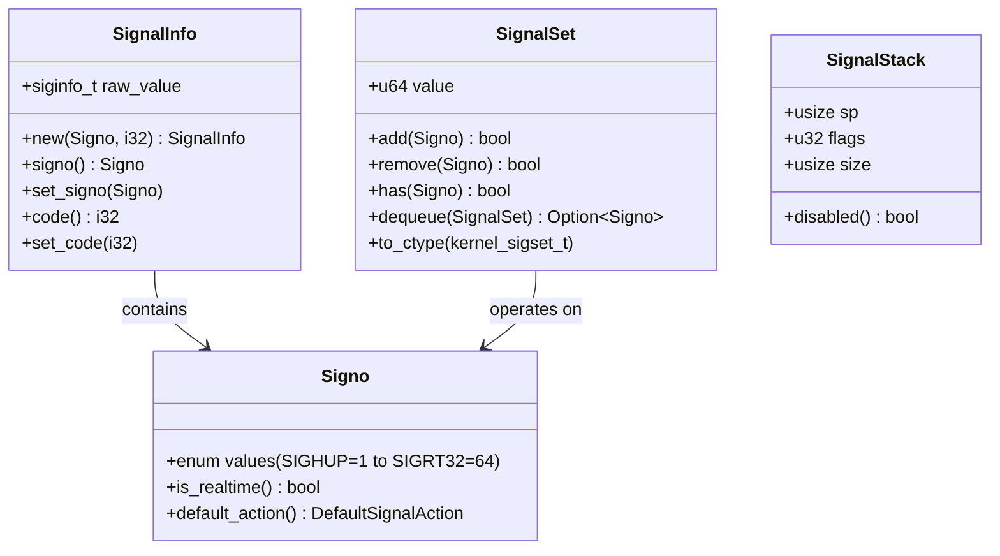
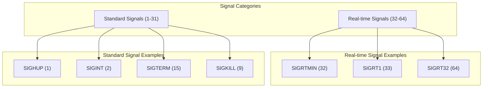
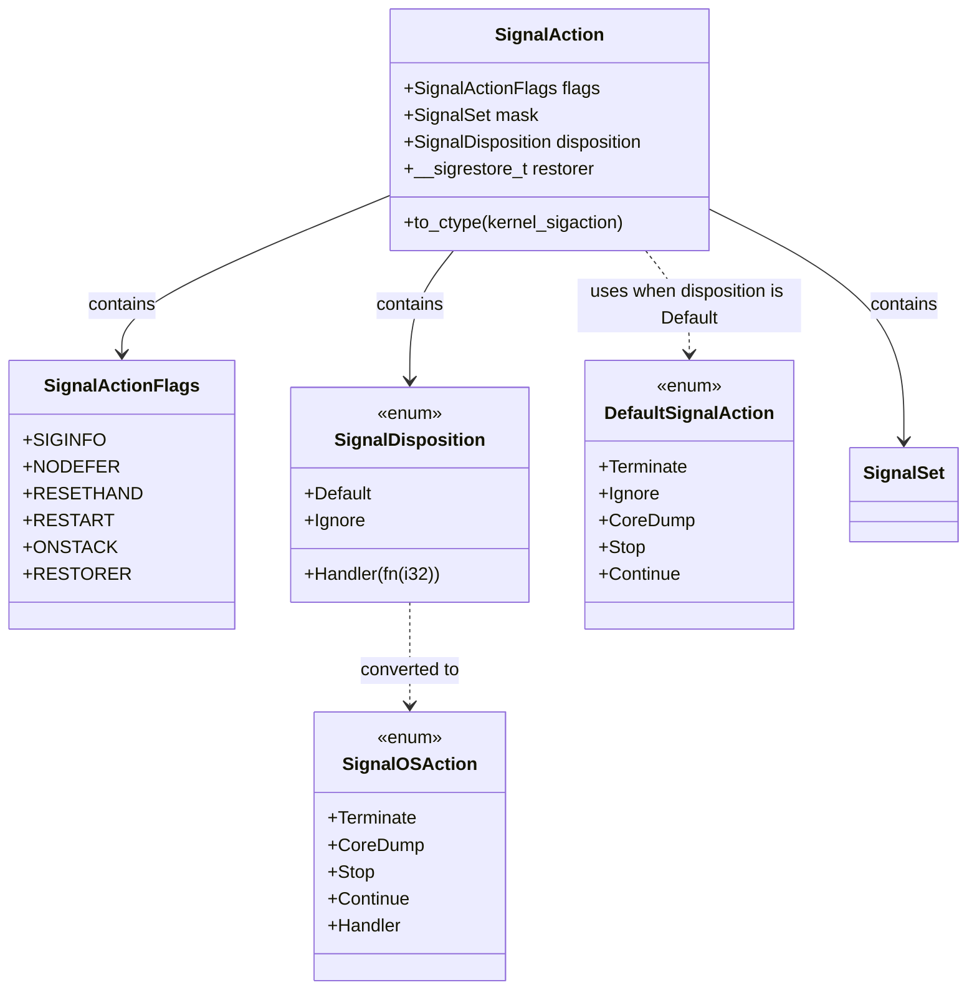
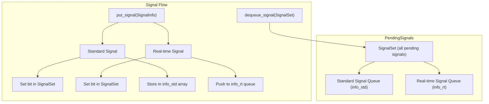
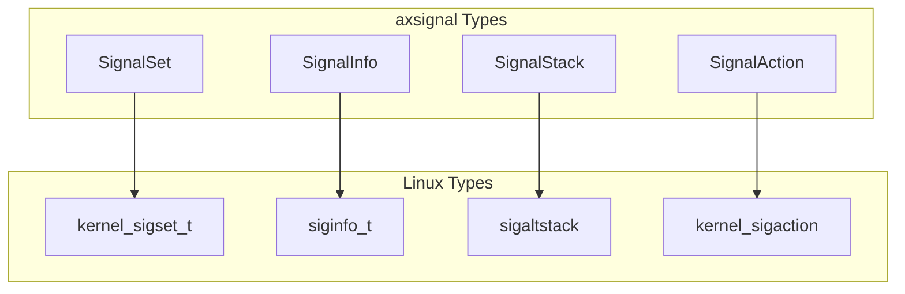

# Signal Types and Structures

> **Relevant source files**
> * [src/action.rs](https://github.com/Starry-OS/axsignal/blob/b5b6089c/src/action.rs)
> * [src/pending.rs](https://github.com/Starry-OS/axsignal/blob/b5b6089c/src/pending.rs)
> * [src/types.rs](https://github.com/Starry-OS/axsignal/blob/b5b6089c/src/types.rs)

## Purpose and Scope

This page documents the core data structures used to represent and manage signals in the axsignal crate. These structures form the foundation of the signal handling system in ArceOS, providing a Unix-like signal framework that's compatible with Linux signal interfaces. For information on how signals are managed at the process and thread levels, see [Signal Management System](/Starry-OS/axsignal/2-signal-management-system).

## Core Signal Types

The axsignal crate defines several fundamental types that represent different aspects of signals in the system.

Sources: [src/types.rs(L12 - L77)&emsp;](https://github.com/Starry-OS/axsignal/blob/b5b6089c/src/types.rs#L12-L77) [src/types.rs(L123 - L182)&emsp;](https://github.com/Starry-OS/axsignal/blob/b5b6089c/src/types.rs#L123-L182) [src/types.rs(L185 - L215)&emsp;](https://github.com/Starry-OS/axsignal/blob/b5b6089c/src/types.rs#L185-L215) [src/types.rs(L218 - L240)&emsp;](https://github.com/Starry-OS/axsignal/blob/b5b6089c/src/types.rs#L218-L240)

### Signal Numbers (Signo)

The `Signo` enum represents signal numbers compatible with Unix-like systems. It defines constants for standard signals (1-31) and real-time signals (32-64).

Key features of the `Signo` enum:

* Represents 64 different signal types (1-64)
* Distinguishes between standard signals (1-31) and real-time signals (32-64)
* Provides the `is_realtime()` method to identify signal categories
* Associates default actions with each signal through the `default_action()` method

The default actions for signals include:

* Terminate: End the process
* CoreDump: End the process and generate a core dump
* Ignore: Do nothing
* Stop: Pause the process
* Continue: Resume a stopped process

Sources: [src/types.rs(L12 - L77)&emsp;](https://github.com/Starry-OS/axsignal/blob/b5b6089c/src/types.rs#L12-L77) [src/types.rs(L80 - L119)&emsp;](https://github.com/Starry-OS/axsignal/blob/b5b6089c/src/types.rs#L80-L119)

### Signal Sets (SignalSet)

The `SignalSet` structure represents a set of signals, compatible with the Linux `sigset_t` type. It uses a 64-bit integer internally, where each bit corresponds to a signal number.

Key operations on `SignalSet`:

* `add(signal)`: Adds a signal to the set
* `remove(signal)`: Removes a signal from the set
* `has(signal)`: Checks if a signal is in the set
* `dequeue(mask)`: Removes and returns a signal from the set that is also in the provided mask

The structure provides conversion to and from the Linux `kernel_sigset_t` type, ensuring compatibility with Linux syscalls and ABI.

Sources: [src/types.rs(L123 - L182)&emsp;](https://github.com/Starry-OS/axsignal/blob/b5b6089c/src/types.rs#L123-L182)

### Signal Information (SignalInfo)

The `SignalInfo` structure encapsulates detailed information about a signal, compatible with the Linux `siginfo_t` type. It provides a transparent wrapper around the raw Linux type with convenient methods for accessing and modifying signal properties.

Key features:

* Retrieves and sets the signal number (`signo`)
* Retrieves and sets the signal code (`code`)
* Preserves compatibility with the Linux ABI for signal handlers that expect a `siginfo_t` parameter

Sources: [src/types.rs(L185 - L215)&emsp;](https://github.com/Starry-OS/axsignal/blob/b5b6089c/src/types.rs#L185-L215)

### Signal Stack (SignalStack)

The `SignalStack` structure defines an alternate stack for signal handlers, compatible with the Linux `sigaltstack` structure. Signal stacks provide a dedicated memory area for signal handlers to execute, which is useful for handling stack overflow situations.

Fields:

* `sp`: Stack pointer (address)
* `flags`: Stack flags (e.g., `SS_DISABLE` to disable the alternate stack)
* `size`: Size of the stack in bytes

The `disabled()` method checks if the alternate stack is disabled.

Sources: [src/types.rs(L218 - L240)&emsp;](https://github.com/Starry-OS/axsignal/blob/b5b6089c/src/types.rs#L218-L240)

## Signal Action Components

The signal action subsystem defines how signals are handled when they are delivered.

Sources: [src/action.rs(L16 - L156)&emsp;](https://github.com/Starry-OS/axsignal/blob/b5b6089c/src/action.rs#L16-L156)

### Default Signal Actions

The `DefaultSignalAction` enum defines the possible default behaviors for signals:

|Action|Description|
| --- | --- |
|Terminate|End the process|
|Ignore|Do nothing when the signal is received|
|CoreDump|End the process and generate a core dump|
|Stop|Pause the process|
|Continue|Resume a stopped process|

Each signal has a predefined default action as specified by the `default_action()` method in the `Signo` enum.

Sources: [src/action.rs(L16 - L31)&emsp;](https://github.com/Starry-OS/axsignal/blob/b5b6089c/src/action.rs#L16-L31) [src/types.rs(L84 - L119)&emsp;](https://github.com/Starry-OS/axsignal/blob/b5b6089c/src/types.rs#L84-L119)

### Signal Action Flags

The `SignalActionFlags` bitflags define modifiers for signal handling behavior:

|Flag|Description|
| --- | --- |
|SIGINFO|Handler expects additional signal information|
|NODEFER|Signal is not blocked during handler execution|
|RESETHAND|Reset handler to default after execution|
|RESTART|Automatically restart interrupted system calls|
|ONSTACK|Use alternate signal stack|
|RESTORER|Custom signal restorer function is provided|

These flags match the Linux SA_* constants and modify how signals are handled and processed.

Sources: [src/action.rs(L50 - L59)&emsp;](https://github.com/Starry-OS/axsignal/blob/b5b6089c/src/action.rs#L50-L59)

### Signal Disposition

The `SignalDisposition` enum defines how a specific signal should be handled:

* `Default`: Use the default action for the signal
* `Ignore`: Ignore the signal
* `Handler(fn)`: Execute a custom handler function

This is part of the `SignalAction` structure and determines the action taken when a signal is delivered.

Sources: [src/action.rs(L73 - L83)&emsp;](https://github.com/Starry-OS/axsignal/blob/b5b6089c/src/action.rs#L73-L83)

### Signal Action Structure

The `SignalAction` structure combines all aspects of signal handling configuration:

* `flags`: Bitflags that modify signal handling behavior
* `mask`: Set of signals blocked during handler execution
* `disposition`: How the signal should be handled
* `restorer`: Function to restore context after handler execution

This structure is compatible with the Linux `sigaction` structure and provides conversion methods for Linux ABI compatibility.

Sources: [src/action.rs(L85 - L156)&emsp;](https://github.com/Starry-OS/axsignal/blob/b5b6089c/src/action.rs#L85-L156)

## Pending Signal Management

The pending signal subsystem manages signals that have been generated but not yet delivered or handled.

Sources: [src/pending.rs(L8 - L66)&emsp;](https://github.com/Starry-OS/axsignal/blob/b5b6089c/src/pending.rs#L8-L66)

### PendingSignals Structure

The `PendingSignals` structure maintains a queue of signals that are waiting to be delivered and processed:

* `set`: A `SignalSet` indicating which signals are pending
* `info_std`: An array of `Option<SignalInfo>` for standard signals (1-31)
* `info_rt`: An array of queues for real-time signals (32-64)

Key differences in handling standard vs. real-time signals:

* Standard signals are not queued (at most one instance of each signal can be pending)
* Real-time signals are fully queued (multiple instances of the same signal can be pending)

Sources: [src/pending.rs(L8 - L29)&emsp;](https://github.com/Starry-OS/axsignal/blob/b5b6089c/src/pending.rs#L8-L29)

### Signal Queueing Mechanisms

The `PendingSignals` structure implements two primary operations:

1. `put_signal(sig)`: Adds a signal to the pending queue

* For standard signals, if the signal is already pending, the new instance is ignored
* For real-time signals, each signal is queued regardless of existing pending signals of the same type
2. `dequeue_signal(mask)`: Removes and returns a signal from the pending queue

* Only returns signals that are included in the provided mask
* For standard signals, it clears the corresponding bit in the signal set
* For real-time signals, it removes one instance from the queue and only clears the bit if the queue becomes empty

This two-tier design provides different quality-of-service levels for standard and real-time signals, matching the behavior of Unix-like systems.

Sources: [src/pending.rs(L30 - L66)&emsp;](https://github.com/Starry-OS/axsignal/blob/b5b6089c/src/pending.rs#L30-L66)

## Linux Compatibility Model

The signal types and structures in axsignal are designed to be binary-compatible with their Linux counterparts.

Key compatibility features:

* `#[repr(transparent)]` ensures binary compatibility for `SignalSet` and `SignalInfo`
* `#[repr(C)]` ensures memory layout compatibility for `SignalStack`
* Conversion methods (`to_ctype`, `TryFrom`) provide interoperability with the Linux ABI

This compatibility layer enables the axsignal crate to interact seamlessly with Linux syscalls and application code that expects Linux-compatible signal structures.

Sources: [src/types.rs(L123 - L182)&emsp;](https://github.com/Starry-OS/axsignal/blob/b5b6089c/src/types.rs#L123-L182) [src/types.rs(L185 - L215)&emsp;](https://github.com/Starry-OS/axsignal/blob/b5b6089c/src/types.rs#L185-L215) [src/types.rs(L218 - L240)&emsp;](https://github.com/Starry-OS/axsignal/blob/b5b6089c/src/types.rs#L218-L240) [src/action.rs(L85 - L156)&emsp;](https://github.com/Starry-OS/axsignal/blob/b5b6089c/src/action.rs#L85-L156)