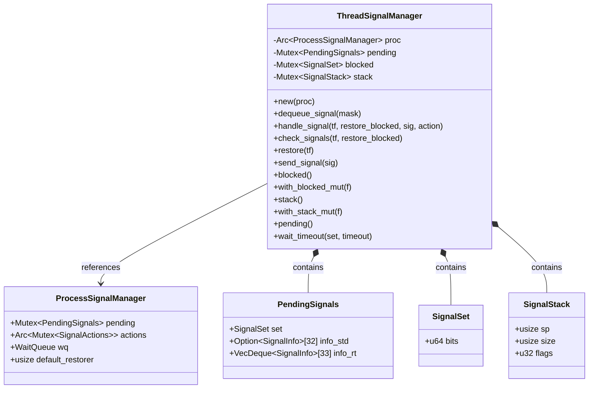
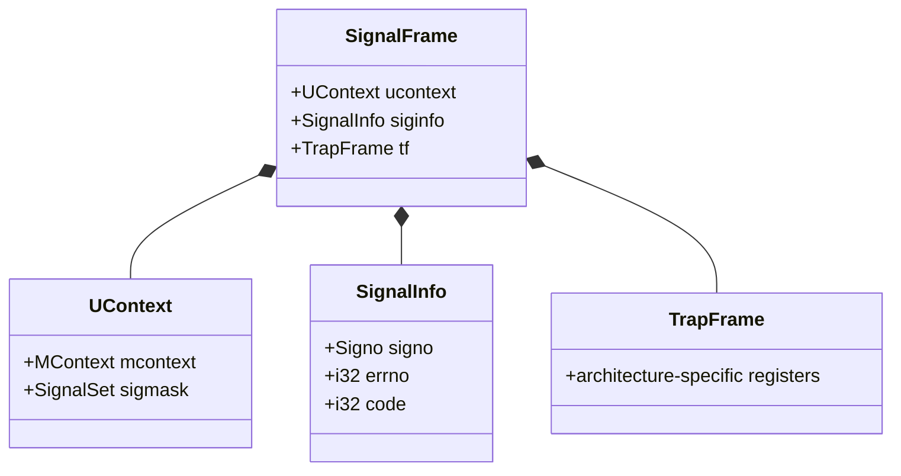
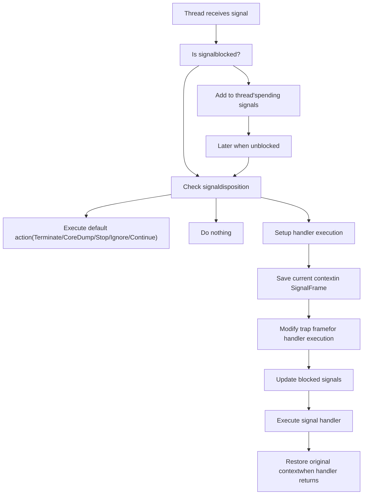
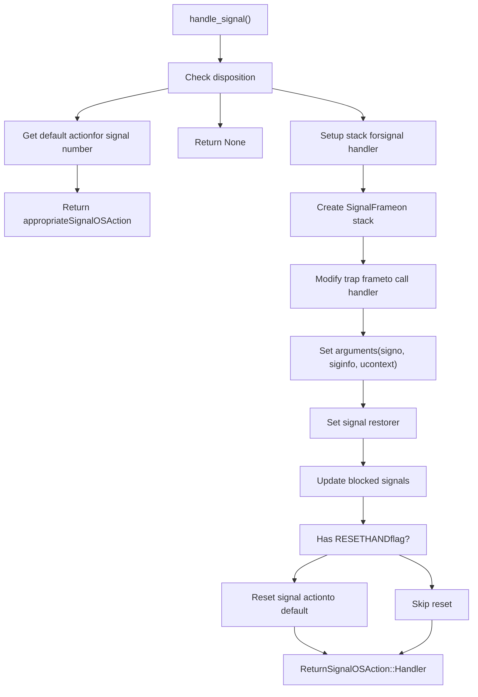

# Thread Signal Manager

> **Relevant source files**
> * [src/api/thread.rs](https://github.com/Starry-OS/axsignal/blob/b5b6089c/src/api/thread.rs)
> * [src/lib.rs](https://github.com/Starry-OS/axsignal/blob/b5b6089c/src/lib.rs)

The Thread Signal Manager is a component of the axsignal crate that provides thread-level signal handling capabilities in a Unix-like signal handling system. It manages signal delivery, blocking, and handling for individual threads, working in coordination with the Process Signal Manager. For process-level signal handling, see [Process Signal Manager](/Starry-OS/axsignal/2.2-process-signal-manager).

## Overview

The Thread Signal Manager implements thread-specific signal handling functionality including:

* Managing thread-specific pending signals
* Controlling which signals are blocked for a thread
* Setting up and managing signal handler stacks
* Handling signal delivery to user-defined handlers
* Coordination with the process-level signal manager



Sources: [src/api/thread.rs(L21 - L31)&emsp;](https://github.com/Starry-OS/axsignal/blob/b5b6089c/src/api/thread.rs#L21-L31)

## Core Components

### SignalFrame

Before a signal handler is invoked, the current execution context is saved in a `SignalFrame` structure on the stack:



Sources: [src/api/thread.rs(L14 - L18)&emsp;](https://github.com/Starry-OS/axsignal/blob/b5b6089c/src/api/thread.rs#L14-L18)

## Signal Handling Flow

The `ThreadSignalManager` follows a specific flow when handling signals:



Sources: [src/api/thread.rs(L50 - L117)&emsp;](https://github.com/Starry-OS/axsignal/blob/b5b6089c/src/api/thread.rs#L50-L117) [src/api/thread.rs(L119 - L143)&emsp;](https://github.com/Starry-OS/axsignal/blob/b5b6089c/src/api/thread.rs#L119-L143)

## Key Methods

### Constructor

The `ThreadSignalManager` is initialized with a reference to a `ProcessSignalManager`:

```rust
pub fn new(proc: Arc<ProcessSignalManager<M, WQ>>) -> Self {
    Self {
        proc,
        pending: Mutex::new(PendingSignals::new()),
        blocked: Mutex::new(SignalSet::default()),
        stack: Mutex::new(SignalStack::default()),
    }
}
```

Sources: [src/api/thread.rs(L34 - L41)&emsp;](https://github.com/Starry-OS/axsignal/blob/b5b6089c/src/api/thread.rs#L34-L41)

### Signal Dequeuing

The `dequeue_signal` method attempts to retrieve a signal from the thread's pending signals. If none are found, it falls back to the process-level signal manager:

```rust
fn dequeue_signal(&self, mask: &SignalSet) -> Option<SignalInfo> {
    self.pending
        .lock()
        .dequeue_signal(mask)
        .or_else(|| self.proc.dequeue_signal(mask))
}
```

Sources: [src/api/thread.rs(L43 - L48)&emsp;](https://github.com/Starry-OS/axsignal/blob/b5b6089c/src/api/thread.rs#L43-L48)

### Signal Handling

The `handle_signal` method is responsible for processing a signal based on its disposition:



Sources: [src/api/thread.rs(L50 - L117)&emsp;](https://github.com/Starry-OS/axsignal/blob/b5b6089c/src/api/thread.rs#L50-L117)

### Check and Handle Signals

The `check_signals` method checks for pending signals and handles them:

```javascript
pub fn check_signals(
    &self,
    tf: &mut TrapFrame,
    restore_blocked: Option<SignalSet>,
) -> Option<(SignalInfo, SignalOSAction)> {
    let actions = self.proc.actions.lock();
    
    let blocked = self.blocked.lock();
    let mask = !*blocked;
    let restore_blocked = restore_blocked.unwrap_or_else(|| *blocked);
    drop(blocked);
    
    loop {
        let Some(sig) = self.dequeue_signal(&mask) else {
            return None;
        };
        let action = &actions[sig.signo()];
        if let Some(os_action) = self.handle_signal(tf, restore_blocked, &sig, action) {
            break Some((sig, os_action));
        }
    }
}
```

Sources: [src/api/thread.rs(L119 - L143)&emsp;](https://github.com/Starry-OS/axsignal/blob/b5b6089c/src/api/thread.rs#L119-L143)

### Signal Frame Restoration

The `restore` method restores the original context from a signal frame:

```javascript
pub fn restore(&self, tf: &mut TrapFrame) {
    let frame_ptr = tf.sp() as *const SignalFrame;
    // SAFETY: pointer is valid
    let frame = unsafe { &*frame_ptr };
    
    *tf = frame.tf;
    frame.ucontext.mcontext.restore(tf);
    
    *self.blocked.lock() = frame.ucontext.sigmask;
}
```

Sources: [src/api/thread.rs(L145 - L155)&emsp;](https://github.com/Starry-OS/axsignal/blob/b5b6089c/src/api/thread.rs#L145-L155)

### Signal Waiting

The `wait_timeout` method allows a thread to wait for a specific set of signals:

```javascript
pub fn wait_timeout(
    &self,
    mut set: SignalSet,
    timeout: Option<Duration>,
) -> Option<SignalInfo> {
    // Non-blocked signals cannot be waited
    set &= self.blocked();
    
    if let Some(sig) = self.dequeue_signal(&set) {
        return Some(sig);
    }
    
    let wq = &self.proc.wq;
    let deadline = timeout.map(|dur| axhal::time::wall_time() + dur);
    
    // There might be false wakeups, so we need a loop
    loop {
        match &deadline {
            Some(deadline) => {
                match deadline.checked_sub(axhal::time::wall_time()) {
                    Some(dur) => {
                        if wq.wait_timeout(Some(dur)) {
                            // timed out
                            break;
                        }
                    }
                    None => {
                        // deadline passed
                        break;
                    }
                }
            }
            _ => wq.wait(),
        }
        
        if let Some(sig) = self.dequeue_signal(&set) {
            return Some(sig);
        }
    }
    
    // TODO: EINTR
    None
}
```

Sources: [src/api/thread.rs(L196 - L239)&emsp;](https://github.com/Starry-OS/axsignal/blob/b5b6089c/src/api/thread.rs#L196-L239)

## Integration with the Signal Handling System

The `ThreadSignalManager` is a key component in the overall signal handling architecture:

```

```

Sources: [src/api/thread.rs(L21 - L31)&emsp;](https://github.com/Starry-OS/axsignal/blob/b5b6089c/src/api/thread.rs#L21-L31) [src/api/thread.rs(L43 - L48)&emsp;](https://github.com/Starry-OS/axsignal/blob/b5b6089c/src/api/thread.rs#L43-L48)

## Performance and Synchronization

The `ThreadSignalManager` uses mutexes to protect its internal state:

|Protected Resource|Purpose|
| --- | --- |
|pending|Protects the thread's pending signals queue|
|blocked|Protects the set of signals blocked from delivery|
|stack|Protects the signal handler stack configuration|

The manager also interacts with the process-level wait queue for signal notification across threads.

Sources: [src/api/thread.rs(L21 - L31)&emsp;](https://github.com/Starry-OS/axsignal/blob/b5b6089c/src/api/thread.rs#L21-L31) [src/api/thread.rs(L196 - L239)&emsp;](https://github.com/Starry-OS/axsignal/blob/b5b6089c/src/api/thread.rs#L196-L239)

## Summary

The Thread Signal Manager is a crucial component of the axsignal crate that handles thread-specific signal management. It works in coordination with the Process Signal Manager to provide a complete signal handling solution, supporting both standard Unix-like signals and real-time signals across multiple architectures.

Key responsibilities include:

* Managing thread-specific pending signals
* Handling signal blocking and unblocking
* Setting up and executing signal handlers
* Managing signal stacks
* Coordinating with the process-level signal manager
* Supporting signal waiting operations with timeouts

The thread-specific nature of the `ThreadSignalManager` allows for fine-grained control over signal handling within multi-threaded applications, while still maintaining compatibility with process-level signal delivery mechanisms.