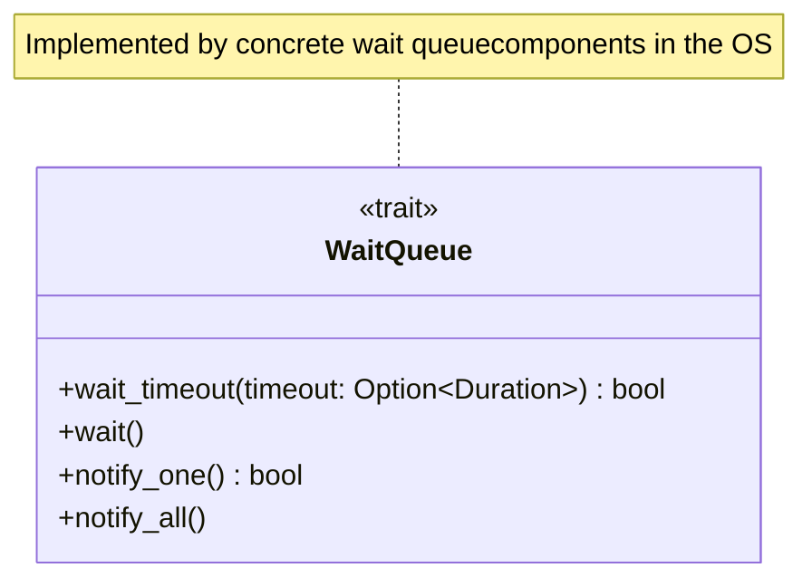
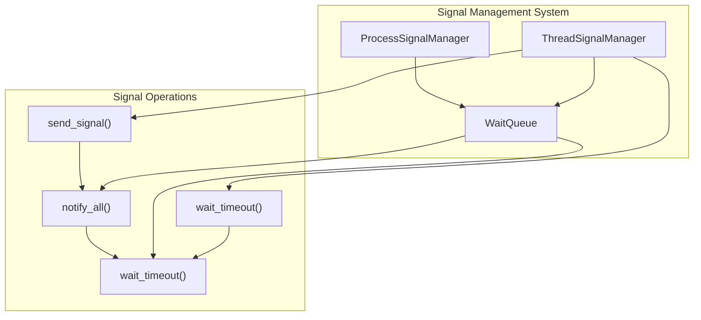
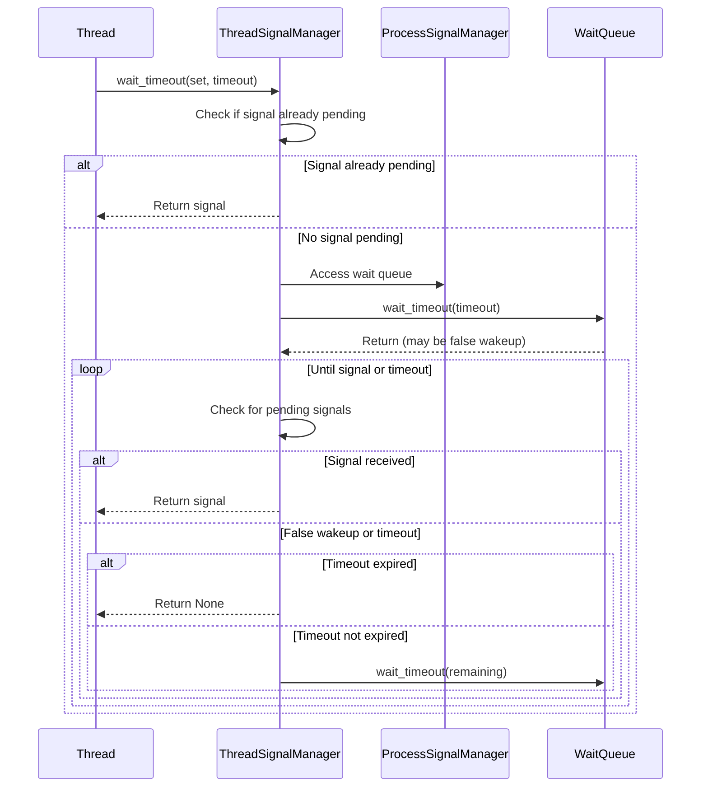
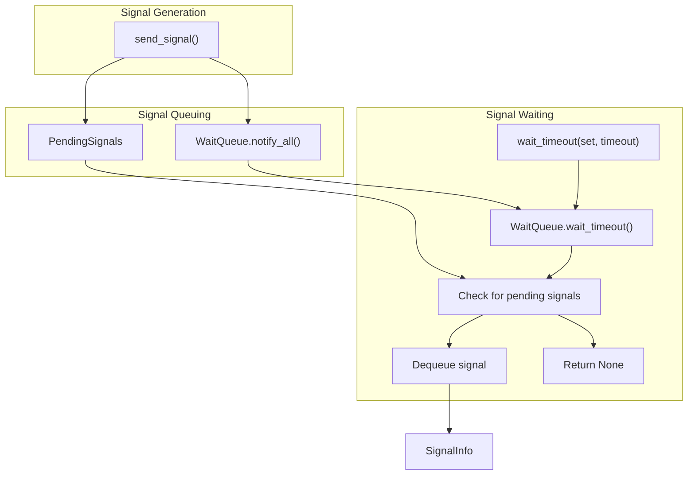

# Wait Queue Interface

> **Relevant source files**
> * [src/api/mod.rs](https://github.com/Starry-OS/axsignal/blob/b5b6089c/src/api/mod.rs)
> * [src/api/thread.rs](https://github.com/Starry-OS/axsignal/blob/b5b6089c/src/api/thread.rs)

## Purpose and Scope

The Wait Queue Interface is a synchronization mechanism used within the axsignal crate to enable threads to efficiently wait for signals. It provides the fundamental building blocks for implementing signal suspension operations like `sigsuspend()` and `sigtimedwait()`. This document covers the Wait Queue trait definition, its implementation requirements, and how it's used within the signal management system.

For information about the overall signal management architecture, see [Signal Management System](/Starry-OS/axsignal/2-signal-management-system), and for process-level and thread-level signal management, see [Process Signal Manager](/Starry-OS/axsignal/2.2-process-signal-manager) and [Thread Signal Manager](/Starry-OS/axsignal/2.1-thread-signal-manager) respectively.

## Wait Queue Trait Definition

The `WaitQueue` trait defines an abstract interface for a thread waiting mechanism that can be used across different parts of the signal handling system.



Sources: [src/api/mod.rs(L9 - L30)&emsp;](https://github.com/Starry-OS/axsignal/blob/b5b6089c/src/api/mod.rs#L9-L30)

The trait provides four essential methods:

|Method|Description|Return Value|
| --- | --- | --- |
|wait_timeout|Blocks the current thread until notified or timeout expires|trueif a notification came,falseif timeout expired|
|wait|Blocks the current thread indefinitely until notified|None (callswait_timeoutwithNone)|
|notify_one|Wakes up a single waiting thread, if any|trueif a thread was notified|
|notify_all|Wakes up all waiting threads|None (repeatedly callsnotify_one)|

Sources: [src/api/mod.rs(L9 - L30)&emsp;](https://github.com/Starry-OS/axsignal/blob/b5b6089c/src/api/mod.rs#L9-L30)

## Integration with Signal Management System

The Wait Queue is a critical component in the signal management architecture, enabling signal-based thread suspension and notification.



Sources: [src/api/thread.rs(L22 - L24)&emsp;](https://github.com/Starry-OS/axsignal/blob/b5b6089c/src/api/thread.rs#L22-L24) [src/api/thread.rs(L197 - L239)&emsp;](https://github.com/Starry-OS/axsignal/blob/b5b6089c/src/api/thread.rs#L197-L239) [src/api/thread.rs(L157 - L163)&emsp;](https://github.com/Starry-OS/axsignal/blob/b5b6089c/src/api/thread.rs#L157-L163)

## Wait Queue Usage in Signal Waiting

The Wait Queue is primarily used to implement signal waiting functionality in the `ThreadSignalManager`:



Sources: [src/api/thread.rs(L197 - L239)&emsp;](https://github.com/Starry-OS/axsignal/blob/b5b6089c/src/api/thread.rs#L197-L239)

## Implementation Details

### Signal Waiting with Timeout

The `wait_timeout` method in `ThreadSignalManager` demonstrates how the Wait Queue is used to implement signal waiting functionality:

1. First checks if a relevant signal is already pending
2. If not, calculates a deadline based on the timeout
3. Enters a loop that:
* Waits on the process's wait queue with a timeout
* Checks if a relevant signal is now pending after each wakeup
* Handles cases of false wakeups by continuing to wait
* Manages the remaining timeout duration

Sources: [src/api/thread.rs(L197 - L239)&emsp;](https://github.com/Starry-OS/axsignal/blob/b5b6089c/src/api/thread.rs#L197-L239)

### Signal Notification

When a signal is sent to a thread, the wait queue is notified:

```
send_signal() → put_signal() → wq.notify_all()
```

This ensures that any threads waiting for signals are woken up to check if one of their waited-for signals is now pending.

Sources: [src/api/thread.rs(L157 - L163)&emsp;](https://github.com/Starry-OS/axsignal/blob/b5b6089c/src/api/thread.rs#L157-L163)

## Key Considerations for Wait Queue Implementations

The `WaitQueue` trait is defined as a generic interface, allowing different concrete implementations to be used. Implementations must consider:

1. **Timeout handling**: Must support both indefinite waiting and time-limited waiting
2. **False wakeup handling**: The signal management code is designed to handle spurious wakeups by rechecking conditions
3. **Efficiency**: Should efficiently wake only necessary threads when possible
4. **Fairness**: Ideally should wake threads in a fair manner (e.g., FIFO order)

The default implementations of `wait()` and `notify_all()` are provided for convenience, but concrete implementations may override them for better performance.

Sources: [src/api/mod.rs(L16 - L29)&emsp;](https://github.com/Starry-OS/axsignal/blob/b5b6089c/src/api/mod.rs#L16-L29)

## Wait Queue in the Signal Processing Flow

The Wait Queue plays a crucial role in the overall signal processing flow:



Sources: [src/api/thread.rs(L197 - L239)&emsp;](https://github.com/Starry-OS/axsignal/blob/b5b6089c/src/api/thread.rs#L197-L239) [src/api/thread.rs(L157 - L163)&emsp;](https://github.com/Starry-OS/axsignal/blob/b5b6089c/src/api/thread.rs#L157-L163)

## Summary

The Wait Queue Interface provides a critical synchronization mechanism for the axsignal crate, enabling efficient signal waiting and notification. By abstracting the waiting and notification operations through a trait, the system allows for flexible implementation while maintaining a consistent interface. The `ThreadSignalManager` leverages this interface to implement signal waiting functionality, with proper handling of timeouts and false wakeups.