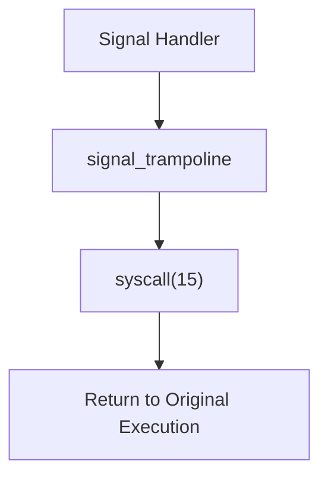
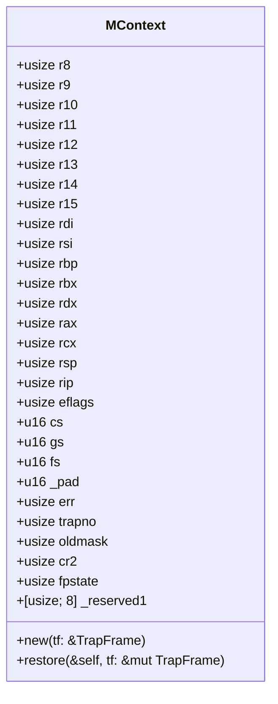
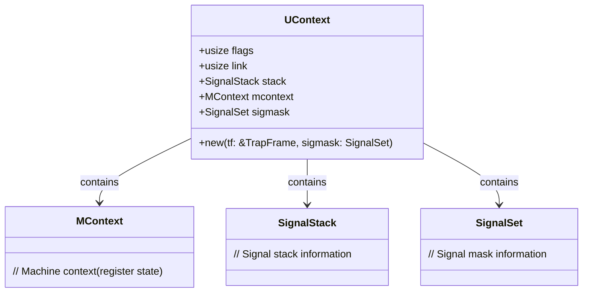
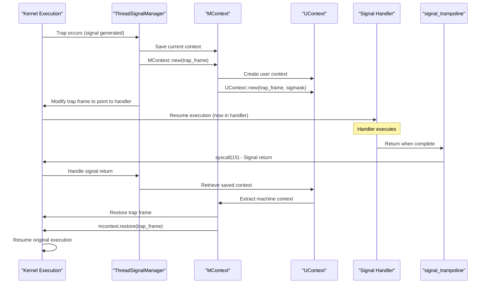
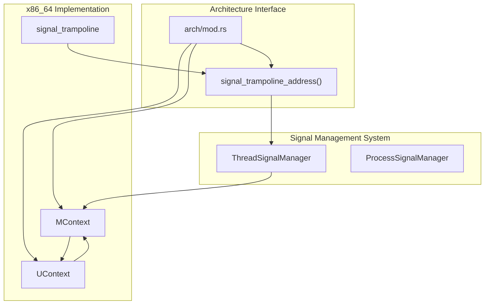

# x86_64 Implementation

> **Relevant source files**
> * [src/arch/mod.rs](https://github.com/Starry-OS/axsignal/blob/b5b6089c/src/arch/mod.rs)
> * [src/arch/x86_64.rs](https://github.com/Starry-OS/axsignal/blob/b5b6089c/src/arch/x86_64.rs)

This page documents the x86_64-specific implementation of the signal handling mechanism in the AxSignal crate. It covers the architecture-specific data structures, context management, and assembly code used for handling signals on the x86_64 architecture. For information about other architectures, see [ARM64 Implementation](/Starry-OS/axsignal/4.2-arm64-implementation), [RISC-V Implementation](/Starry-OS/axsignal/4.3-risc-v-implementation), or [LoongArch64 Implementation](/Starry-OS/axsignal/4.4-loongarch64-implementation).

## Overview

The x86_64 implementation provides architecture-specific components required for signal handling, including:

1. The signal trampoline assembly code
2. Machine context (MContext) for saving/restoring CPU registers
3. User context (UContext) structure for the complete signal handling context

These components work together to allow saving the current execution state when a signal occurs, executing a signal handler, and then restoring the original state to resume normal execution.

Sources: [src/arch/mod.rs(L1 - L26)&emsp;](https://github.com/Starry-OS/axsignal/blob/b5b6089c/src/arch/mod.rs#L1-L26) [src/arch/x86_64.rs(L1 - L4)&emsp;](https://github.com/Starry-OS/axsignal/blob/b5b6089c/src/arch/x86_64.rs#L1-L4)

## Signal Trampoline

The signal trampoline is a small assembly function that serves as the return mechanism after a signal handler completes execution. It's designed to be a fixed-address function that can be reliably used by the signal handling system.

### Implementation Details

The signal trampoline is implemented in assembly and placed in its own 4KB-aligned section:

1. It executes syscall 15 (0xF), which is designated for signal return
2. The assembly code is padded to occupy a full 4KB page

The trampoline's address is exposed through the `signal_trampoline_address()` function, allowing the signal handling system to set up the return address for signal handlers.

Sources: [src/arch/mod.rs(L19 - L25)&emsp;](https://github.com/Starry-OS/axsignal/blob/b5b6089c/src/arch/mod.rs#L19-L25) [src/arch/x86_64.rs(L5 - L17)&emsp;](https://github.com/Starry-OS/axsignal/blob/b5b6089c/src/arch/x86_64.rs#L5-L17)

## Machine Context (MContext)

The `MContext` structure represents the complete CPU register state for x86_64 architecture. This structure is crucial for:

1. Saving the processor state when a signal is delivered
2. Restoring the processor state when returning from a signal handler

### Structure Layout

The `MContext` structure contains all general-purpose registers, instruction pointer, stack pointer, flags, segment registers, and other CPU state information:

### Conversion Methods

The `MContext` structure provides methods to convert between the trap frame format and the machine context format:

1. `new()`: Creates a new `MContext` by copying register values from a `TrapFrame`
2. `restore()`: Updates a `TrapFrame` with register values from the `MContext`

These methods enable seamless conversion between the kernel's internal representation of CPU state (TrapFrame) and the architecture-specific representation used for signal handling (MContext).

Sources: [src/arch/x86_64.rs(L19 - L109)&emsp;](https://github.com/Starry-OS/axsignal/blob/b5b6089c/src/arch/x86_64.rs#L19-L109)

## User Context (UContext)

The `UContext` structure combines the machine context with additional information needed for signal handling, providing a complete context for signal handlers.

### Structure Layout

The `UContext` structure includes:

1. `flags`: Used for various control flags
2. `link`: Pointer to linked context (for nested signals)
3. `stack`: Information about the signal stack
4. `mcontext`: The machine context (CPU registers)
5. `sigmask`: The signal mask to be applied during handler execution

### Context Creation

The `UContext::new()` method creates a new user context from a trap frame and signal mask:

1. It initializes the flags and link fields to zero
2. Sets up a default signal stack
3. Creates a new machine context from the provided trap frame
4. Stores the provided signal mask

This combined context provides all the information a signal handler needs to execute properly and allows for correct state restoration afterward.

Sources: [src/arch/x86_64.rs(L111 - L131)&emsp;](https://github.com/Starry-OS/axsignal/blob/b5b6089c/src/arch/x86_64.rs#L111-L131)

## Signal Handling Flow on x86_64

The following diagram illustrates the complete flow of signal handling on x86_64, from signal delivery to handler execution and context restoration.

The key steps in this process are:

1. When a signal is delivered, the current CPU state is saved into an `MContext`
2. A full `UContext` is created, including the machine context, signal mask, and stack info
3. The trap frame is modified to point to the signal handler
4. When the signal handler returns, it goes to `signal_trampoline`
5. The trampoline executes syscall 15 to return to the kernel
6. The saved context is restored, and normal execution resumes

This architecture-specific implementation ensures that signals can be properly handled on x86_64 systems without corrupting the execution state of the process.

Sources: [src/arch/x86_64.rs(L1 - L131)&emsp;](https://github.com/Starry-OS/axsignal/blob/b5b6089c/src/arch/x86_64.rs#L1-L131)

## Register State Mapping

The following table shows how register state is mapped between the `TrapFrame` and `MContext` structures:

|TrapFrame Field|MContext Field|Description|
| --- | --- | --- |
|r8|r8|General purpose register R8|
|r9|r9|General purpose register R9|
|r10|r10|General purpose register R10|
|r11|r11|General purpose register R11|
|r12|r12|General purpose register R12|
|r13|r13|General purpose register R13|
|r14|r14|General purpose register R14|
|r15|r15|General purpose register R15|
|rdi|rdi|First function argument register|
|rsi|rsi|Second function argument register|
|rbp|rbp|Base pointer register|
|rbx|rbx|General purpose register (callee saved)|
|rdx|rdx|Third function argument register|
|rax|rax|Return value register|
|rcx|rcx|Fourth function argument register|
|rsp|rsp|Stack pointer register|
|rip|rip|Instruction pointer register|
|rflags|eflags|CPU flags register|
|cs|cs|Code segment register|
|error_code|err|Error code from exception|
|vector|trapno|Interrupt/exception vector number|

This mapping ensures that all necessary register state is preserved during signal handling.

Sources: [src/arch/x86_64.rs(L53 - L108)&emsp;](https://github.com/Starry-OS/axsignal/blob/b5b6089c/src/arch/x86_64.rs#L53-L108)

## Integration with Signal Management System

The x86_64 implementation integrates with the broader signal management system through the following mechanisms:

Key integration points:

1. The `signal_trampoline_address()` function exposes the address of the architecture-specific trampoline
2. The `MContext` and `UContext` structures are used by the `ThreadSignalManager` to save and restore execution context
3. The architecture module (`arch/mod.rs`) selects and exports the appropriate implementation based on the target architecture

This modular design allows the signal management system to work consistently across different architectures while handling the architecture-specific details appropriately.

Sources: [src/arch/mod.rs(L1 - L26)&emsp;](https://github.com/Starry-OS/axsignal/blob/b5b6089c/src/arch/mod.rs#L1-L26) [src/arch/x86_64.rs(L1 - L131)&emsp;](https://github.com/Starry-OS/axsignal/blob/b5b6089c/src/arch/x86_64.rs#L1-L131)