# Advanced Usage Patterns

> **Relevant source files**
> * [src/map.rs](https://github.com/Starry-OS/weak-map/blob/b19a081d/src/map.rs)
> * [src/traits.rs](https://github.com/Starry-OS/weak-map/blob/b19a081d/src/traits.rs)

This page explores complex usage patterns, optimization techniques, and best practices for the `WeakMap` implementation. While [Basic Usage Examples](/Starry-OS/weak-map/3.1-basic-usage-examples) covers fundamental operations, this section focuses on advanced scenarios that leverage the full potential of weak references in map data structures.

## Understanding the Cleanup Mechanism

The `WeakMap` implementation includes an automatic cleanup mechanism that purges expired weak references. Understanding this mechanism is crucial for optimizing performance.

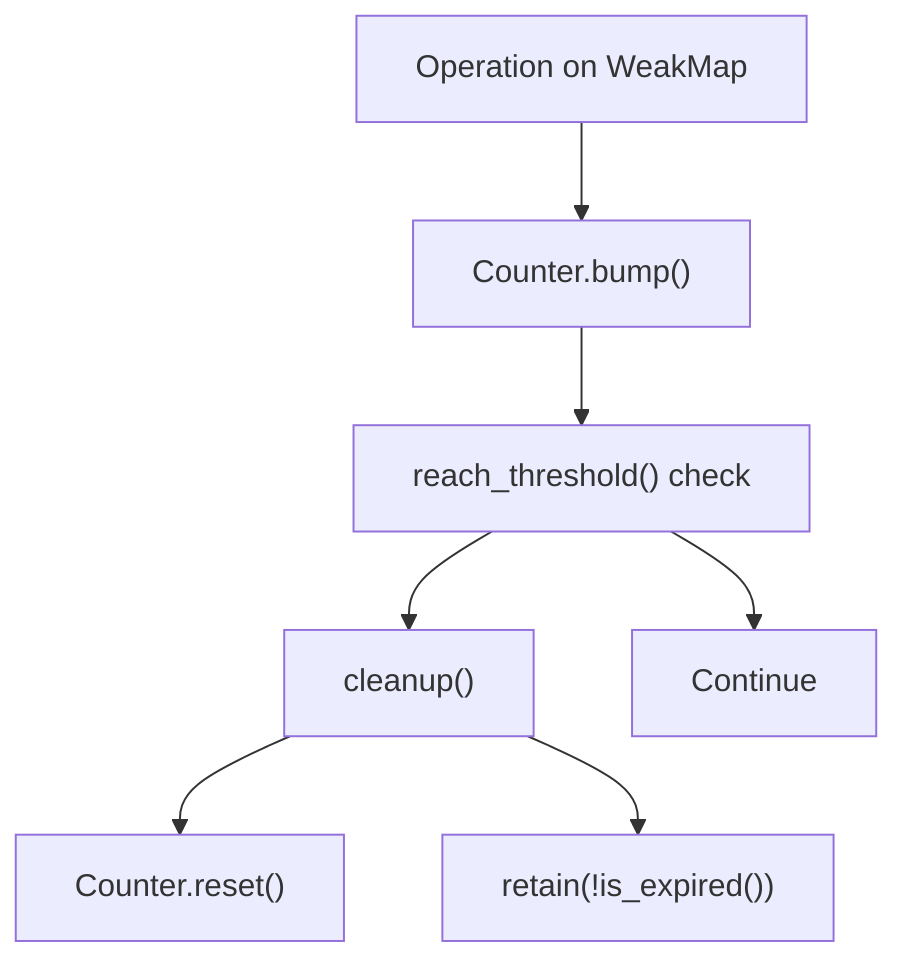

By default, cleanup occurs after `OPS_THRESHOLD` (1000) operations on the map. This value is defined as a constant in [src/map.rs(L16)&emsp;](https://github.com/Starry-OS/weak-map/blob/b19a081d/src/map.rs#L16-L16)

Sources: [src/map.rs(L14 - L47)&emsp;](https://github.com/Starry-OS/weak-map/blob/b19a081d/src/map.rs#L14-L47) [src/map.rs(L158 - L169)&emsp;](https://github.com/Starry-OS/weak-map/blob/b19a081d/src/map.rs#L158-L169)

### Examining Cleanup Performance

Understanding the performance characteristics of the cleanup process is important for applications with stringent timing requirements:

1. **Cleanup Complexity**: The cleanup operation is O(n) as it iterates through all entries in the map.
2. **Lazy Cleanup**: Entries are only removed during cleanup operations, not immediately when they expire.
3. **Actual vs. Raw Length**: The `len()` method reports only valid entries, while `raw_len()` includes expired entries.

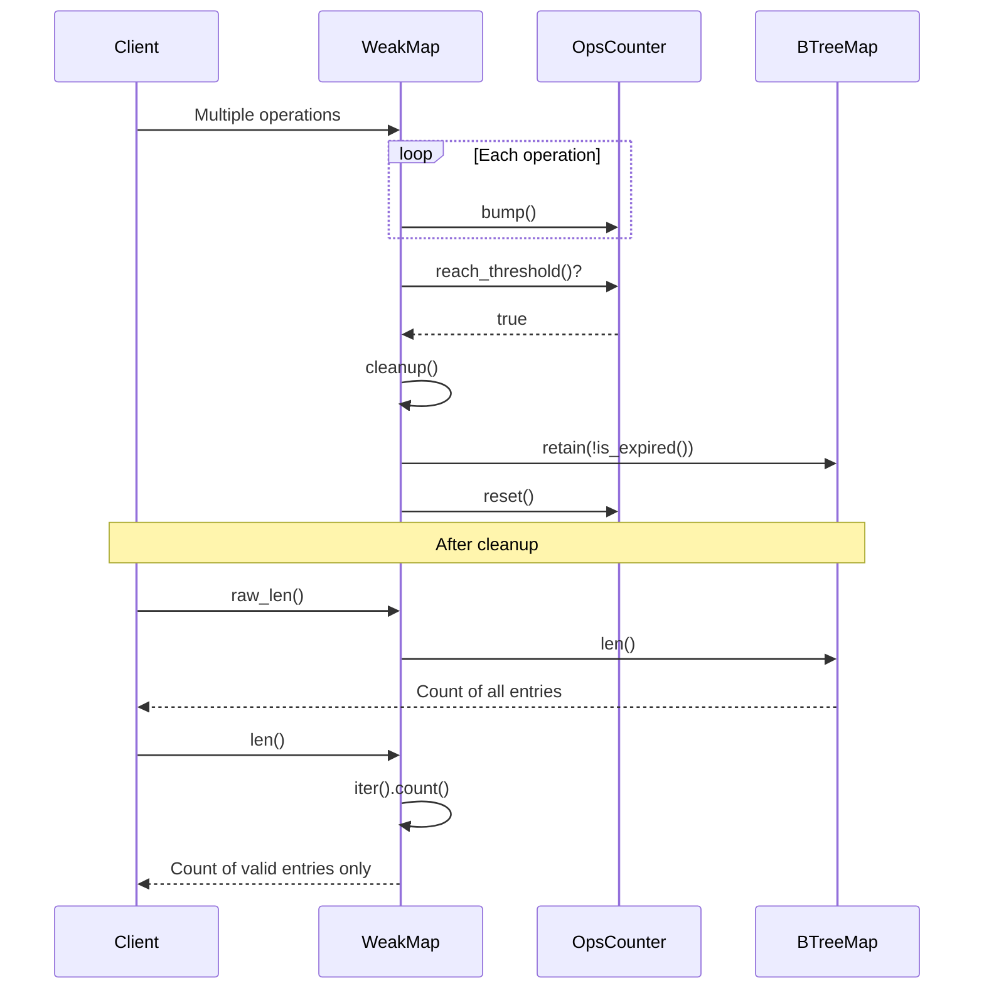

Sources: [src/map.rs(L158 - L169)&emsp;](https://github.com/Starry-OS/weak-map/blob/b19a081d/src/map.rs#L158-L169) [src/map.rs(L113 - L115)&emsp;](https://github.com/Starry-OS/weak-map/blob/b19a081d/src/map.rs#L113-L115) [src/map.rs(L171 - L185)&emsp;](https://github.com/Starry-OS/weak-map/blob/b19a081d/src/map.rs#L171-L185)

## Custom Reference Types

The `WeakMap` can work with any reference type that implements the `WeakRef` trait, while the values must be from types implementing the `StrongRef` trait.

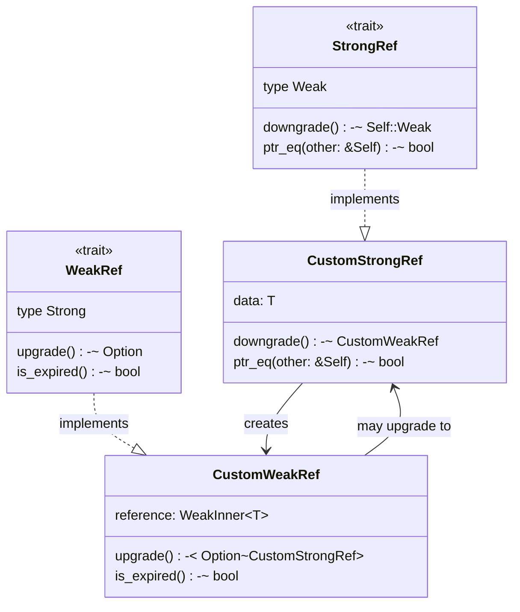

Implementing these traits for custom reference types allows you to integrate them with `WeakMap`:

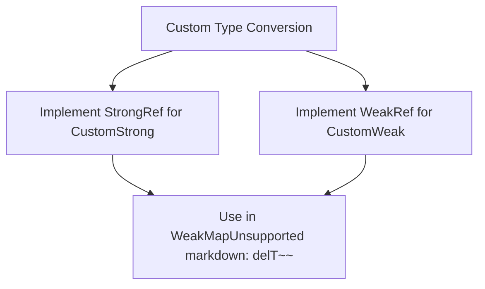

Sources: [src/traits.rs(L3 - L19)&emsp;](https://github.com/Starry-OS/weak-map/blob/b19a081d/src/traits.rs#L3-L19) [src/traits.rs(L21 - L40)&emsp;](https://github.com/Starry-OS/weak-map/blob/b19a081d/src/traits.rs#L21-L40)

## Advanced Conversion Operations

### Converting Between WeakMap and StrongMap

The `WeakMap` implementation provides methods for converting between weak and strong maps:

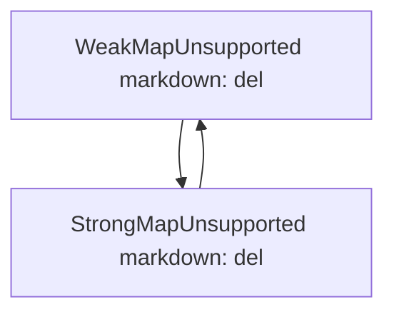

The `upgrade()` method creates a new `StrongMap` containing only the valid entries:

Sources: [src/map.rs(L296 - L306)&emsp;](https://github.com/Starry-OS/weak-map/blob/b19a081d/src/map.rs#L296-L306) [src/map.rs(L368 - L380)&emsp;](https://github.com/Starry-OS/weak-map/blob/b19a081d/src/map.rs#L368-L380)

### Working with Iterators

`WeakMap` provides various iterator types to work with different aspects of the map:

|Iterator Type|Description|Returns|Implementation|
| --- | --- | --- | --- |
|Iter|References to entries|(&'a K, V::Strong)|src/map.rs382-430|
|Keys|References to keys|&'a K|src/map.rs444-485|
|Values|Valid values|V::Strong|src/map.rs487-528|
|IntoIter|Owned entries|(K, V::Strong)|src/map.rs530-571|
|IntoKeys|Owned keys|K|src/map.rs573-597|
|IntoValues|Owned values|V::Strong|src/map.rs599-623|

Note that all iterators automatically filter out expired references, so you only get valid entries.

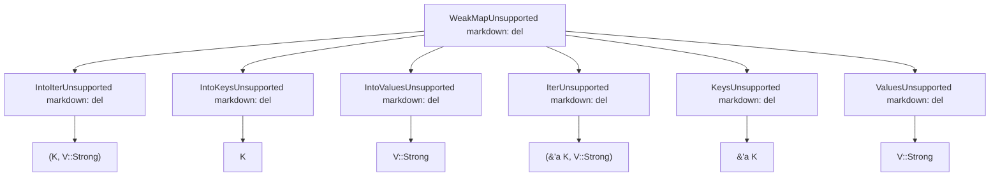

Sources: [src/map.rs(L119 - L149)&emsp;](https://github.com/Starry-OS/weak-map/blob/b19a081d/src/map.rs#L119-L149) [src/map.rs(L382 - L623)&emsp;](https://github.com/Starry-OS/weak-map/blob/b19a081d/src/map.rs#L382-L623)

## Memory Management Strategies

### Minimizing Memory Overhead

When working with `WeakMap`, consider these strategies to minimize memory overhead:

1. **Preemptive Cleanup**: For large maps, consider manually triggering cleanup before critical operations.
2. **Monitoring Raw Size**: Use `raw_len()` to monitor the total size including expired entries.
3. **Strategic Insert/Remove**: Batch insertions and removals to minimize cleanup frequency.

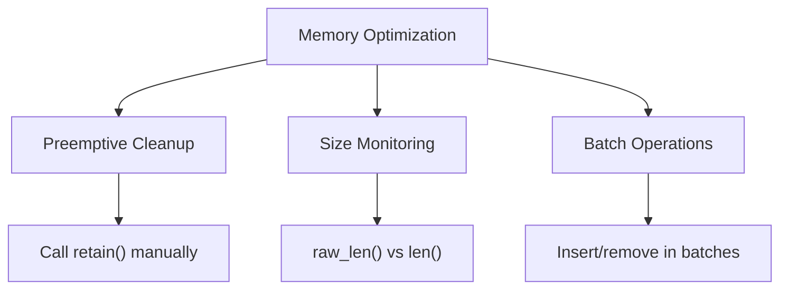

Sources: [src/map.rs(L113 - L115)&emsp;](https://github.com/Starry-OS/weak-map/blob/b19a081d/src/map.rs#L113-L115) [src/map.rs(L158 - L169)&emsp;](https://github.com/Starry-OS/weak-map/blob/b19a081d/src/map.rs#L158-L169) [src/map.rs(L187 - L201)&emsp;](https://github.com/Starry-OS/weak-map/blob/b19a081d/src/map.rs#L187-L201)

## Thread Safety Considerations

The `WeakMap` can be used with both single-threaded (`Rc`/`Weak`) and thread-safe (`Arc`/`Weak`) reference types.

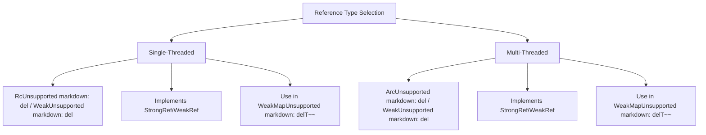

Selection depends on your concurrency requirements:

|Reference Type|Thread-Safe|Use Case|
| --- | --- | --- |
|Rc/Weak|No|Single-threaded applications, better performance|
|Arc/Weak|Yes|Multi-threaded applications, safe concurrent access|

Sources: [src/traits.rs(L42 - L64)&emsp;](https://github.com/Starry-OS/weak-map/blob/b19a081d/src/traits.rs#L42-L64) [src/traits.rs(L66 - L88)&emsp;](https://github.com/Starry-OS/weak-map/blob/b19a081d/src/traits.rs#L66-L88)

## Advanced Usage Patterns

### Caching with Automatic Cleanup

`WeakMap` is particularly well-suited for implementing caches that automatically evict entries when they are no longer used elsewhere:

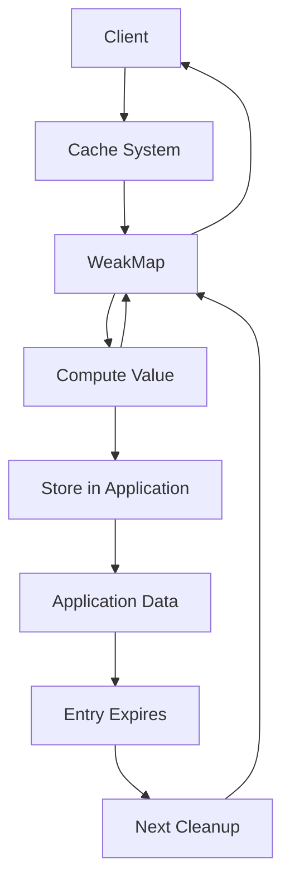

Sources: [src/map.rs(L203 - L214)&emsp;](https://github.com/Starry-OS/weak-map/blob/b19a081d/src/map.rs#L203-L214) [src/map.rs(L258 - L263)&emsp;](https://github.com/Starry-OS/weak-map/blob/b19a081d/src/map.rs#L258-L263)

### Observer Pattern Implementation

`WeakMap` can be used to implement observer patterns without memory leaks:

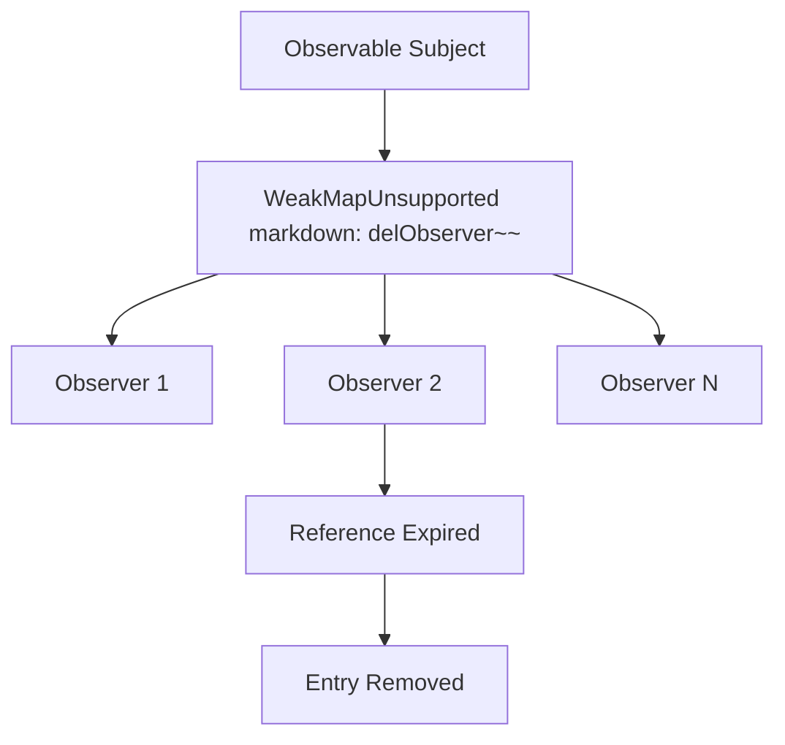

Sources: [src/map.rs(L203 - L214)&emsp;](https://github.com/Starry-OS/weak-map/blob/b19a081d/src/map.rs#L203-L214) [src/map.rs(L258 - L263)&emsp;](https://github.com/Starry-OS/weak-map/blob/b19a081d/src/map.rs#L258-L263)

### Breaking Reference Cycles

`WeakMap` is ideal for breaking reference cycles in complex data structures:

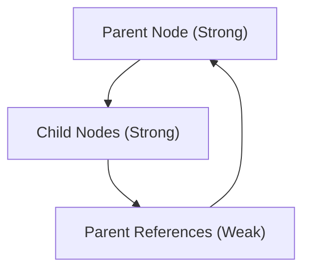

This pattern avoids memory leaks while maintaining bidirectional relationships.

Sources: [src/traits.rs(L3 - L19)&emsp;](https://github.com/Starry-OS/weak-map/blob/b19a081d/src/traits.rs#L3-L19) [src/traits.rs(L21 - L40)&emsp;](https://github.com/Starry-OS/weak-map/blob/b19a081d/src/traits.rs#L21-L40)

## Performance Optimizations

### Choosing the Right Cleanup Strategy

The default cleanup strategy may not be optimal for all use cases:

|Usage Pattern|Recommended Approach|
| --- | --- |
|High churn (many entries added/removed)|LowerOPS_THRESHOLDor manual cleanup|
|Mostly static data with few expirations|Default cleanup is adequate|
|Memory-constrained environments|Preemptive cleanup after critical operations|
|Performance-critical code paths|Consider manual cleanup during idle periods|

### Optimizing Map Operations

For performance-critical applications, consider these strategies:

1. **Pre-sizing**: If approximate size is known, create with appropriate capacity
2. **Batch Processing**: Group insertions and retrievals to minimize cleanup overhead
3. **Strategic Cleanup**: Trigger cleanup during low-activity periods
4. **Monitoring**: Track `raw_len()` vs. `len()` to gauge cleanup effectiveness

Sources: [src/map.rs(L158 - L169)&emsp;](https://github.com/Starry-OS/weak-map/blob/b19a081d/src/map.rs#L158-L169) [src/map.rs(L113 - L115)&emsp;](https://github.com/Starry-OS/weak-map/blob/b19a081d/src/map.rs#L113-L115) [src/map.rs(L171 - L185)&emsp;](https://github.com/Starry-OS/weak-map/blob/b19a081d/src/map.rs#L171-L185)

## Conclusion

Advanced usage of `WeakMap` requires understanding its internal cleanup mechanism, reference type interactions, and memory management characteristics. By applying the patterns and strategies outlined in this document, you can leverage `WeakMap` effectively in complex applications while maintaining optimal performance.