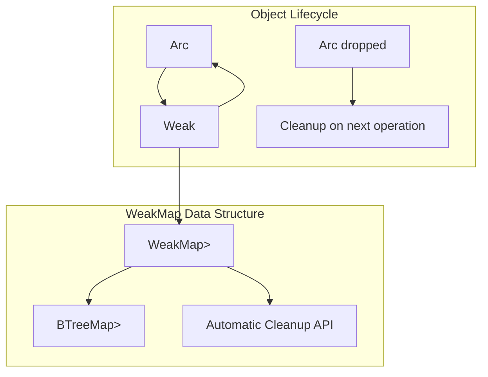
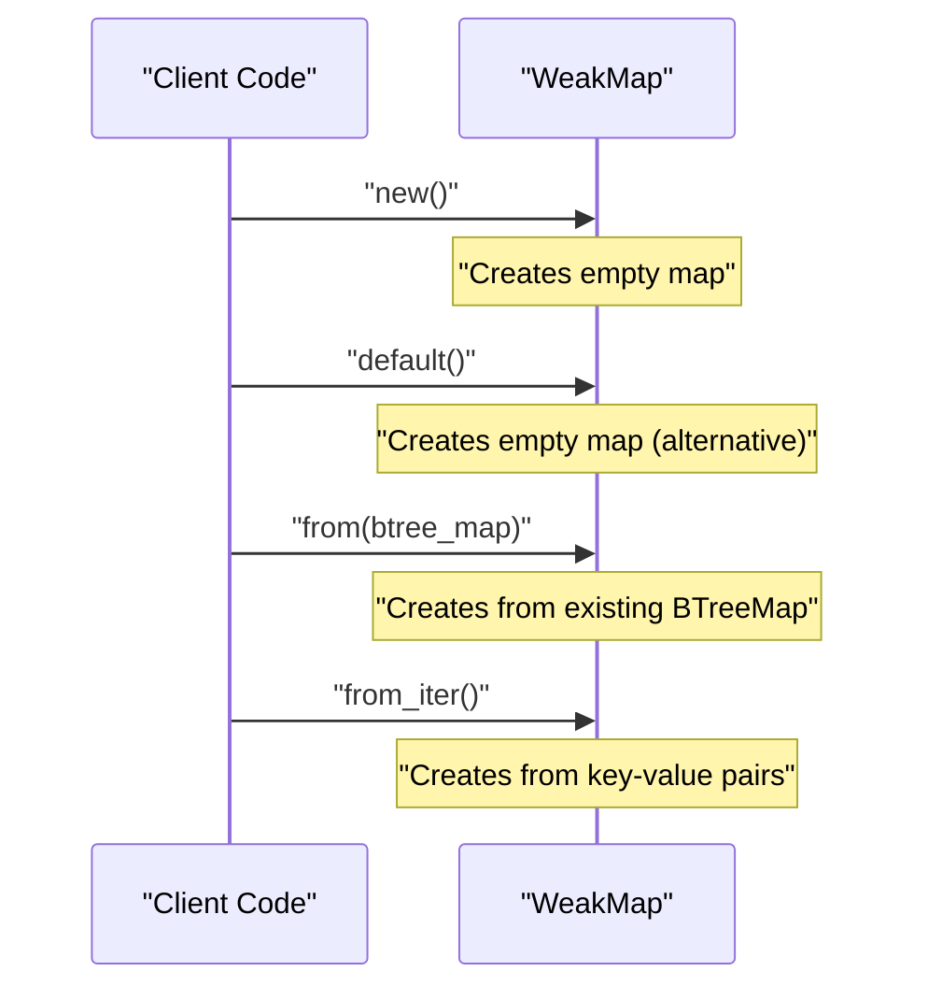
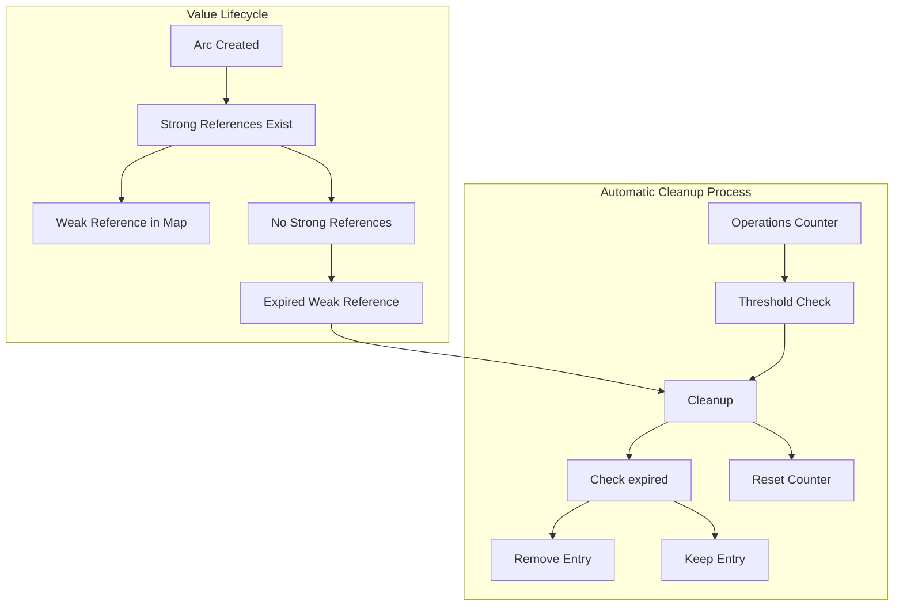
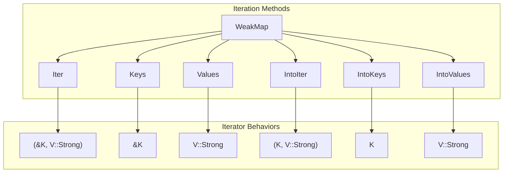

# Basic Usage Examples

> **Relevant source files**
> * [README.md](https://github.com/Starry-OS/weak-map/blob/b19a081d/README.md)
> * [src/map.rs](https://github.com/Starry-OS/weak-map/blob/b19a081d/src/map.rs)

This page provides practical examples demonstrating how to use the `WeakMap` and `StrongMap` data structures in the weak-map library. For advanced usage patterns and optimization techniques, see [Advanced Usage Patterns](/Starry-OS/weak-map/3.2-advanced-usage-patterns).

## Introduction to WeakMap

`WeakMap` is a B-Tree map that stores weak references to values, automatically removing entries when the referenced values are dropped. This makes it ideal for caching scenarios where you want to access objects as long as they're in use elsewhere, without preventing them from being garbage collected.



Sources: [src/map.rs(L60 - L65)&emsp;](https://github.com/Starry-OS/weak-map/blob/b19a081d/src/map.rs#L60-L65) [src/map.rs(L158 - L169)&emsp;](https://github.com/Starry-OS/weak-map/blob/b19a081d/src/map.rs#L158-L169)

## Creating a WeakMap

Creating a new `WeakMap` is straightforward:



### Basic Creation Examples:

1. Creating an empty `WeakMap`:

```javascript
let map = WeakMap::<String, Weak<u32>>::new();
```
2. Using `Default` trait:

```javascript
let map: WeakMap<String, Weak<u32>> = WeakMap::default();
```
3. Creating from an iterator of key-value pairs:

```javascript
let values = vec![(1, &Arc::new("one")), (2, &Arc::new("two"))];
let map = WeakMap::from_iter(values);
```

Sources: [src/map.rs(L68 - L77)&emsp;](https://github.com/Starry-OS/weak-map/blob/b19a081d/src/map.rs#L68-L77) [src/map.rs(L80 - L84)&emsp;](https://github.com/Starry-OS/weak-map/blob/b19a081d/src/map.rs#L80-L84) [src/map.rs(L341 - L355)&emsp;](https://github.com/Starry-OS/weak-map/blob/b19a081d/src/map.rs#L341-L355)

## Basic Operations

### Inserting Values

To insert values into a `WeakMap`, you need to provide a key and a strong reference to the value. The map will store a weak reference to the value internally.

```javascript
let mut map = WeakMap::<u32, Weak<String>>::new();
let value = Arc::new(String::from("example"));
map.insert(1, &value);
```

The `insert` method returns an `Option<V::Strong>` containing the previous strong reference associated with the key, if one existed and hasn't been dropped.

Sources: [src/map.rs(L258 - L263)&emsp;](https://github.com/Starry-OS/weak-map/blob/b19a081d/src/map.rs#L258-L263)

### Retrieving Values

To retrieve values, use the `get` method with a reference to the key:

```javascript
if let Some(strong_ref) = map.get(&1) {
    // Use strong_ref
}
```

The `get` method returns `Option<V::Strong>`, containing the strong reference if the key exists and the weak reference could be upgraded.

Sources: [src/map.rs(L207 - L214)&emsp;](https://github.com/Starry-OS/weak-map/blob/b19a081d/src/map.rs#L207-L214)

### Checking for Keys

To check if a key exists in the map without retrieving the value:

```
if map.contains_key(&1) {
    // Key exists and reference is not expired
}
```

Sources: [src/map.rs(L239 - L246)&emsp;](https://github.com/Starry-OS/weak-map/blob/b19a081d/src/map.rs#L239-L246)

### Removing Entries

To remove an entry from the map:

```javascript
if let Some(strong_ref) = map.remove(&1) {
    // Entry was removed and reference was still valid
}
```

Sources: [src/map.rs(L270 - L277)&emsp;](https://github.com/Starry-OS/weak-map/blob/b19a081d/src/map.rs#L270-L277)

## Handling of Dropped References

The key feature of `WeakMap` is its ability to automatically clean up entries whose values have been dropped:



Sources: [src/map.rs(L14 - L48)&emsp;](https://github.com/Starry-OS/weak-map/blob/b19a081d/src/map.rs#L14-L48) [src/map.rs(L158 - L169)&emsp;](https://github.com/Starry-OS/weak-map/blob/b19a081d/src/map.rs#L158-L169)

### Example of Automatic Cleanup

When a referenced value is dropped, it doesn't immediately get removed from the `WeakMap`. Instead, the map detects and removes expired references during subsequent operations:

```javascript
let mut map = WeakMap::<u32, Weak<String>>::new();

// Create a value in a nested scope so it gets dropped
{
    let value = Arc::new(String::from("temporary"));
    map.insert(1, &value);
} // value is dropped here

// The entry still exists in the underlying BTreeMap
assert_eq!(map.raw_len(), 1);

// But it won't be returned when getting or counting valid entries
assert_eq!(map.len(), 0);
assert_eq!(map.get(&1), None);
```

After a certain number of operations (defined by `OPS_THRESHOLD` which is 1000), the map will automatically perform a cleanup to remove all expired references:

```
// After many operations, the expired references are cleaned up
assert_eq!(map.raw_len(), 0);
```

Sources: [src/map.rs(L16)&emsp;](https://github.com/Starry-OS/weak-map/blob/b19a081d/src/map.rs#L16-L16) [src/map.rs(L158 - L161)&emsp;](https://github.com/Starry-OS/weak-map/blob/b19a081d/src/map.rs#L158-L161) [src/map.rs(L625 - L660)&emsp;](https://github.com/Starry-OS/weak-map/blob/b19a081d/src/map.rs#L625-L660)

## Converting Between WeakMap and StrongMap

### Upgrading to StrongMap

You can convert a `WeakMap` to a `StrongMap` (which contains only strong references) using the `upgrade` method:

```javascript
let strong_map: StrongMap<K, Arc<V>> = weak_map.upgrade();
```

This creates a new `StrongMap` containing only the keys that have valid references in the `WeakMap`.

Sources: [src/map.rs(L296 - L306)&emsp;](https://github.com/Starry-OS/weak-map/blob/b19a081d/src/map.rs#L296-L306)

### Creating WeakMap from StrongMap

Conversely, you can create a `WeakMap` from a `StrongMap`:

```javascript
let weak_map = WeakMap::from(&strong_map);
```

Sources: [src/map.rs(L368 - L380)&emsp;](https://github.com/Starry-OS/weak-map/blob/b19a081d/src/map.rs#L368-L380)

## Iterating Over WeakMap Contents

`WeakMap` provides various iteration methods that only yield entries with valid references:



Sources: [src/map.rs(L119 - L149)&emsp;](https://github.com/Starry-OS/weak-map/blob/b19a081d/src/map.rs#L119-L149) [src/map.rs(L383 - L623)&emsp;](https://github.com/Starry-OS/weak-map/blob/b19a081d/src/map.rs#L383-L623)

### Iterating Over Key-Value Pairs

```
for (key, value) in map.iter() {
    // key is a reference to the key, value is a strong reference
}
```

### Iterating Over Keys or Values Only

```
// Iterating over keys
for key in map.keys() {
    // Process key
}

// Iterating over values
for value in map.values() {
    // Process value
}
```

Sources: [src/map.rs(L383 - L528)&emsp;](https://github.com/Starry-OS/weak-map/blob/b19a081d/src/map.rs#L383-L528)

## Complete Usage Example

Here's a more complete example demonstrating the key features of `WeakMap`:

```javascript
use std::sync::{Arc, Weak};
use weak_map::WeakMap;

// Create a new WeakMap
let mut cache = WeakMap::<String, Weak<Vec<u8>>>::new();

// Create some data and insert it into the map
let data1 = Arc::new(vec![1, 2, 3]);
let data2 = Arc::new(vec![4, 5, 6]);

cache.insert("data1".to_string(), &data1);
cache.insert("data2".to_string(), &data2);

// Data can be retrieved as long as strong references exist
assert_eq!(cache.get(&"data1".to_string()).unwrap(), data1);

// When all strong references to a value are dropped, it can't be retrieved
drop(data1);
assert_eq!(cache.get(&"data1".to_string()), None);

// But data2 is still accessible
assert_eq!(cache.get(&"data2".to_string()).unwrap(), data2);

// The map can tell us how many valid entries it has
assert_eq!(cache.len(), 1);
```

Sources: [src/map.rs(L625 - L646)&emsp;](https://github.com/Starry-OS/weak-map/blob/b19a081d/src/map.rs#L625-L646)

## Practical Use Cases

`WeakMap` is ideal for several common scenarios:

|Use Case|Description|
| --- | --- |
|Caches|Store cached data without preventing garbage collection|
|Object Registries|Track objects by ID without affecting their lifecycle|
|Observers|Maintain a list of observers without creating reference cycles|
|Resource Pools|Track resources that can be released when no longer needed|

### Example: Simple Cache Implementation

```rust
struct Cache {
    data: WeakMap<String, Weak<Vec<u8>>>
}

impl Cache {
    fn new() -> Self {
        Self { data: WeakMap::new() }
    }
    
    fn store(&mut self, key: String, value: &Arc<Vec<u8>>) {
        self.data.insert(key, value);
    }
    
    fn retrieve(&self, key: &str) -> Option<Arc<Vec<u8>>> {
        self.data.get(key)
    }
}
```

Sources: [src/map.rs(L60 - L65)&emsp;](https://github.com/Starry-OS/weak-map/blob/b19a081d/src/map.rs#L60-L65) [src/map.rs(L207 - L214)&emsp;](https://github.com/Starry-OS/weak-map/blob/b19a081d/src/map.rs#L207-L214) [src/map.rs(L258 - L263)&emsp;](https://github.com/Starry-OS/weak-map/blob/b19a081d/src/map.rs#L258-L263)