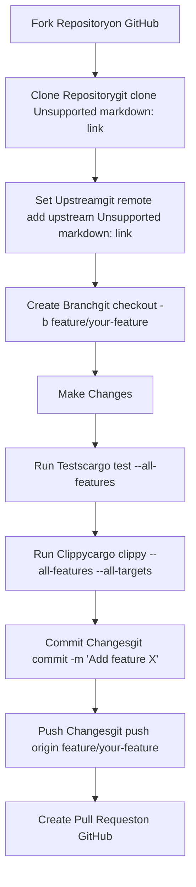
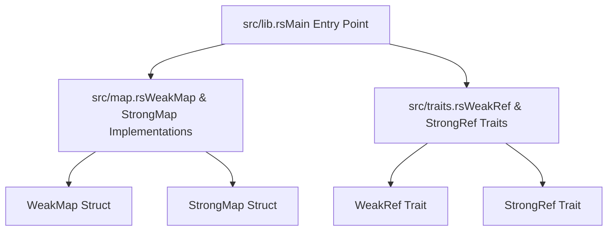
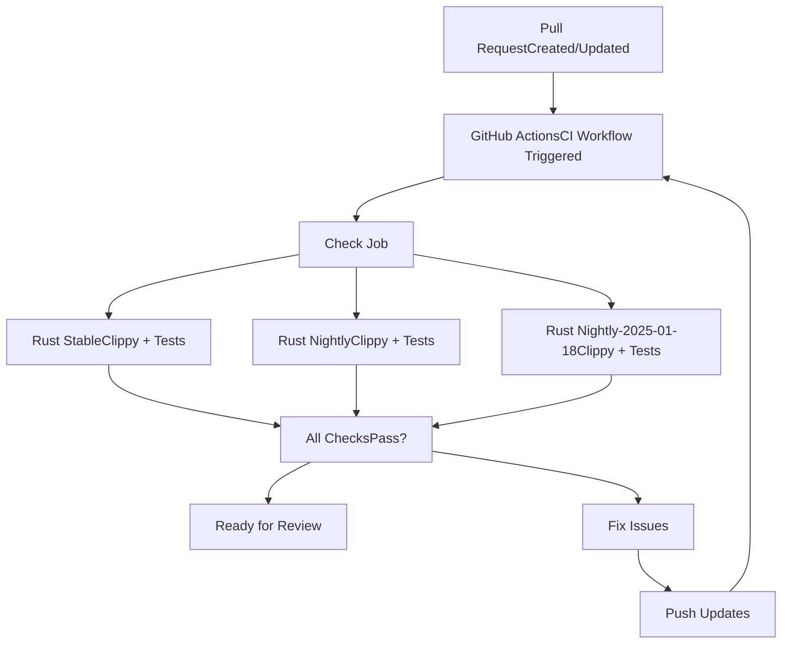
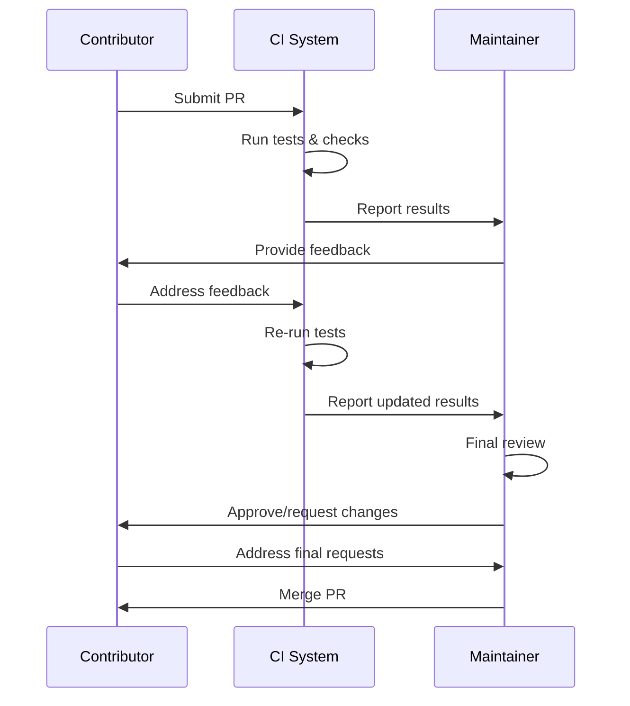

# Contributing Guide

> **Relevant source files**
> * [.github/workflows/ci.yml](https://github.com/Starry-OS/weak-map/blob/b19a081d/.github/workflows/ci.yml)
> * [.gitignore](https://github.com/Starry-OS/weak-map/blob/b19a081d/.gitignore)
> * [README.md](https://github.com/Starry-OS/weak-map/blob/b19a081d/README.md)

This document provides guidelines and instructions for contributing to the weak-map library. It covers the development workflow, code standards, CI process, and pull request procedures. For information on how to use the library, see the [Usage Guide](/Starry-OS/weak-map/3-usage-guide) or [Core Components](/Starry-OS/weak-map/2-core-components) for implementation details.

## Development Environment Setup

### Prerequisites

To contribute to weak-map, you'll need:

* Rust toolchain (stable, though the project is tested on nightly as well)
* Cargo (Rust's package manager)
* Git

### Getting Started



Sources: [.github/workflows/ci.yml(L1 - L32)&emsp;](https://github.com/Starry-OS/weak-map/blob/b19a081d/.github/workflows/ci.yml#L1-L32)

## Code Standards and Guidelines

The weak-map codebase follows standard Rust coding conventions. All contributions should:

1. Pass Clippy checks with no warnings (`cargo clippy --all-features --all-targets -- -Dwarnings`)
2. Include appropriate tests
3. Maintain or improve test coverage
4. Include documentation for public API items
5. Follow the existing code style

### Project Structure

When making changes, it's important to understand the project's structure:



Sources: [README.md(L1 - L7)&emsp;](https://github.com/Starry-OS/weak-map/blob/b19a081d/README.md#L1-L7)

## Testing Requirements

All contributions must include appropriate tests:

* **Unit Tests**: Test individual functions and methods
* **Integration Tests**: Test interactions between components
* **Edge Cases**: Include tests for boundary conditions

Run tests locally before submitting a PR:

```
cargo test --all-features
```

## CI Process

The weak-map repository uses GitHub Actions for continuous integration:



The CI process checks:

1. Clippy static analysis with warnings treated as errors
2. All tests passing across multiple Rust versions
3. All features enabled during testing

Sources: [.github/workflows/ci.yml(L1 - L32)&emsp;](https://github.com/Starry-OS/weak-map/blob/b19a081d/.github/workflows/ci.yml#L1-L32)

## Pull Request Guidelines

### PR Submission

When submitting a pull request:

1. Provide a clear, descriptive title
2. Include a detailed description of changes
3. Reference any related issues
4. Explain your testing approach
5. Highlight any breaking changes

### Review Process

The review process typically involves:

1. CI checks passing
2. Code review by maintainers
3. Addressing feedback
4. Final approval and merge



Sources: [.github/workflows/ci.yml(L1 - L32)&emsp;](https://github.com/Starry-OS/weak-map/blob/b19a081d/.github/workflows/ci.yml#L1-L32)

## Documentation

Documentation is a crucial part of the weak-map project:

* **Code Documentation**: All public APIs should have rustdoc comments
* **Examples**: Include examples for non-trivial functionality
* **Wiki Contributions**: Update relevant wiki pages when changing functionality

### Documentation Style

```javascript
/// A map containing weak references to values.
/// 
/// Values are automatically removed when the original reference is dropped.
/// 
/// # Examples
/// 
/// ```
/// use weak_map::WeakMap;
/// use std::rc::Rc;
/// 
/// let mut map = WeakMap::new();
/// let value = Rc::new("value");
/// 
/// map.insert("key", value.clone());
/// assert!(map.contains_key("key"));
/// 
/// drop(value);  // Drop the strong reference
/// assert!(!map.get("key").is_some());
/// ```
```

## Licensing

The weak-map project is dual-licensed under MIT and Apache 2.0 licenses. By contributing to this project, you agree that your contributions will be licensed under both licenses.

For details about the project's licenses, see the [License Information](/Starry-OS/weak-map/5.2-license-information) page.

## Technical Requirements Checklist

Before submitting your PR, ensure you've completed the following:

|Requirement|Description|Status|
| --- | --- | --- |
|Clippy Checks|cargo clippy --all-features --all-targetspasses with no warnings|☐|
|Tests|All existing tests pass and new functionality has tests|☐|
|Documentation|Public APIs are documented with rustdoc comments|☐|
|CI Passing|All CI checks pass on GitHub|☐|
|Code Style|Code follows existing style and conventions|☐|
|Breaking Changes|Breaking changes are clearly documented|☐|

Sources: [.github/workflows/ci.yml(L1 - L32)&emsp;](https://github.com/Starry-OS/weak-map/blob/b19a081d/.github/workflows/ci.yml#L1-L32)