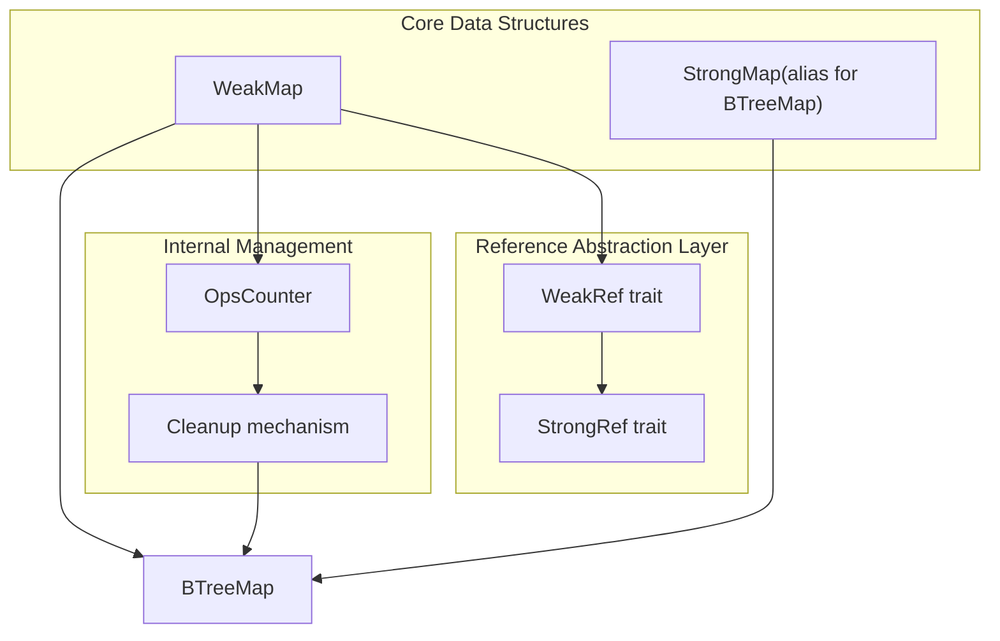
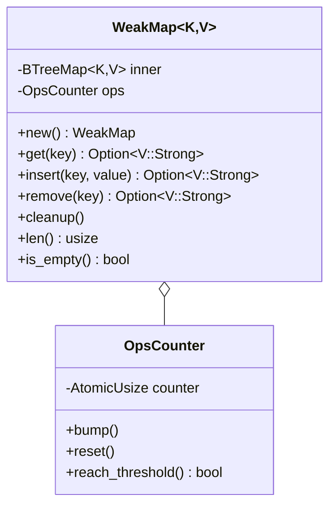
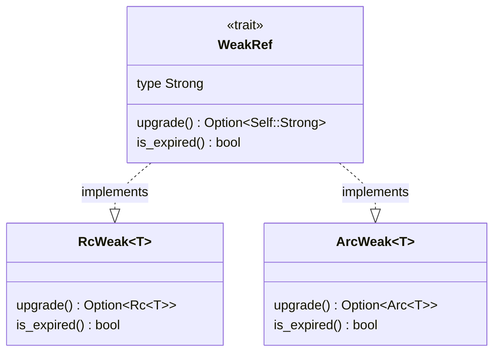
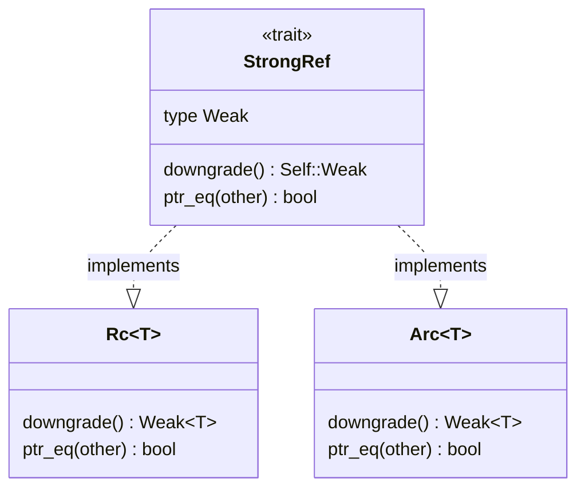
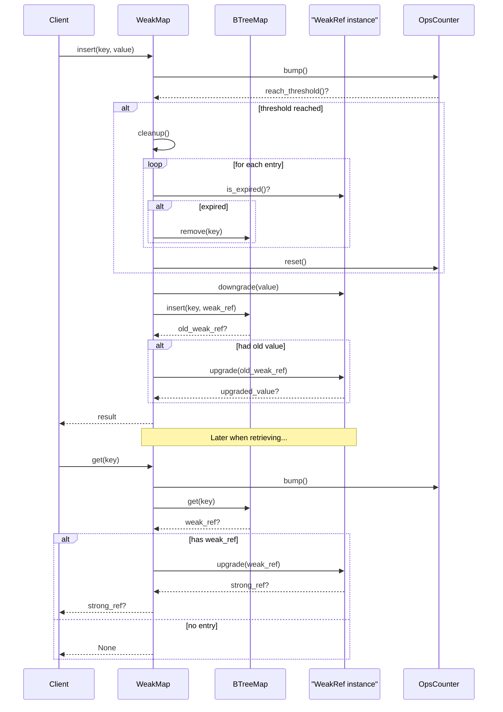
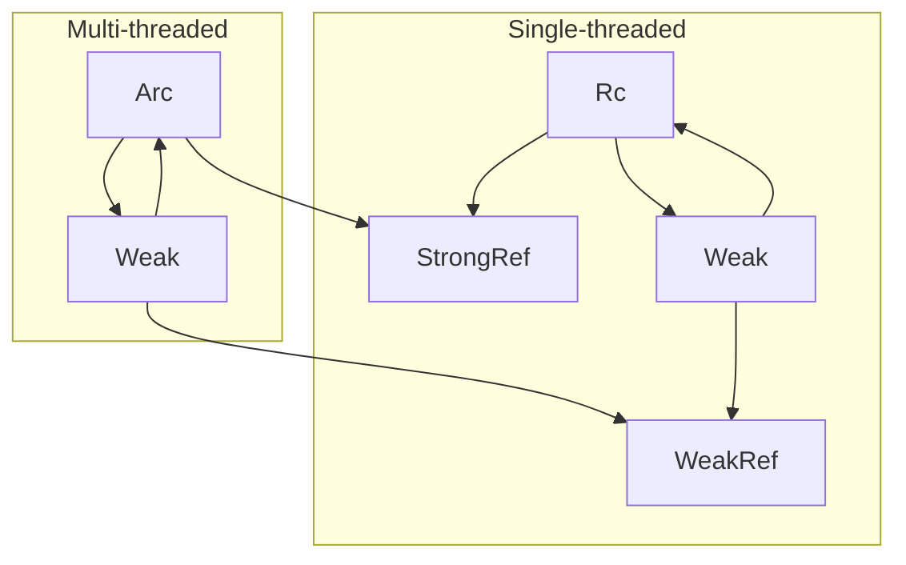

# Core Components

> **Relevant source files**
> * [src/lib.rs](https://github.com/Starry-OS/weak-map/blob/b19a081d/src/lib.rs)
> * [src/map.rs](https://github.com/Starry-OS/weak-map/blob/b19a081d/src/map.rs)
> * [src/traits.rs](https://github.com/Starry-OS/weak-map/blob/b19a081d/src/traits.rs)

This document provides an overview of the main components that make up the weak-map library and their relationships. It explains the architectural structure and key mechanisms that enable the library's functionality of maintaining maps with weak references.

For detailed implementation details of each component, see [WeakMap and StrongMap](/Starry-OS/weak-map/2.1-weakmap-and-strongmap) and [Reference Traits](/Starry-OS/weak-map/2.2-reference-traits). For usage examples, refer to the [Usage Guide](/Starry-OS/weak-map/3-usage-guide).

## System Architecture

The weak-map library is built around several core components that work together to provide a map data structure that automatically removes entries when referenced values are dropped.



Sources: [src/map.rs(L57 - L65)&emsp;](https://github.com/Starry-OS/weak-map/blob/b19a081d/src/map.rs#L57-L65) [src/traits.rs(L3 - L40)&emsp;](https://github.com/Starry-OS/weak-map/blob/b19a081d/src/traits.rs#L3-L40)

## Key Components

### 1. WeakMap

`WeakMap<K, V>` is the primary data structure provided by this library. It wraps a `BTreeMap` and stores weak references to values, automatically cleaning up entries when the referenced values are dropped.

Key characteristics:

* Generic over key type `K` and weak reference type `V`
* `V` must implement the `WeakRef` trait
* Contains an operations counter to trigger periodic cleanup
* Provides methods to insert, retrieve, and remove entries that handle weak reference conversion



Sources: [src/map.rs(L62 - L307)&emsp;](https://github.com/Starry-OS/weak-map/blob/b19a081d/src/map.rs#L62-L307) [src/map.rs(L13 - L55)&emsp;](https://github.com/Starry-OS/weak-map/blob/b19a081d/src/map.rs#L13-L55)

### 2. StrongMap

`StrongMap<K, V>` is a simple type alias for the standard `BTreeMap<K, V>`. It serves as a counterpart to `WeakMap` for situations where strong references are needed.

```
pub type StrongMap<K, V> = btree_map::BTreeMap<K, V>;
```

Sources: [src/map.rs(L57 - L58)&emsp;](https://github.com/Starry-OS/weak-map/blob/b19a081d/src/map.rs#L57-L58)

### 3. Reference Traits

The library defines two key traits that abstract over reference types:

#### WeakRef Trait

Defines the interface for weak references:



#### StrongRef Trait

Defines the interface for strong references:



Sources: [src/traits.rs(L3 - L19)&emsp;](https://github.com/Starry-OS/weak-map/blob/b19a081d/src/traits.rs#L3-L19) [src/traits.rs(L21 - L40)&emsp;](https://github.com/Starry-OS/weak-map/blob/b19a081d/src/traits.rs#L21-L40) [src/traits.rs(L42 - L88)&emsp;](https://github.com/Starry-OS/weak-map/blob/b19a081d/src/traits.rs#L42-L88)

### 4. Operations Counter and Cleanup Mechanism

The `OpsCounter` is an internal component that:

* Tracks the number of operations performed on a `WeakMap`
* Triggers cleanup after a threshold (1000 operations)
* Uses atomic operations for thread safety

The cleanup mechanism removes expired weak references from the map, preventing memory leaks and maintaining map efficiency.

Sources: [src/map.rs(L13 - L48)&emsp;](https://github.com/Starry-OS/weak-map/blob/b19a081d/src/map.rs#L13-L48) [src/map.rs(L158 - L169)&emsp;](https://github.com/Starry-OS/weak-map/blob/b19a081d/src/map.rs#L158-L169)

## Component Interactions

The core components interact to provide the `WeakMap` functionality:



Sources: [src/map.rs(L152 - L277)&emsp;](https://github.com/Starry-OS/weak-map/blob/b19a081d/src/map.rs#L152-L277) [src/traits.rs(L3 - L40)&emsp;](https://github.com/Starry-OS/weak-map/blob/b19a081d/src/traits.rs#L3-L40)

## Implementation Details

### WeakMap Implementation

The `WeakMap` is implemented using a `BTreeMap` with the following key mechanisms:

|Component|Purpose|Implementation|
| --- | --- | --- |
|innerfield|Stores the actual map data|BTreeMap<K, V>|
|opsfield|Tracks operations for cleanup|OpsCounter|
|cleanupmethod|Removes expired references|Callsis_expired()on each value|
|getmethod|Retrieves and upgrades references|Usesupgrade()fromWeakRef|
|insertmethod|Stores new weak references|Usesdowngrade()fromStrongRef|

Sources: [src/map.rs(L62 - L65)&emsp;](https://github.com/Starry-OS/weak-map/blob/b19a081d/src/map.rs#L62-L65) [src/map.rs(L158 - L169)&emsp;](https://github.com/Starry-OS/weak-map/blob/b19a081d/src/map.rs#L158-L169) [src/map.rs(L207 - L214)&emsp;](https://github.com/Starry-OS/weak-map/blob/b19a081d/src/map.rs#L207-L214) [src/map.rs(L258 - L263)&emsp;](https://github.com/Starry-OS/weak-map/blob/b19a081d/src/map.rs#L258-L263)

### Reference Trait Implementations

The library implements the reference traits for both `Rc`/`Weak` (for single-threaded use) and `Arc`/`Weak` (for multi-threaded use):



Sources: [src/traits.rs(L42 - L88)&emsp;](https://github.com/Starry-OS/weak-map/blob/b19a081d/src/traits.rs#L42-L88)

### Operations Counter

The operations counter uses atomic operations to ensure thread safety when tracking operations:

* Increments a counter with each operation
* Triggers cleanup when the threshold of 1000 operations is reached
* Resets after cleanup

Sources: [src/map.rs(L13 - L48)&emsp;](https://github.com/Starry-OS/weak-map/blob/b19a081d/src/map.rs#L13-L48) [src/map.rs(L16)&emsp;](https://github.com/Starry-OS/weak-map/blob/b19a081d/src/map.rs#L16-L16)

## Iterator Support

`WeakMap` provides several iterator types to access its contents:

|Iterator|Description|Returned By|
| --- | --- | --- |
|Iter|References to keys and upgraded values|iter()|
|Keys|References to just the keys|keys()|
|Values|Just the upgraded values|values()|
|IntoIter|Owned keys and upgraded values|into_iter()|
|IntoKeys|Owned keys|into_keys()|
|IntoValues|Just the upgraded values|into_values()|

Each iterator handles weak reference upgrading automatically, skipping expired values.

Sources: [src/map.rs(L382 - L623)&emsp;](https://github.com/Starry-OS/weak-map/blob/b19a081d/src/map.rs#L382-L623)