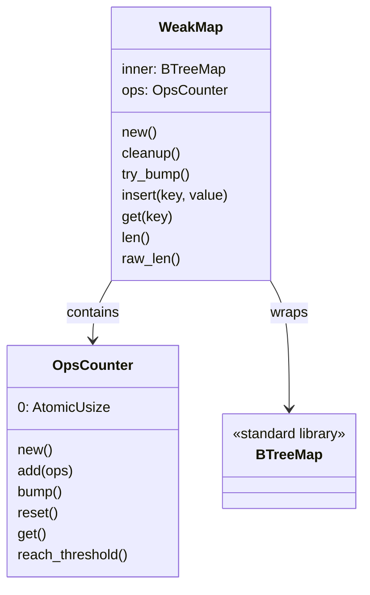
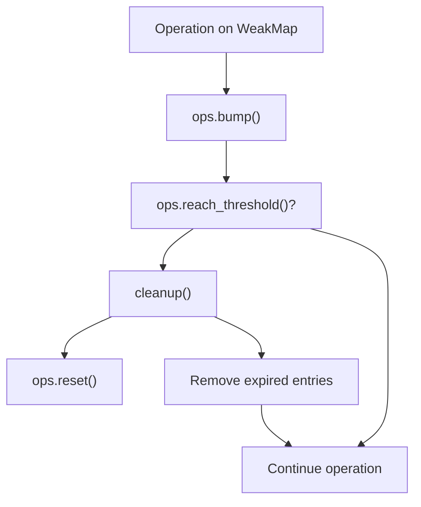
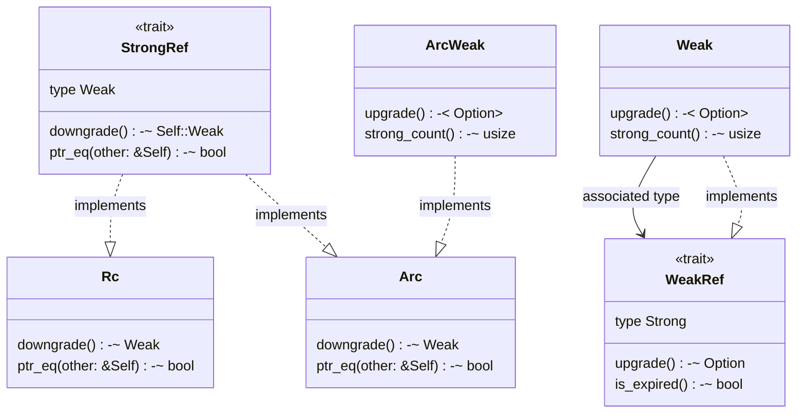
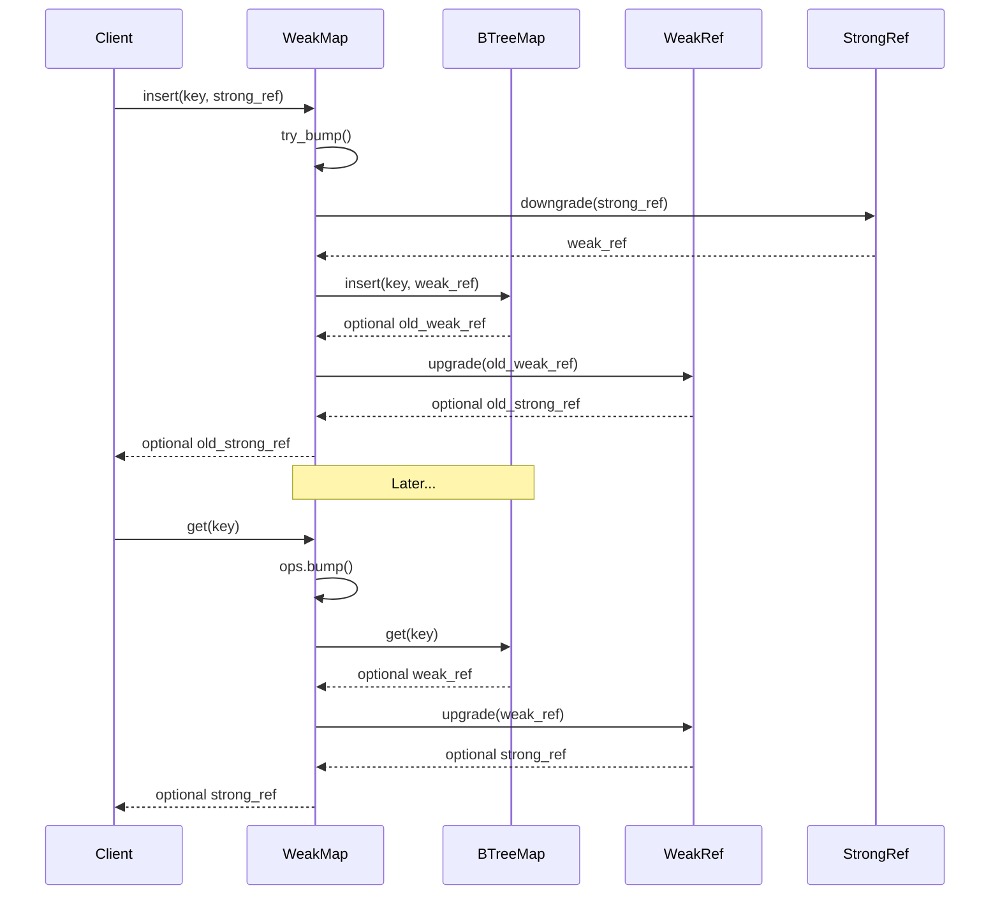
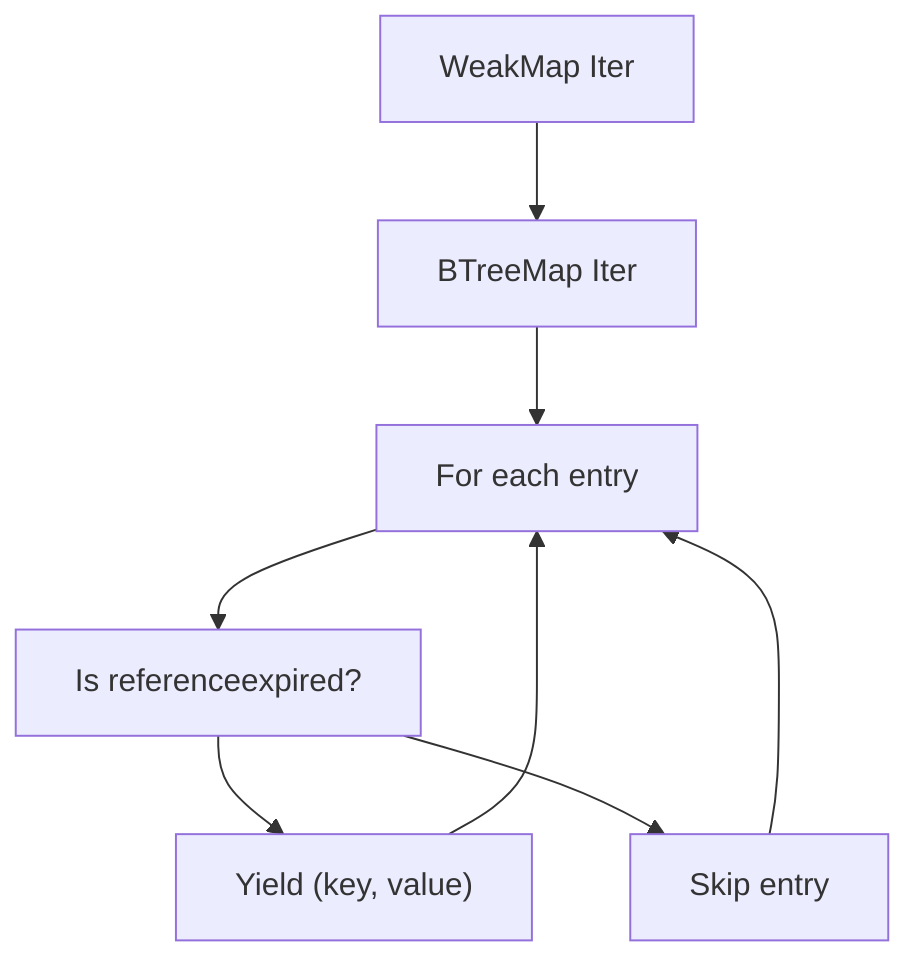
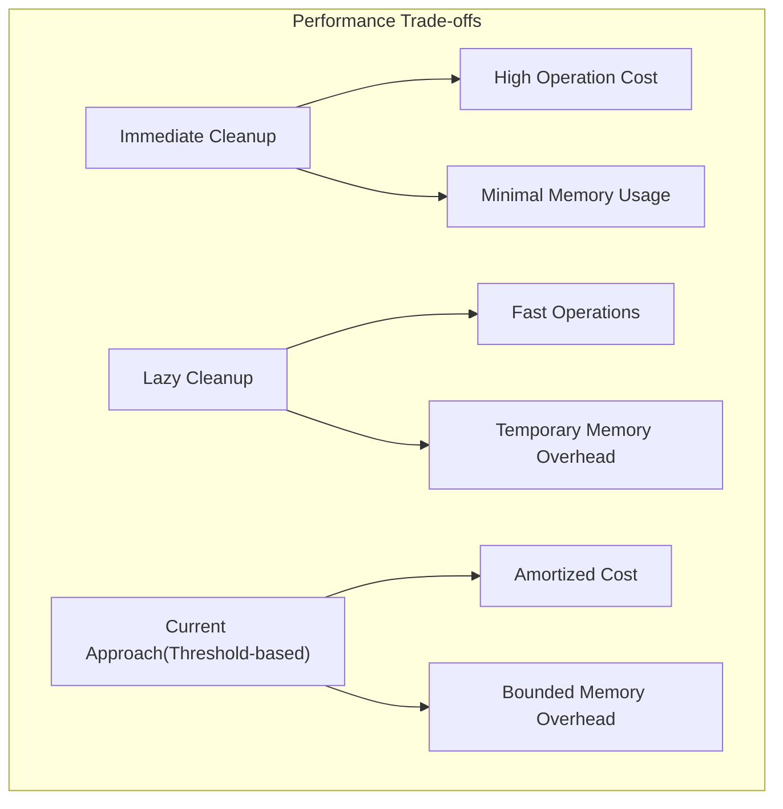
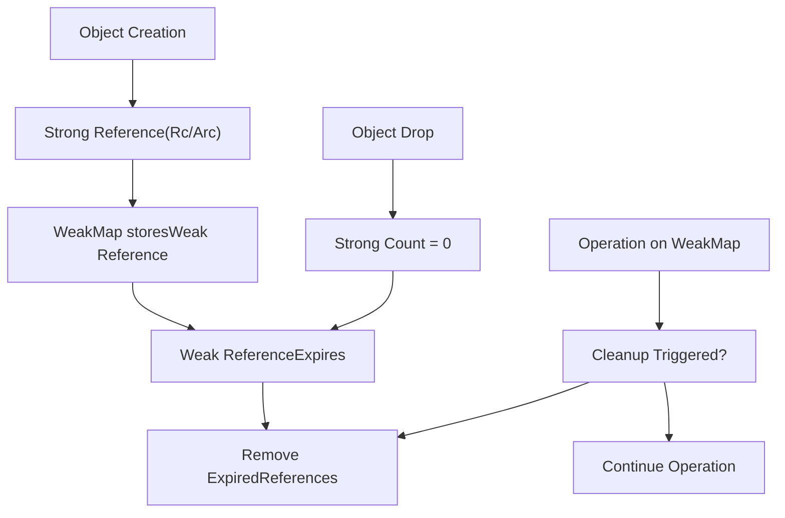

# Implementation Details

> **Relevant source files**
> * [src/map.rs](https://github.com/Starry-OS/weak-map/blob/b19a081d/src/map.rs)
> * [src/traits.rs](https://github.com/Starry-OS/weak-map/blob/b19a081d/src/traits.rs)

This document provides a deep dive into the internal implementation of the `weak-map` library. It covers the core mechanisms that enable automatic cleanup of expired references, the internal data structures, and how different components interact to provide efficient weak reference management. For information about usage patterns and API, see [Usage Guide](/Starry-OS/weak-map/3-usage-guide).

## Internal Structure

The `WeakMap` is implemented as a wrapper around Rust's standard `BTreeMap` with additional logic to handle weak references and their lifecycle management.

Sources: [src/map.rs(L11 - L65)&emsp;](https://github.com/Starry-OS/weak-map/blob/b19a081d/src/map.rs#L11-L65) [src/map.rs(L13 - L55)&emsp;](https://github.com/Starry-OS/weak-map/blob/b19a081d/src/map.rs#L13-L55)

The `WeakMap` structure has two main components:

* `inner`: A standard `BTreeMap<K, V>` that stores the actual key-value pairs
* `ops`: An `OpsCounter` that tracks operations to trigger cleanup at appropriate intervals

The `OpsCounter` is a simple wrapper around an atomic counter that helps determine when to perform cleanup operations.

## Cleanup Mechanism

One of the most important aspects of the `WeakMap` implementation is its automatic cleanup mechanism, which ensures that expired references are removed.

Sources: [src/map.rs(L157 - L169)&emsp;](https://github.com/Starry-OS/weak-map/blob/b19a081d/src/map.rs#L157-L169) [src/map.rs(L13 - L47)&emsp;](https://github.com/Starry-OS/weak-map/blob/b19a081d/src/map.rs#L13-L47)

The cleanup process:

1. Each operation increments the operation counter
2. When the counter reaches the threshold (1000 operations, defined as `OPS_THRESHOLD`), cleanup is triggered
3. The cleanup process resets the counter and removes all expired references from the map

This approach balances performance with memory usage:

* The map doesn't need to check every entry on every operation
* Cleanup is amortized over multiple operations
* Expired entries will eventually be removed without manual intervention

## Reference Management

The `weak-map` library relies on two core traits for reference management:

Sources: [src/traits.rs(L3 - L40)&emsp;](https://github.com/Starry-OS/weak-map/blob/b19a081d/src/traits.rs#L3-L40) [src/traits.rs(L42 - L88)&emsp;](https://github.com/Starry-OS/weak-map/blob/b19a081d/src/traits.rs#L42-L88)

The trait implementations enable the `WeakMap` to work with different types of weak references:

* `StrongRef` is implemented for `Rc<T>` and `Arc<T>`
* `WeakRef` is implemented for `Weak<T>` (from `Rc`) and `Weak<T>` (from `Arc`)

This abstraction allows the `WeakMap` to be agnostic about the specific reference type being used, as long as it conforms to the trait requirements.

## Operation Flow

When performing operations on a `WeakMap`, there's a specific flow that handles the weak references correctly:

Sources: [src/map.rs(L203 - L214)&emsp;](https://github.com/Starry-OS/weak-map/blob/b19a081d/src/map.rs#L203-L214) [src/map.rs(L258 - L263)&emsp;](https://github.com/Starry-OS/weak-map/blob/b19a081d/src/map.rs#L258-L263)

Key points in the operation flow:

1. For insertion (`insert`):

* The strong reference is downgraded to a weak reference
* The weak reference is stored in the map
* If an existing reference is replaced, it's upgraded before being returned
2. For retrieval (`get`):

* The weak reference is retrieved from the map
* The weak reference is upgraded to a strong reference if still valid
* If the reference has expired, `None` is returned

## Iterator Implementation

Iterators in `WeakMap` are designed to filter out expired references automatically:

Sources: [src/map.rs(L382 - L430)&emsp;](https://github.com/Starry-OS/weak-map/blob/b19a081d/src/map.rs#L382-L430) [src/map.rs(L445 - L485)&emsp;](https://github.com/Starry-OS/weak-map/blob/b19a081d/src/map.rs#L445-L485) [src/map.rs(L488 - L528)&emsp;](https://github.com/Starry-OS/weak-map/blob/b19a081d/src/map.rs#L488-L528)

The library provides several iterator types:

|Iterator Type|Description|Returns|
| --- | --- | --- |
|Iter|References to entries|(&'a K, V::Strong)|
|Keys|References to keys|&'a K|
|Values|Values as strong references|V::Strong|
|IntoIter|Owned entries|(K, V::Strong)|
|IntoKeys|Owned keys|K|
|IntoValues|Owned values as strong references|V::Strong|

Each iterator automatically filters out entries with expired references by attempting to upgrade the weak reference. If the upgrade fails, the entry is skipped.

## Performance Considerations

The performance of `WeakMap` is influenced by several implementation choices:

1. **Cleanup threshold**: The cleanup process only runs after a certain number of operations (`OPS_THRESHOLD = 1000`), which amortizes the cost of cleanup.
2. **BTreeMap as the underlying data structure**: The choice of `BTreeMap` provides O(log n) complexity for most operations.
3. **Lazy iteration**: Iterators only yield valid entries, but they must attempt to upgrade each weak reference, which can be expensive.

Sources: [src/map.rs(L15 - L16)&emsp;](https://github.com/Starry-OS/weak-map/blob/b19a081d/src/map.rs#L15-L16) [src/map.rs(L157 - L169)&emsp;](https://github.com/Starry-OS/weak-map/blob/b19a081d/src/map.rs#L157-L169) [src/map.rs(L625 - L660)&emsp;](https://github.com/Starry-OS/weak-map/blob/b19a081d/src/map.rs#L625-L660)

The current implementation strikes a balance between operation speed and memory usage:

* Operations are fast most of the time (no cleanup)
* Memory overhead is bounded (cleanup happens periodically)
* The cost of cleanup is amortized over multiple operations

The test cases in the codebase demonstrate this behavior, showing that after many operations the map will clean up expired references automatically.

## Memory Management

The core memory management feature of `WeakMap` is its ability to automatically handle expired references.

Sources: [src/map.rs(L157 - L161)&emsp;](https://github.com/Starry-OS/weak-map/blob/b19a081d/src/map.rs#L157-L161) [src/traits.rs(L33 - L39)&emsp;](https://github.com/Starry-OS/weak-map/blob/b19a081d/src/traits.rs#L33-L39) [src/map.rs(L632 - L660)&emsp;](https://github.com/Starry-OS/weak-map/blob/b19a081d/src/map.rs#L632-L660)

When an object is dropped elsewhere in the program:

1. Its strong count reaches zero
2. Any weak references to it become expired
3. The next time the cleanup mechanism runs in `WeakMap`, these expired references will be removed

This ensures that `WeakMap` doesn't hold onto memory for objects that are no longer needed elsewhere in the program.