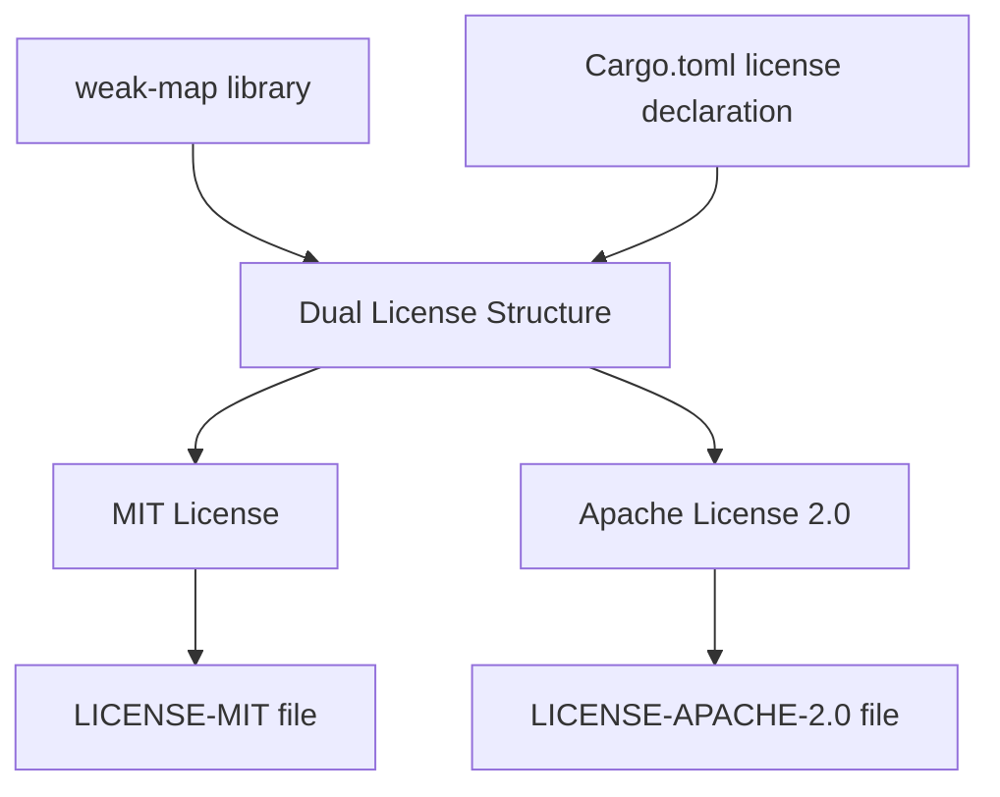
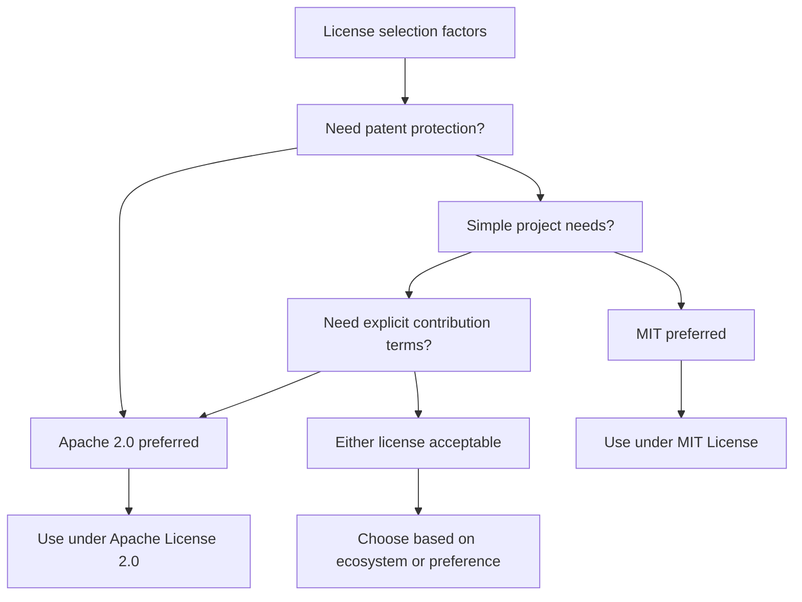

# License Information

> **Relevant source files**
> * [Cargo.toml](https://github.com/Starry-OS/weak-map/blob/b19a081d/Cargo.toml)
> * [LICENSE-APACHE-2.0](https://github.com/Starry-OS/weak-map/blob/b19a081d/LICENSE-APACHE-2.0)
> * [LICENSE-MIT](https://github.com/Starry-OS/weak-map/blob/b19a081d/LICENSE-MIT)

This document details the licensing structure of the weak-map library, explaining the dual-licensing approach that allows users to choose between two open-source licenses when using or modifying the codebase.

## Dual-Licensing Model

The weak-map library is dual-licensed, allowing users to choose between the MIT License and the Apache License 2.0. This is specified in the Cargo.toml configuration file:

```
license = "MIT OR Apache-2.0"
```

The "OR" operator indicates that users may select either license according to their preferences and requirements, without needing to comply with both.

Sources: [Cargo.toml(L7)&emsp;](https://github.com/Starry-OS/weak-map/blob/b19a081d/Cargo.toml#L7-L7)

## License Comparison

The following table compares key aspects of both licenses:

|Feature|MIT License|Apache License 2.0|
| --- | --- | --- |
|License length|Brief (22 lines)|Comprehensive (200+ lines)|
|Patent protection|No explicit patent grant|Explicit patent grant (Section 3)|
|Trademark provisions|None|Explicit restrictions (Section 6)|
|Modification notices|Requires copyright notice preservation|Requires indicating significant changes (Section 4)|
|Contribution terms|Not specified|Explicitly addressed (Section 5)|
|Warranty disclaimer|Simple disclaimer|Detailed disclaimer (Section 7)|
|Liability limitation|Simple limitation|Detailed limitation (Section 8)|

Sources: [LICENSE-MIT](https://github.com/Starry-OS/weak-map/blob/b19a081d/LICENSE-MIT) [LICENSE-APACHE-2.0](https://github.com/Starry-OS/weak-map/blob/b19a081d/LICENSE-APACHE-2.0)

## License Files

The repository contains two license files:

1. **LICENSE-MIT**: Contains the full text of the MIT License, dated 2025 with copyright attributed to Asakura Mizu.
2. **LICENSE-APACHE-2.0**: Contains the full text of the Apache License 2.0, with copyright attributed to Asakura Mizu.

These files serve as the authoritative license texts for the project.

Sources: [LICENSE-MIT](https://github.com/Starry-OS/weak-map/blob/b19a081d/LICENSE-MIT) [LICENSE-APACHE-2.0](https://github.com/Starry-OS/weak-map/blob/b19a081d/LICENSE-APACHE-2.0)

## Dual-Licensing Structure



Sources: [Cargo.toml(L7)&emsp;](https://github.com/Starry-OS/weak-map/blob/b19a081d/Cargo.toml#L7-L7) [LICENSE-MIT](https://github.com/Starry-OS/weak-map/blob/b19a081d/LICENSE-MIT) [LICENSE-APACHE-2.0](https://github.com/Starry-OS/weak-map/blob/b19a081d/LICENSE-APACHE-2.0)

## Compliance Requirements

### MIT License Compliance

To comply with the MIT License when using weak-map:

1. Include the following copyright notice: "Copyright (c) 2025 Asakura Mizu"
2. Include the complete MIT license text from the LICENSE-MIT file
3. Include both items in all copies or substantial portions of the software

### Apache License 2.0 Compliance

To comply with the Apache License 2.0 when using weak-map:

1. Include the copyright notice: "Copyright 2025 Asakura Mizu"
2. Include a complete copy of the Apache License 2.0
3. For modified files, add notices stating that you changed the files
4. Retain all copyright, patent, trademark, and attribution notices
5. If the original contains a NOTICE file, include readable copy of attribution notices

Sources: [LICENSE-MIT(L3 - L21)&emsp;](https://github.com/Starry-OS/weak-map/blob/b19a081d/LICENSE-MIT#L3-L21) [LICENSE-APACHE-2.0(L89 - L201)&emsp;](https://github.com/Starry-OS/weak-map/blob/b19a081d/LICENSE-APACHE-2.0#L89-L201)

## License Selection Decision Flow

The following diagram provides guidance on selecting the appropriate license for your use case:



Sources: [LICENSE-MIT](https://github.com/Starry-OS/weak-map/blob/b19a081d/LICENSE-MIT) [LICENSE-APACHE-2.0](https://github.com/Starry-OS/weak-map/blob/b19a081d/LICENSE-APACHE-2.0) [Cargo.toml(L7)&emsp;](https://github.com/Starry-OS/weak-map/blob/b19a081d/Cargo.toml#L7-L7)

## Implications for Contributors

Contributors to the weak-map project should understand:

1. Their contributions will be available under both licenses
2. By submitting a contribution, they agree their work may be distributed under either license
3. The project maintainers can relicense their contributions as needed within these two options
4. Any separate agreements with the project maintainers take precedence

This follows standard practice for dual-licensed Rust projects, ensuring maximum flexibility for users of the library.

Sources: [LICENSE-MIT](https://github.com/Starry-OS/weak-map/blob/b19a081d/LICENSE-MIT) [LICENSE-APACHE-2.0](https://github.com/Starry-OS/weak-map/blob/b19a081d/LICENSE-APACHE-2.0) [Cargo.toml(L7)&emsp;](https://github.com/Starry-OS/weak-map/blob/b19a081d/Cargo.toml#L7-L7)

## License Coverage

The dual-licensing covers all components of the weak-map library, including:

1. The core implementation files in `src/`
2. Documentation and examples
3. Build configurations and metadata

All these components can be used, modified, and distributed according to either license at the user's discretion.

Sources: [Cargo.toml(L7)&emsp;](https://github.com/Starry-OS/weak-map/blob/b19a081d/Cargo.toml#L7-L7)

## Project Metadata License Information

The licensing information is also reflected in the project metadata, which is important for users who install the library via Cargo. The specification in Cargo.toml ensures that the licensing information is properly included in the package registry (crates.io) and documentation (docs.rs).

```
[package]
name = "weak-map"
version = "0.1.0"
edition = "2024"
authors = ["Asakura Mizu <asakuramizu111@gmail.com>"]
description = "BTreeMap with weak references"
license = "MIT OR Apache-2.0"
repository = "https://github.com/Starry-OS/weak-map"
documentation = "https://docs.rs/weak-map"
```

This metadata ensures transparency about the licensing terms and helps users make informed decisions about incorporating the library into their projects.

Sources: [Cargo.toml(L1 - L11)&emsp;](https://github.com/Starry-OS/weak-map/blob/b19a081d/Cargo.toml#L1-L11)