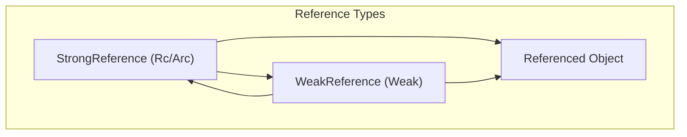
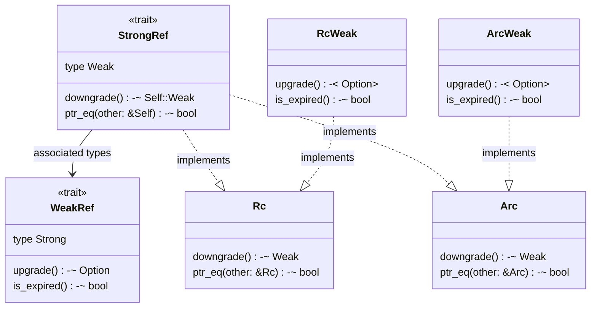
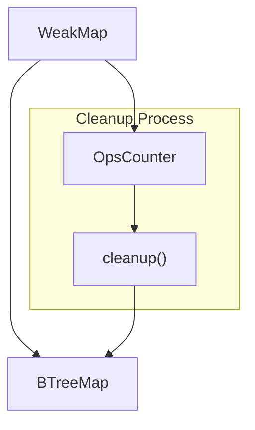
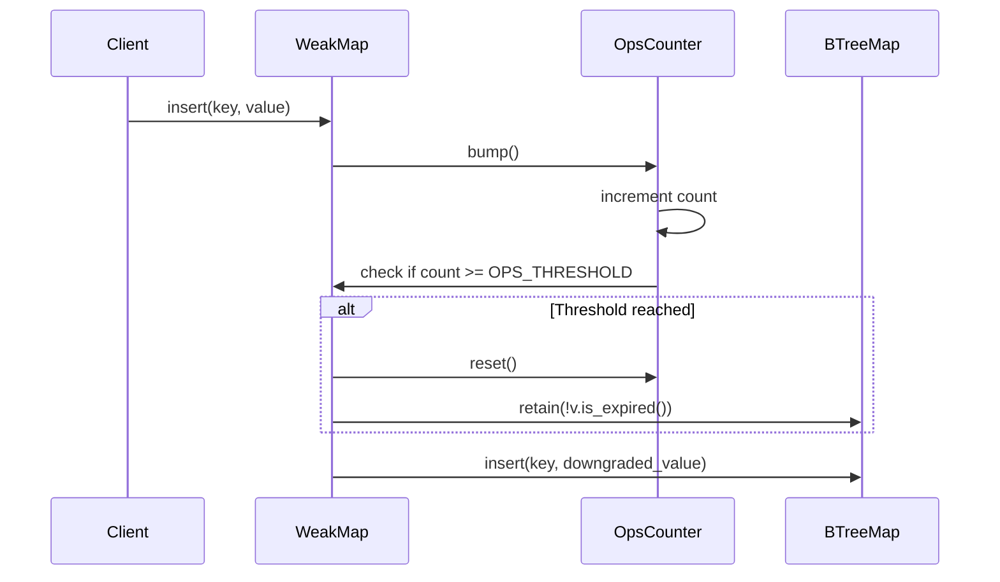
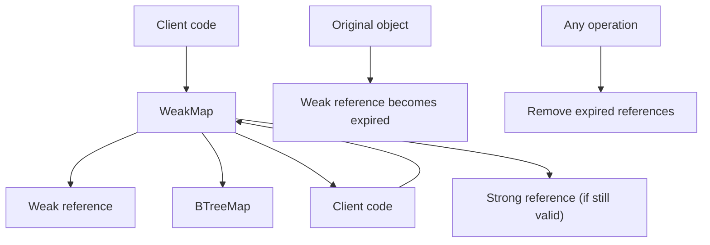
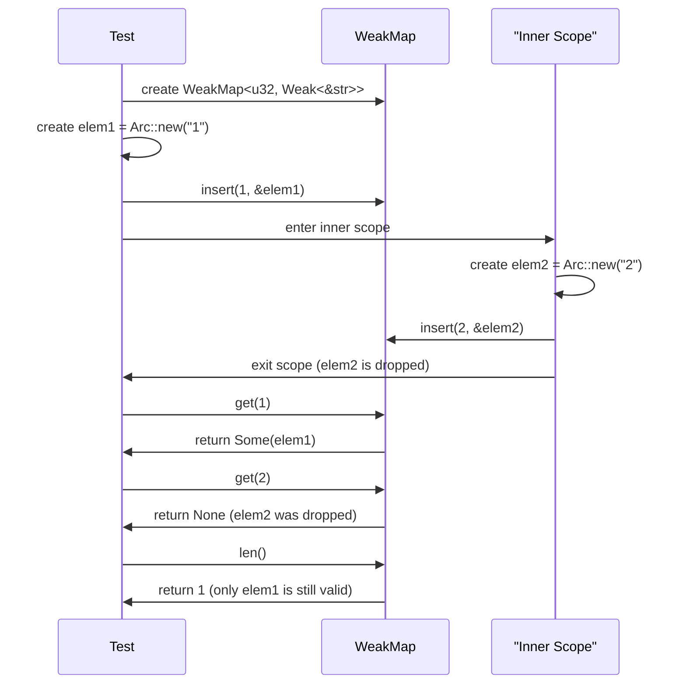

# Memory Management

> **Relevant source files**
> * [src/map.rs](https://github.com/Starry-OS/weak-map/blob/b19a081d/src/map.rs)
> * [src/traits.rs](https://github.com/Starry-OS/weak-map/blob/b19a081d/src/traits.rs)

## Purpose and Scope

This document explains how memory is managed in the weak-map library, focusing on weak references and the automatic cleanup process. It details how the `WeakMap` data structure prevents memory leaks while allowing values to be deallocated when they're no longer needed elsewhere.

For information about the core components and API of the `WeakMap` and `StrongMap` implementations, see [WeakMap and StrongMap](/Starry-OS/weak-map/2.1-weakmap-and-strongmap). For details about the reference traits, see [Reference Traits](/Starry-OS/weak-map/2.2-reference-traits).

## Weak vs Strong References

The weak-map library is built around the concept of weak references, which are references that don't prevent the referenced object from being deallocated.

Sources: [src/traits.rs(L3 - L40)&emsp;](https://github.com/Starry-OS/weak-map/blob/b19a081d/src/traits.rs#L3-L40)

Key characteristics:

* **Strong references** (`Rc<T>`, `Arc<T>`) increase the reference count and prevent deallocating the object
* **Weak references** (`Weak<T>`) don't affect the reference count used for deallocation decisions
* When all strong references are dropped, the object is deallocated, even if weak references still exist
* Weak references can be "upgraded" to strong references, but this will fail if the object has been deallocated

## Reference Management Architecture

The library provides traits that abstract over different reference types:

Sources: [src/traits.rs(L3 - L88)&emsp;](https://github.com/Starry-OS/weak-map/blob/b19a081d/src/traits.rs#L3-L88)

This architecture allows the `WeakMap` to work with different types of references, making it flexible for various use cases:

* Single-threaded applications can use `Rc`/`Weak` references
* Multi-threaded applications can use `Arc`/`Weak` references

## Automatic Cleanup Mechanism

A key feature of `WeakMap` is its automatic cleanup of expired weak references:

Sources: [src/map.rs(L13 - L47)&emsp;](https://github.com/Starry-OS/weak-map/blob/b19a081d/src/map.rs#L13-L47) [src/map.rs(L158 - L169)&emsp;](https://github.com/Starry-OS/weak-map/blob/b19a081d/src/map.rs#L158-L169)

### Operations Counter

The operations counter tracks the number of operations performed on the map:

|Component|Purpose|Implementation|
| --- | --- | --- |
|OpsCounter|Tracks operations on the map|Uses an atomic counter (AtomicUsize)|
|OPS_THRESHOLD|Determines when cleanup occurs|Constant set to 1000 operations|
|try_bump()|Increments counter and checks threshold|Called on mutations like insert/remove|
|cleanup()|Removes expired entries|Retains only non-expired entries|

Sources: [src/map.rs(L13 - L47)&emsp;](https://github.com/Starry-OS/weak-map/blob/b19a081d/src/map.rs#L13-L47)

The operations counter uses atomic operations to ensure thread safety. Each mutation operation (insert, remove) increments the counter, and when it reaches the threshold (1000 operations), the cleanup process is triggered.

Sources: [src/map.rs(L164 - L169)&emsp;](https://github.com/Starry-OS/weak-map/blob/b19a081d/src/map.rs#L164-L169) [src/map.rs(L258 - L263)&emsp;](https://github.com/Starry-OS/weak-map/blob/b19a081d/src/map.rs#L258-L263)

## Reference Lifecycle in WeakMap

The lifecycle of references in the `WeakMap` follows this pattern:

Sources: [src/map.rs(L207 - L214)&emsp;](https://github.com/Starry-OS/weak-map/blob/b19a081d/src/map.rs#L207-L214) [src/map.rs(L258 - L263)&emsp;](https://github.com/Starry-OS/weak-map/blob/b19a081d/src/map.rs#L258-L263)

### Key Stages:

1. **Storage Phase**:

* The client provides a key and a strong reference (`&V::Strong`)
* `WeakMap` downgrades the strong reference to a weak reference
* The key and weak reference are stored in the underlying `BTreeMap`
2. **Retrieval Phase**:

* The client requests a value by key
* `WeakMap` retrieves the weak reference from the `BTreeMap`
* It attempts to upgrade the weak reference to a strong reference
* If successful (object still exists), it returns the strong reference
* If unsuccessful (object has been deallocated), it returns `None`
3. **Cleanup Phase**:

* After a threshold number of operations, cleanup is triggered
* All expired weak references are removed from the map
* The operations counter is reset

Sources: [src/map.rs(L158 - L161)&emsp;](https://github.com/Starry-OS/weak-map/blob/b19a081d/src/map.rs#L158-L161)

## Memory Management in Practice

The following test demonstrates how memory is automatically managed:

Sources: [src/map.rs(L632 - L646)&emsp;](https://github.com/Starry-OS/weak-map/blob/b19a081d/src/map.rs#L632-L646)

In this test:

1. Two values are inserted into the `WeakMap`
2. The second value (`elem2`) goes out of scope and is dropped
3. When retrieving the values, only the first one is still available
4. The `len()` method accurately reports only one valid element, even though there are two entries in the underlying map

## Performance Considerations

The automatic cleanup mechanism balances memory usage with performance:

|Consideration|Implementation|Trade-off|
| --- | --- | --- |
|Delayed cleanup|Cleanup occurs afterOPS_THRESHOLDoperations|Amortizes cleanup cost across operations|
|Lazy iteration|Iterators skip expired references|Avoids unnecessary memory allocations|
|On-demand length|len()counts only valid references|More expensive than raw_len() but accurate|
|Targeted cleanup|retain()function used to filter|More efficient than rebuilding the map|

Sources: [src/map.rs(L158 - L161)&emsp;](https://github.com/Starry-OS/weak-map/blob/b19a081d/src/map.rs#L158-L161) [src/map.rs(L172 - L179)&emsp;](https://github.com/Starry-OS/weak-map/blob/b19a081d/src/map.rs#L172-L179)

For high-performance scenarios where cleanup frequency needs to be tuned, the `OPS_THRESHOLD` constant (set to 1000) determines how often the cleanup process runs. This value represents a balance between memory usage (keeping expired references around) and CPU usage (cleaning up frequently).

For more in-depth performance considerations, see [Performance Considerations](/Starry-OS/weak-map/4.2-performance-considerations).