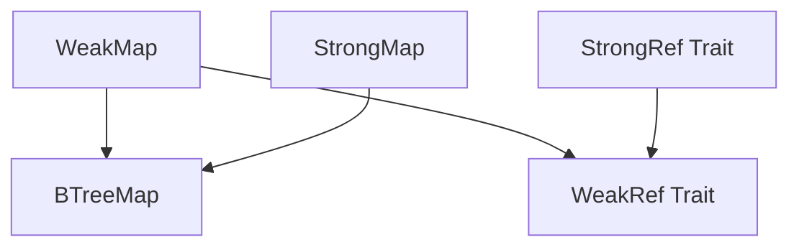
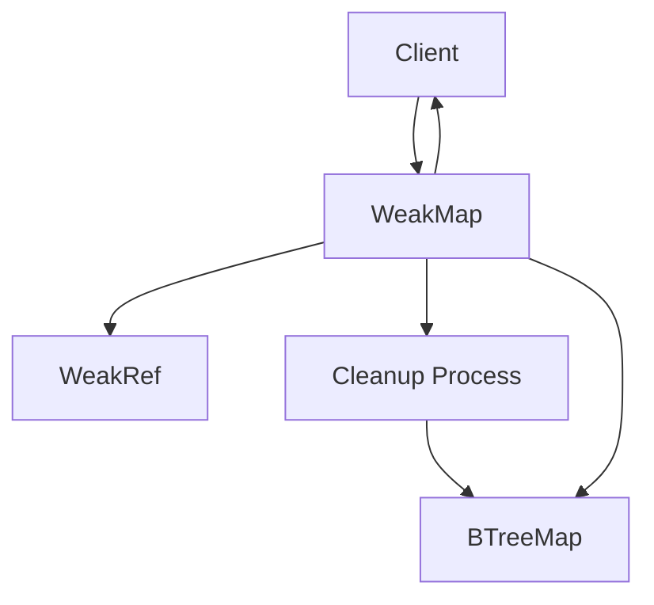
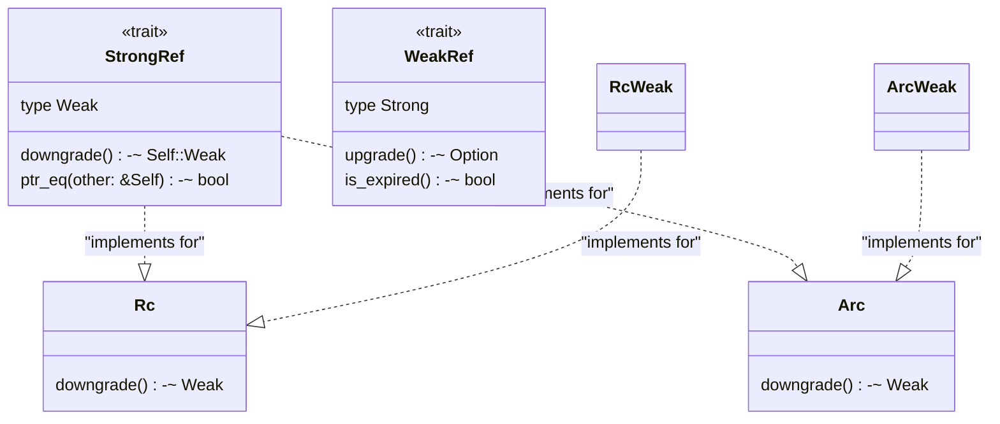
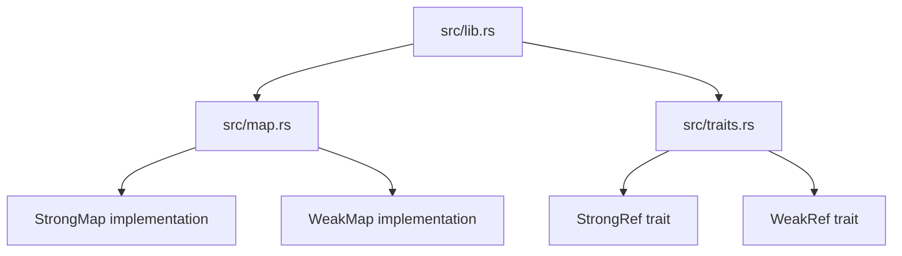

# Overview

> **Relevant source files**
> * [Cargo.toml](https://github.com/Starry-OS/weak-map/blob/b19a081d/Cargo.toml)
> * [README.md](https://github.com/Starry-OS/weak-map/blob/b19a081d/README.md)
> * [src/lib.rs](https://github.com/Starry-OS/weak-map/blob/b19a081d/src/lib.rs)

This document provides an introduction to the weak-map repository, a Rust library that implements a specialized B-Tree map data structure capable of storing weak references to values. These entries are automatically removed when the referenced values are dropped, preventing memory leaks and dangling references.

For detailed information about specific components, see [Core Components](/Starry-OS/weak-map/2-core-components), [WeakMap and StrongMap](/Starry-OS/weak-map/2.1-weakmap-and-strongmap), and [Reference Traits](/Starry-OS/weak-map/2.2-reference-traits). For practical applications, refer to [Usage Guide](/Starry-OS/weak-map/3-usage-guide).

Sources: [README.md(L1 - L7)&emsp;](https://github.com/Starry-OS/weak-map/blob/b19a081d/README.md#L1-L7) [src/lib.rs(L1 - L3)&emsp;](https://github.com/Starry-OS/weak-map/blob/b19a081d/src/lib.rs#L1-L3)

## What is weak-map?

The weak-map library offers a Rust implementation of `WeakMap`, which wraps the standard `BTreeMap` to store weak references to values rather than the values themselves. This approach enables memory-efficient collections where entries are automatically removed when the referenced values are dropped elsewhere in the program.

Key characteristics:

* No standard library dependency (works in `no_std` environments)
* Support for both single-threaded (`Rc`) and thread-safe (`Arc`) reference counting
* Similar to the [weak-table](https://github.com/Starry-OS/weak-map/blob/b19a081d/weak-table) library, but uses `BTreeMap` as its underlying implementation

Sources: [README.md(L1 - L7)&emsp;](https://github.com/Starry-OS/weak-map/blob/b19a081d/README.md#L1-L7) [src/lib.rs(L1 - L6)&emsp;](https://github.com/Starry-OS/weak-map/blob/b19a081d/src/lib.rs#L1-L6) [Cargo.toml(L2 - L11)&emsp;](https://github.com/Starry-OS/weak-map/blob/b19a081d/Cargo.toml#L2-L11)

## Core Components

The library consists of four main components defined in the `src/map.rs` and `src/traits.rs` files and exposed through `src/lib.rs`:

1. **WeakMap**: A map that stores weak references to values, automatically cleaning up entries when values are dropped
2. **StrongMap**: A simpler wrapper around `BTreeMap` for storing strong references
3. **WeakRef**: Trait defining the interface for weak reference types
4. **StrongRef**: Trait defining the interface for strong reference types

### Component Architecture

Sources: [src/lib.rs(L9 - L13)&emsp;](https://github.com/Starry-OS/weak-map/blob/b19a081d/src/lib.rs#L9-L13)

## Working Mechanism

The `WeakMap` data structure operates through a reference conversion process:

1. **Insertion**: When a value is inserted, it's first converted to a weak reference using the `downgrade` method from the `StrongRef` trait
2. **Storage**: The weak reference is stored in the underlying `BTreeMap`
3. **Retrieval**: When retrieving a value, the weak reference is obtained from the `BTreeMap`
4. **Upgrade Attempt**: The system attempts to upgrade the weak reference to a strong reference using the `upgrade` method from the `WeakRef` trait
5. **Result**: If the original value has been dropped, the upgrade fails and returns `None`
6. **Cleanup**: Periodically, after a certain number of operations (defined by `OPS_THRESHOLD`), the `WeakMap` removes expired references

### Operation Flow

Sources: [src/map.rs](https://github.com/Starry-OS/weak-map/blob/b19a081d/src/map.rs)

## Reference Management System

The library defines two core traits that abstract over reference-counted types:

1. **StrongRef**: Implemented for reference-counted types like `Rc` and `Arc`

* Provides `downgrade()` to convert a strong reference to a weak reference
* Provides `ptr_eq()` to check if two references point to the same value
2. **WeakRef**: Implemented for weak reference types like `Weak<T>` from both `Rc` and `Arc`

* Provides `upgrade()` to attempt converting a weak reference to a strong reference
* Provides `is_expired()` to check if the referenced value has been dropped

This trait-based design allows `WeakMap` to work with different reference-counted types flexibly.

### Reference Traits Implementation

Sources: [src/traits.rs](https://github.com/Starry-OS/weak-map/blob/b19a081d/src/traits.rs)

## Common Use Cases

The `WeakMap` is particularly useful in scenarios where:

* **Caching**: Storing objects that may be dropped elsewhere without creating memory leaks
* **Observer Pattern**: Implementing observers without creating reference cycles
* **Object Registry**: Maintaining a registry of objects without preventing them from being garbage collected
* **Graph Data Structures**: Working with graphs while avoiding circular reference memory leaks
* **Resource Management**: Tracking resources without extending their lifetime

Sources: [README.md](https://github.com/Starry-OS/weak-map/blob/b19a081d/README.md) [src/lib.rs(L1 - L3)&emsp;](https://github.com/Starry-OS/weak-map/blob/b19a081d/src/lib.rs#L1-L3)

## Project Structure

The weak-map library is organized into the following key files:

|File|Purpose|
| --- | --- |
|src/lib.rs|Entry point of the library, re-exporting the main components|
|src/map.rs|Contains the implementations ofWeakMapandStrongMap|
|src/traits.rs|Defines theStrongRefandWeakReftraits|

### Project Structure Diagram

Sources: [src/lib.rs(L7 - L13)&emsp;](https://github.com/Starry-OS/weak-map/blob/b19a081d/src/lib.rs#L7-L13)

## Related Documentation

For more detailed information about specific aspects:

* For implementation details of `WeakMap` and `StrongMap`, see [WeakMap and StrongMap](/Starry-OS/weak-map/2.1-weakmap-and-strongmap)
* For more information about reference traits, see [Reference Traits](/Starry-OS/weak-map/2.2-reference-traits)
* For usage examples, see [Basic Usage Examples](/Starry-OS/weak-map/3.1-basic-usage-examples)
* For performance considerations and memory management details, see [Implementation Details](/Starry-OS/weak-map/4-implementation-details)

Sources: [README.md](https://github.com/Starry-OS/weak-map/blob/b19a081d/README.md)