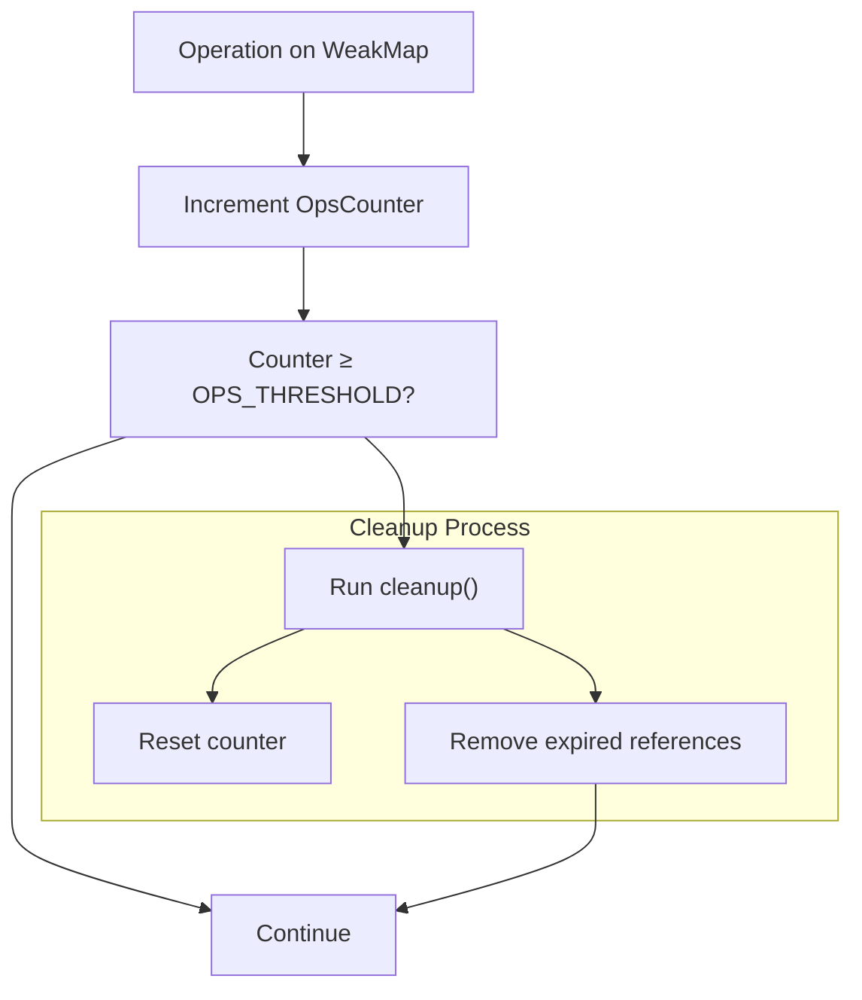
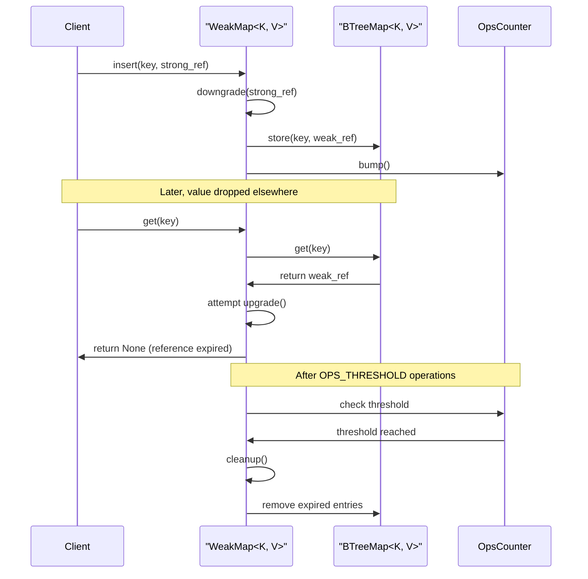
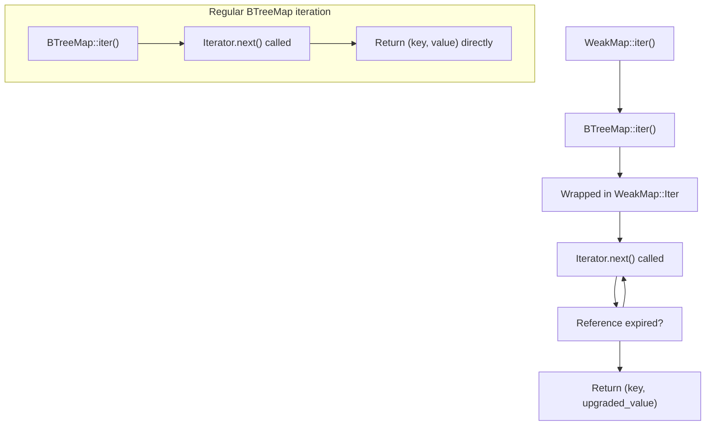
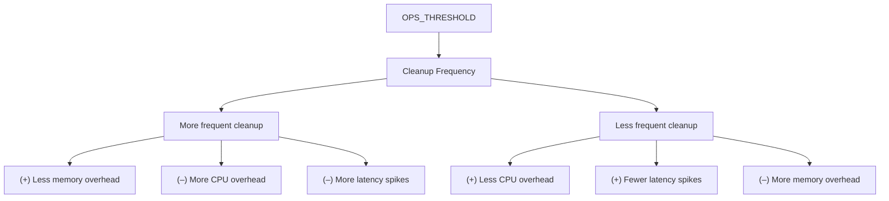

# Performance Considerations

> **Relevant source files**
> * [src/map.rs](https://github.com/Starry-OS/weak-map/blob/b19a081d/src/map.rs)

This document covers the performance characteristics of the `WeakMap` implementation, including its automatic cleanup mechanism, operation complexity, and memory management considerations. For information about memory management internals, see [Memory Management](/Starry-OS/weak-map/4.1-memory-management).

## Automatic Cleanup Mechanism

`WeakMap` implements an automatic garbage collection mechanism that periodically removes expired weak references from its internal storage. This prevents the map from accumulating dead entries indefinitely.

The cleanup process is controlled by an operations counter that triggers garbage collection after a set threshold:

* Each map operation increments a counter
* When counter reaches `OPS_THRESHOLD` (1000 operations), cleanup runs
* Cleanup removes all entries with expired weak references
* Counter resets after cleanup

Sources: [src/map.rs(L13 - L47)&emsp;](https://github.com/Starry-OS/weak-map/blob/b19a081d/src/map.rs#L13-L47) [src/map.rs(L158 - L169)&emsp;](https://github.com/Starry-OS/weak-map/blob/b19a081d/src/map.rs#L158-L169)

## Operation Complexity

`WeakMap` is built on top of `BTreeMap` and inherits its characteristics, with additional overhead for weak reference handling.

|Operation|Time Complexity|Notes|
| --- | --- | --- |
|get(key)|O(log n)|Plus weak reference upgrade cost|
|insert(key, value)|O(log n)|Plus weak reference downgrade cost|
|remove(key)|O(log n)|Plus weak reference upgrade cost|
|len()|O(n)|Must iterate all entries to filter expired refs|
|is_empty()|O(n)|Callslen()under the hood|
|contains_key(key)|O(log n)|Must check if reference is expired|
|cleanup()|O(n)|Full scan removing expired references|
|upgrade()toStrongMap|O(n)|Must attempt to upgrade all references|
|Iteration|O(n)|Filters out expired references during iteration|

Sources: [src/map.rs(L158 - L161)&emsp;](https://github.com/Starry-OS/weak-map/blob/b19a081d/src/map.rs#L158-L161) [src/map.rs(L176 - L179)&emsp;](https://github.com/Starry-OS/weak-map/blob/b19a081d/src/map.rs#L176-L179) [src/map.rs(L383 - L430)&emsp;](https://github.com/Starry-OS/weak-map/blob/b19a081d/src/map.rs#L383-L430)

## Memory Management Model

The key performance advantage of `WeakMap` is its ability to avoid memory leaks by not keeping values alive when they're no longer needed elsewhere in the program.

This diagram illustrates how `WeakMap` interacts with its references and automatic cleanup mechanism throughout the lifecycle of operations.

Sources: [src/map.rs(L158 - L169)&emsp;](https://github.com/Starry-OS/weak-map/blob/b19a081d/src/map.rs#L158-L169) [src/map.rs(L207 - L214)&emsp;](https://github.com/Starry-OS/weak-map/blob/b19a081d/src/map.rs#L207-L214) [src/map.rs(L258 - L263)&emsp;](https://github.com/Starry-OS/weak-map/blob/b19a081d/src/map.rs#L258-L263)

## Performance Implications

### Cleanup Overhead

While the automatic cleanup provides memory safety, it comes with performance costs:

* Periodic O(n) cleanup operations that scan all entries
* Unpredictable timing of these operations can cause occasional latency spikes
* Cleanup frequency depends on operation patterns (thrashing can occur with certain workloads)

In the worst case, if a `WeakMap` contains many expired references and few valid ones, a significant portion of operations can be spent on cleanup rather than useful work.

Sources: [src/map.rs(L158 - L161)&emsp;](https://github.com/Starry-OS/weak-map/blob/b19a081d/src/map.rs#L158-L161) [src/map.rs(L16)&emsp;](https://github.com/Starry-OS/weak-map/blob/b19a081d/src/map.rs#L16-L16)

### Iterator Performance

Iterators in `WeakMap` must filter out expired references during iteration, adding overhead compared to regular collection iterators:

This filtering during iteration means:

* Size hints are less accurate (`0` to `n` rather than exact counts)
* Iteration may be slower than with regular collections
* Memory usage during iteration remains efficient due to lazy evaluation

Sources: [src/map.rs(L383 - L405)&emsp;](https://github.com/Starry-OS/weak-map/blob/b19a081d/src/map.rs#L383-L405) [src/map.rs(L390 - L399)&emsp;](https://github.com/Starry-OS/weak-map/blob/b19a081d/src/map.rs#L390-L399)

### Memory Usage vs Regular Collections

The weak reference approach offers significant memory advantages in certain scenarios:

|Collection Type|Memory Behavior|Reference Behavior|
| --- | --- | --- |
|BTreeMap<K, V>|Stores full values|Values kept alive even when unused elsewhere|
|WeakMap<K, V>|Stores weak references|Values collected when no strong refs exist|

When storing large objects that may be dropped elsewhere in the program, `WeakMap` allows for automatic reclamation of memory without manual bookkeeping.

Sources: [src/map.rs(L60 - L65)&emsp;](https://github.com/Starry-OS/weak-map/blob/b19a081d/src/map.rs#L60-L65)

## Performance Tuning

The main tunable parameter for `WeakMap` performance is the `OPS_THRESHOLD` constant:

The default threshold (1000 operations) aims to balance:

* Memory usage (keeping expired references consumes memory)
* CPU overhead (running cleanup too frequently is expensive)
* Latency consistency (avoiding frequent pauses for cleanup)

Sources: [src/map.rs(L16)&emsp;](https://github.com/Starry-OS/weak-map/blob/b19a081d/src/map.rs#L16-L16)

## Real-World Performance Behavior

The test cases demonstrate key performance characteristics:

1. **Basic Functionality Test**: Shows how expired references are automatically excluded from operations like `len()` and `get()`.
2. **Cleanup Trigger Test**: Shows how the cleanup mechanism is automatically triggered after `OPS_THRESHOLD` operations, removing expired references from the map's internal storage.

Testing shows that after many operations, the map correctly maintains its state:

* Only counts valid references in its logical length (`len()`)
* Still tracks the total entries in its raw length (`raw_len()`)
* Automatically cleans up entries when the threshold is reached

Sources: [src/map.rs(L625 - L660)&emsp;](https://github.com/Starry-OS/weak-map/blob/b19a081d/src/map.rs#L625-L660)

## Optimization Recommendations

When using `WeakMap` in performance-sensitive code, consider these guidelines:

1. **Avoid frequent `len()` calls**: Since this operation is O(n), cache the length if needed repeatedly.
2. **Be aware of operation count**: Operations that might trigger cleanup can cause occasional performance spikes.
3. **Use `raw_len()` for debugging**: This gives you the total entries including expired ones without the O(n) scan.
4. **Consider selective cleanup**: For very large maps, consider manually cleaning up at strategic times rather than relying solely on the automatic threshold.
5. **Use appropriate data structures**: If you don't need the weak reference behavior, consider using `StrongMap` which avoids the overhead of reference handling.

Sources: [src/map.rs(L113 - L115)&emsp;](https://github.com/Starry-OS/weak-map/blob/b19a081d/src/map.rs#L113-L115) [src/map.rs(L176 - L179)&emsp;](https://github.com/Starry-OS/weak-map/blob/b19a081d/src/map.rs#L176-L179)