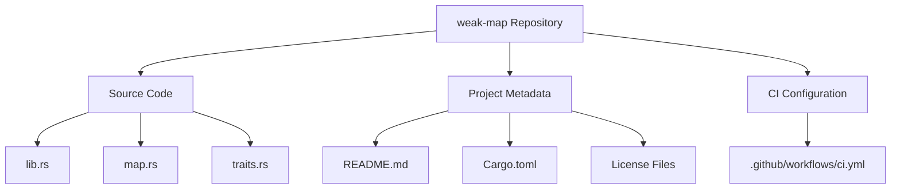
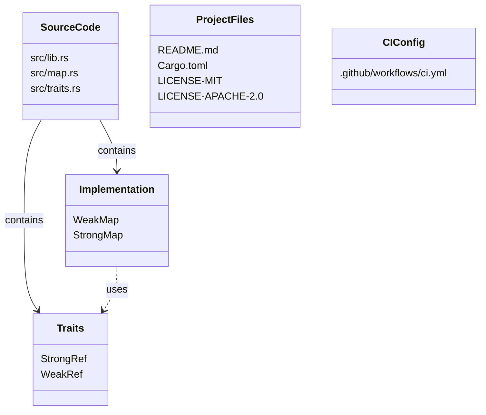
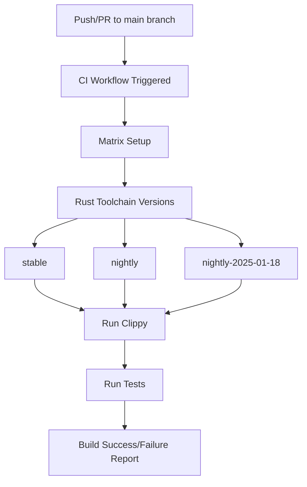
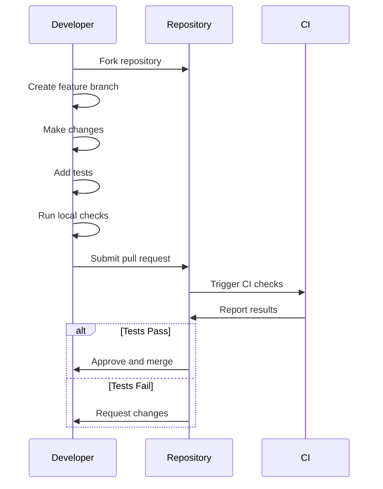
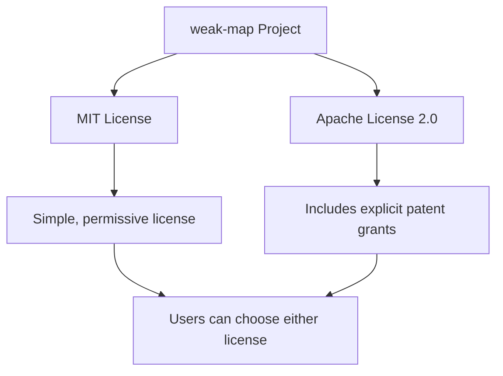
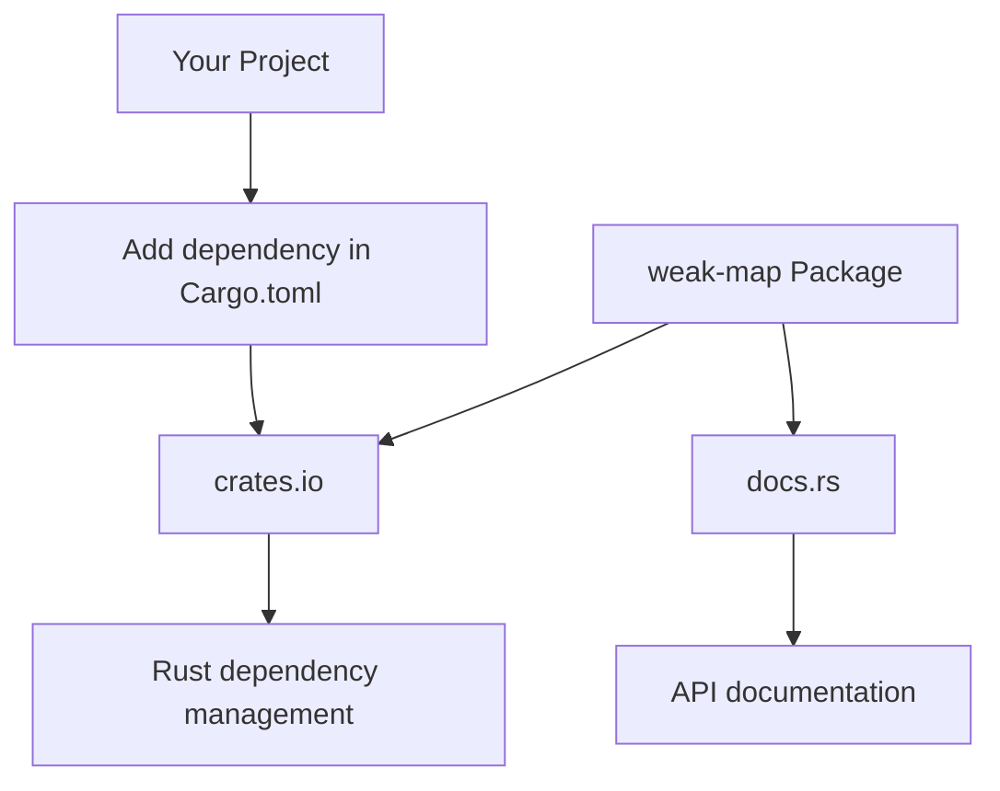

# Project Information

> **Relevant source files**
> * [.github/workflows/ci.yml](https://github.com/Starry-OS/weak-map/blob/b19a081d/.github/workflows/ci.yml)
> * [README.md](https://github.com/Starry-OS/weak-map/blob/b19a081d/README.md)

This document provides essential information about the weak-map project structure, development workflow, contribution guidelines, and licensing. For detailed technical information about the implementation, please refer to [Core Components](/Starry-OS/weak-map/2-core-components) and [Implementation Details](/Starry-OS/weak-map/4-implementation-details).

## Project Overview

The weak-map repository provides a Rust implementation of `WeakMap` - a B-Tree map data structure that stores weak references to values, automatically removing entries when referenced values are dropped. It is hosted on GitHub at [https://github.com/Starry-OS/weak-map](https://github.com/Starry-OS/weak-map) and published as a crate on crates.io.



Sources: README.md, .github/workflows/ci.yml

## Repository Structure

The weak-map project follows a standard Rust crate organization with a clean separation between the core implementations and trait definitions.



Sources: README.md

## Development Workflow

The weak-map project employs GitHub Actions for continuous integration to ensure code quality and test coverage.

### CI Process

The CI workflow runs automatically on:

* Push to the main branch
* Pull requests targeting the main branch



Sources: [.github/workflows/ci.yml(L3 - L10)&emsp;](https://github.com/Starry-OS/weak-map/blob/b19a081d/.github/workflows/ci.yml#L3-L10)

### CI Actions

The CI performs these specific checks:

1. **Clippy Linting**: Runs with all features and targets, with warnings treated as errors:

```
cargo clippy --all-features --all-targets -- -Dwarnings
```
2. **Comprehensive Testing**: Runs all tests with all features enabled:

```
cargo test --all-features
```

Sources: [.github/workflows/ci.yml(L28 - L31)&emsp;](https://github.com/Starry-OS/weak-map/blob/b19a081d/.github/workflows/ci.yml#L28-L31)

## Contributing Guidelines

Contributions to the weak-map project are welcome. Based on the repository structure and CI configuration, here are the recommended steps for contributing:

1. **Fork the repository** on GitHub
2. **Create a feature branch** for your changes
3. **Make your changes** following the code style of the project
4. **Add tests** for your changes to ensure they work correctly
5. **Run the checks locally** that will be performed by CI:
```
cargo clippy --all-features --all-targets -- -Dwarnings
cargo test --all-features
```
6. **Submit a pull request** to the main branch



Sources: [.github/workflows/ci.yml(L14 - L31)&emsp;](https://github.com/Starry-OS/weak-map/blob/b19a081d/.github/workflows/ci.yml#L14-L31)

## License Information

The weak-map project is dual-licensed under both the MIT License and the Apache License 2.0, allowing users to choose the license that best suits their needs.

### Dual License Approach



### License Usage

* **MIT License**: A permissive license that allows users to do almost anything with the code, including using it in proprietary software, as long as they provide attribution.
* **Apache License 2.0**: Also permissive, but includes explicit patent grants and more detailed terms around trademark usage.

The license files (LICENSE-MIT and LICENSE-APACHE-2.0) are included in the repository root directory, as indicated by project structure diagrams.

Sources: README.md

## Package Information

The weak-map package is published on [crates.io](https://crates.io/crates/weak-map) and documentation is available on [docs.rs](https://docs.rs/weak-map).



### Project Origins

As noted in the README, weak-map is "similar to and inspired by [weak-table](https://github.com/Starry-OS/weak-map/blob/b19a081d/weak-table) but using `BTreeMap` as underlying implementation."

Sources: [README.md(L6)&emsp;](https://github.com/Starry-OS/weak-map/blob/b19a081d/README.md#L6-L6)