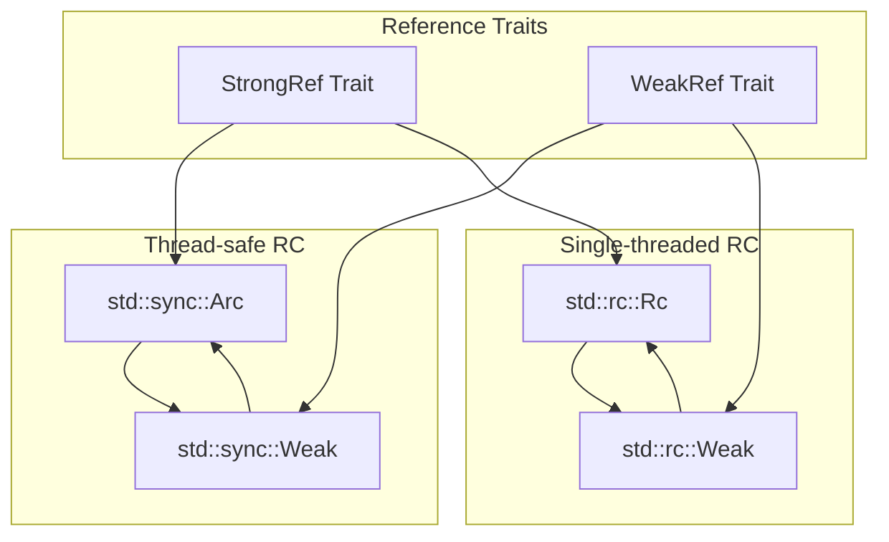
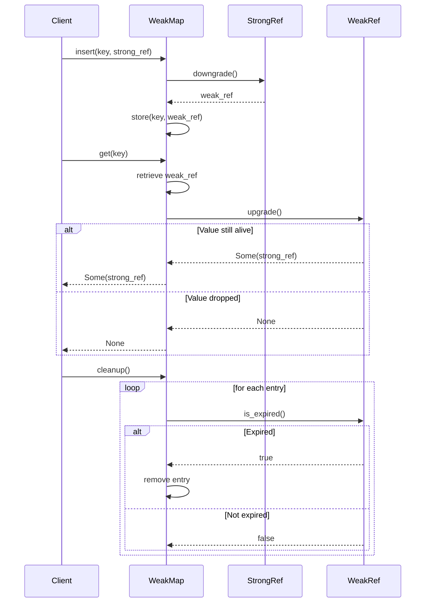
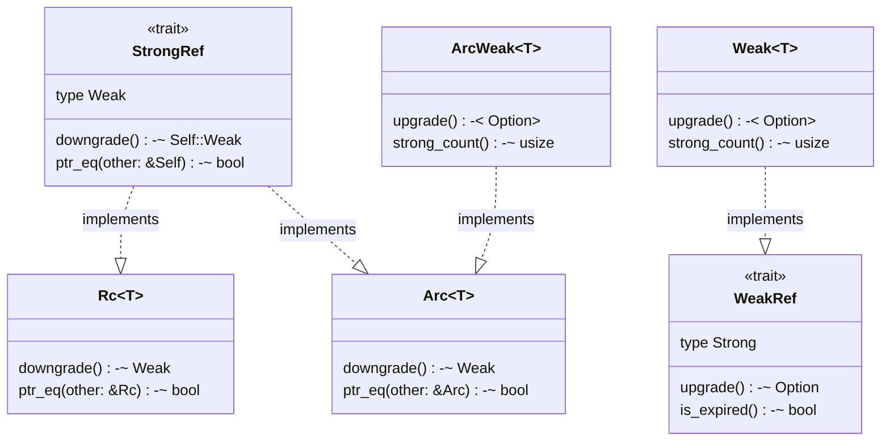

# Reference Traits

> **Relevant source files**
> * [src/lib.rs](https://github.com/Starry-OS/weak-map/blob/b19a081d/src/lib.rs)
> * [src/traits.rs](https://github.com/Starry-OS/weak-map/blob/b19a081d/src/traits.rs)

This document explains the reference trait system that forms the foundation of the weak-map library. The reference traits provide a flexible abstraction layer for working with different types of references (both strong and weak) in a generic way, enabling the core functionality of `WeakMap`. For details about the map implementations themselves, see [WeakMap and StrongMap](/Starry-OS/weak-map/2.1-weakmap-and-strongmap).

## Overview of Reference Traits

The weak-map library defines two fundamental traits that abstract over reference types:

1. `StrongRef` - Represents a strong reference that keeps a value alive
2. `WeakRef` - Represents a weak reference that doesn't prevent a value from being dropped

These traits allow the `WeakMap` to work with different types of reference-counted values without being tied to specific implementations.

```

```

Sources: [src/traits.rs(L3 - L40)&emsp;](https://github.com/Starry-OS/weak-map/blob/b19a081d/src/traits.rs#L3-L40)

## The StrongRef Trait

The `StrongRef` trait defines an interface for types that represent strong references to heap-allocated values. A strong reference keeps the referenced value alive for as long as the reference exists.

```rust
pub trait StrongRef {
    type Weak: WeakRef<Strong = Self>;
    fn downgrade(&self) -> Self::Weak;
    fn ptr_eq(&self, other: &Self) -> bool;
}
```

The trait requires:

|Member|Type|Purpose|
| --- | --- | --- |
|Weak|Associated type|Specifies the corresponding weak reference type|
|downgrade()|Method|Converts a strong reference to a weak reference|
|ptr_eq()|Method|Compares two strong references for pointer equality|

The `Weak` associated type establishes a relationship with the `WeakRef` trait, ensuring that both traits are implemented in a compatible way.

Sources: [src/traits.rs(L3 - L19)&emsp;](https://github.com/Starry-OS/weak-map/blob/b19a081d/src/traits.rs#L3-L19)

## The WeakRef Trait

The `WeakRef` trait defines an interface for types that represent weak references to heap-allocated values. A weak reference does not keep the referenced value alive; it can be used to access the value only if it's still alive due to strong references elsewhere.

```rust
pub trait WeakRef {
    type Strong: StrongRef<Weak = Self>;
    fn upgrade(&self) -> Option<Self::Strong>;
    fn is_expired(&self) -> bool {
        self.upgrade().is_none()
    }
}
```

The trait requires:

|Member|Type|Purpose|
| --- | --- | --- |
|Strong|Associated type|Specifies the corresponding strong reference type|
|upgrade()|Method|Attempts to convert a weak reference to a strong reference|
|is_expired()|Method|Checks if the weak reference is expired (has default implementation)|

The `Strong` associated type complements the `Weak` type in `StrongRef`, creating a bidirectional relationship between the two traits.

Sources: [src/traits.rs(L21 - L40)&emsp;](https://github.com/Starry-OS/weak-map/blob/b19a081d/src/traits.rs#L21-L40)

## Trait Implementations

The library provides implementations of these traits for standard Rust reference-counting types. This allows `WeakMap` to work with both single-threaded and thread-safe reference types.



Sources: [src/traits.rs(L42 - L88)&emsp;](https://github.com/Starry-OS/weak-map/blob/b19a081d/src/traits.rs#L42-L88)

### Implementation for std::rc

For single-threaded reference counting, the traits are implemented for `std::rc::Rc<T>` and `std::rc::Weak<T>`:

|Type|Trait|Implementation Details|
| --- | --- | --- |
|Rc<T>|StrongRef|UsesRc::downgradeandRc::ptr_eq|
|Weak<T>|WeakRef|UsesWeak::upgradeand customis_expiredthat checksstrong_count|

The `is_expired` implementation for `Weak<T>` optimizes the check by directly using `strong_count() == 0` instead of trying to upgrade the reference.

Sources: [src/traits.rs(L42 - L64)&emsp;](https://github.com/Starry-OS/weak-map/blob/b19a081d/src/traits.rs#L42-L64)

### Implementation for std::sync

For thread-safe reference counting, the traits are implemented for `std::sync::Arc<T>` and `std::sync::Weak<T>`:

|Type|Trait|Implementation Details|
| --- | --- | --- |
|Arc<T>|StrongRef|UsesArc::downgradeandArc::ptr_eq|
|Weak<T>|WeakRef|UsesWeak::upgradeand customis_expiredthat checksstrong_count|

Similar to the `std::rc` implementation, the `is_expired` implementation for `std::sync::Weak<T>` directly checks the strong count for efficiency.

Sources: [src/traits.rs(L66 - L88)&emsp;](https://github.com/Starry-OS/weak-map/blob/b19a081d/src/traits.rs#L66-L88)

## Reference Traits in Action

The reference traits enable `WeakMap` to work with different reference types in a generic way. Here's how these traits are used in the workflow of `WeakMap`:



The use of traits allows `WeakMap` to be generic over the specific reference type, supporting both `Rc` and `Arc` with the same implementation.

Sources: [src/traits.rs(L3 - L40)&emsp;](https://github.com/Starry-OS/weak-map/blob/b19a081d/src/traits.rs#L3-L40)

## Type Relationships

The following diagram illustrates the relationships between the trait types and concrete implementations:



This abstraction allows the `WeakMap` implementation to remain independent of the specific reference type, supporting both `Rc` for single-threaded use cases and `Arc` for multi-threaded scenarios.

Sources: [src/traits.rs(L42 - L88)&emsp;](https://github.com/Starry-OS/weak-map/blob/b19a081d/src/traits.rs#L42-L88)

## Summary

The reference traits (`StrongRef` and `WeakRef`) provide a flexible abstraction for working with different types of references in the weak-map library. By implementing these traits for standard Rust reference types (`Rc`/`Weak` and `Arc`/`Weak`), the library allows for generic handling of references while maintaining the ability to use weak references that don't prevent values from being garbage collected.

These traits are fundamental to the operation of `WeakMap`, enabling it to store weak references to values and automatically clean up entries when the referenced values are dropped.