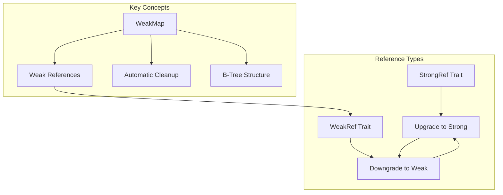
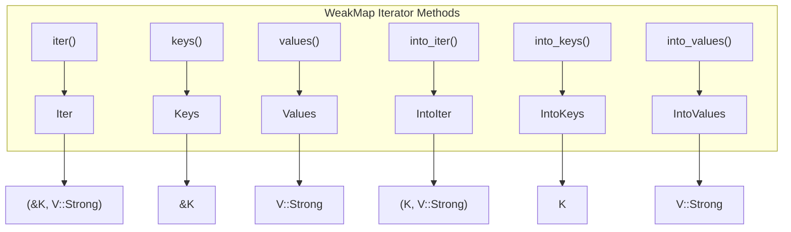
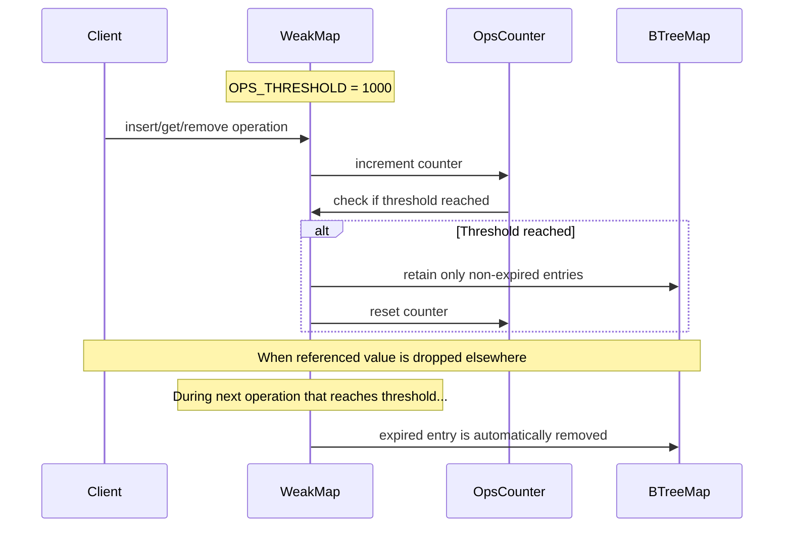

# Usage Guide

> **Relevant source files**
> * [README.md](https://github.com/Starry-OS/weak-map/blob/b19a081d/README.md)
> * [src/map.rs](https://github.com/Starry-OS/weak-map/blob/b19a081d/src/map.rs)

This guide provides comprehensive instructions on how to effectively use the weak-map library. The library offers a specialized `WeakMap` implementation - a B-Tree map that stores weak references to values, automatically removing entries when referenced values are dropped.

For detailed information about the core components, see [Core Components](/Starry-OS/weak-map/2-core-components) and for implementation details, see [Implementation Details](/Starry-OS/weak-map/4-implementation-details).

## Basic Concepts

The weak-map library centers around the `WeakMap` data structure, which combines the ordered key-value storage of a B-Tree map with automatic memory management through weak references.



**Key Benefits**:

* Prevents memory leaks in cyclic reference scenarios
* Automatically cleans up entries when referenced values are dropped
* Provides a familiar map interface with weak reference handling

Sources: [src/map.rs(L60 - L65)&emsp;](https://github.com/Starry-OS/weak-map/blob/b19a081d/src/map.rs#L60-L65) [README.md(L1 - L6)&emsp;](https://github.com/Starry-OS/weak-map/blob/b19a081d/README.md#L1-L6)

## Creating a WeakMap

There are several ways to create a `WeakMap` instance:

```

```

### Basic Creation

The simplest way to create a `WeakMap` is using the `new()` method:

```javascript
let map = WeakMap::<u32, Weak<String>>::new();
```

### From Existing Collections

You can create a `WeakMap` from various sources:

1. **From a BTreeMap**:

```javascript
let btree_map = BTreeMap::<u32, Weak<String>>::new();
let weak_map = WeakMap::from(btree_map);
```
2. **From an iterator**:

```javascript
let items = [(1, &arc_value1), (2, &arc_value2)];
let weak_map = WeakMap::from_iter(items);
```
3. **From an array**:

```javascript
let weak_map = WeakMap::from([(1, &arc_value1), (2, &arc_value2)]);
```
4. **From a StrongMap**:

```javascript
let strong_map = StrongMap::<u32, Arc<String>>::new();
let weak_map = WeakMap::from(&strong_map);
```

Sources: [src/map.rs(L68 - L77)&emsp;](https://github.com/Starry-OS/weak-map/blob/b19a081d/src/map.rs#L68-L77) [src/map.rs(L86 - L101)&emsp;](https://github.com/Starry-OS/weak-map/blob/b19a081d/src/map.rs#L86-L101) [src/map.rs(L341 - L380)&emsp;](https://github.com/Starry-OS/weak-map/blob/b19a081d/src/map.rs#L341-L380)

## Basic Operations

`WeakMap` provides standard map operations with weak reference handling:

### Inserting Elements

To insert elements into a `WeakMap`, use the `insert` method:

```javascript
use std::sync::{Arc, Weak};
let mut map = WeakMap::<u32, Weak<String>>::new();

// Create a strong reference
let value = Arc::new(String::from("example"));

// Insert into map (automatically creates weak reference)
map.insert(1, &value);
```

Note that `insert` takes a strong reference (`&V::Strong`) but stores it as a weak reference internally.

### Retrieving Elements

To get an element from the map:

```javascript
// Returns Option<Arc<String>> (or None if expired or not found)
if let Some(strong_ref) = map.get(&1) {
    println!("Value: {}", strong_ref);
}
```

The `get` method returns:

* `Some(value)` if the key exists and the weak reference can be upgraded
* `None` if the key doesn't exist or the reference has expired

### Removing Elements

To remove elements:

```javascript
// Remove and return the value if it exists and hasn't expired
let removed_value = map.remove(&1);

// Remove and return both key and value
let removed_entry = map.remove_entry(&1);
```

Sources: [src/map.rs(L203 - L293)&emsp;](https://github.com/Starry-OS/weak-map/blob/b19a081d/src/map.rs#L203-L293)

## Working with WeakMap Iterators

`WeakMap` provides various iterators that automatically filter out expired references:



### Non-consuming Iterators

```
// Iterate over key-value pairs
for (key, value) in map.iter() {
    // value is a strong reference (expired references are skipped)
}

// Iterate over keys only
for key in map.keys() {
    // ...
}

// Iterate over values only
for value in map.values() {
    // value is a strong reference
}
```

### Consuming Iterators

```
// Convert map into iterator and consume it
for (key, value) in map.into_iter() {
    // value is a strong reference
}

// Or just get keys
for key in map.into_keys() {
    // ...
}

// Or just get values
for value in map.into_values() {
    // value is a strong reference
}
```

Sources: [src/map.rs(L118 - L149)&emsp;](https://github.com/Starry-OS/weak-map/blob/b19a081d/src/map.rs#L118-L149) [src/map.rs(L382 - L622)&emsp;](https://github.com/Starry-OS/weak-map/blob/b19a081d/src/map.rs#L382-L622)

## Checking Map State

`WeakMap` provides methods to check its state:

```javascript
// Number of valid entries (excludes expired references)
let valid_count = map.len();

// Total number of entries (including expired references)
let total_count = map.raw_len();

// Check if map is empty (contains no valid entries)
let is_empty = map.is_empty();

// Check if map contains a specific key
let has_key = map.contains_key(&1);
```

Note that `len()` is an O(n) operation as it needs to check if each reference is valid.

Sources: [src/map.rs(L112 - L185)&emsp;](https://github.com/Starry-OS/weak-map/blob/b19a081d/src/map.rs#L112-L185) [src/map.rs(L235 - L246)&emsp;](https://github.com/Starry-OS/weak-map/blob/b19a081d/src/map.rs#L235-L246)

## Converting Between Map Types

You can convert between `WeakMap` and `StrongMap`:

```javascript
// Convert WeakMap to StrongMap (includes only valid references)
let strong_map: StrongMap<K, V::Strong> = weak_map.upgrade();

// Convert StrongMap to WeakMap
let weak_map = WeakMap::from(&strong_map);

// Convert WeakMap to standard BTreeMap
let btree_map: BTreeMap<K, V> = weak_map.into();

// Convert BTreeMap to WeakMap
let weak_map = WeakMap::from(btree_map);
```

Sources: [src/map.rs(L86 - L101)&emsp;](https://github.com/Starry-OS/weak-map/blob/b19a081d/src/map.rs#L86-L101) [src/map.rs(L296 - L306)&emsp;](https://github.com/Starry-OS/weak-map/blob/b19a081d/src/map.rs#L296-L306) [src/map.rs(L368 - L380)&emsp;](https://github.com/Starry-OS/weak-map/blob/b19a081d/src/map.rs#L368-L380)

## Understanding Automatic Cleanup

The `WeakMap` implements an automatic cleanup mechanism to remove expired weak references:



The cleanup process works as follows:

1. Each operation (get, insert, remove) increments an internal operations counter
2. When the operations counter reaches `OPS_THRESHOLD` (1000), cleanup is triggered
3. During cleanup, all expired references are removed from the map
4. The operations counter is reset to zero

This amortizes the cost of cleanup across operations, preventing performance spikes.

Sources: [src/map.rs(L14 - L48)&emsp;](https://github.com/Starry-OS/weak-map/blob/b19a081d/src/map.rs#L14-L48) [src/map.rs(L158 - L169)&emsp;](https://github.com/Starry-OS/weak-map/blob/b19a081d/src/map.rs#L158-L169)

## Practical Example

Here's a complete example demonstrating typical `WeakMap` usage:

```javascript
use std::sync::{Arc, Weak};
use weak_map::WeakMap;

// Create a new WeakMap
let mut map = WeakMap::<String, Weak<i32>>::new();

// Create some values with separate lifetimes
let value1 = Arc::new(42);
let value2 = Arc::new(100);

// Insert values (automatically creates weak references)
map.insert("first".to_string(), &value1);
map.insert("second".to_string(), &value2);

// Verify both values are accessible
assert_eq!(map.get(&"first".to_string()), Some(value1.clone()));
assert_eq!(map.get(&"second".to_string()), Some(value2.clone()));
assert_eq!(map.len(), 2);

// Drop one of the strong references
drop(value2);

// The weak reference is now expired
assert_eq!(map.get(&"second".to_string()), None);
assert_eq!(map.len(), 1); // Only one valid entry remains

// After enough operations, expired entries are automatically removed
// (This happens after OPS_THRESHOLD operations)
```

This example demonstrates how entries are automatically managed based on the lifecycle of the referenced values.

Sources: [src/map.rs(L625 - L646)&emsp;](https://github.com/Starry-OS/weak-map/blob/b19a081d/src/map.rs#L625-L646)

## Performance Considerations

When using `WeakMap`, keep these performance aspects in mind:

1. **Cleanup Frequency**: Cleanup occurs after every 1000 operations (`OPS_THRESHOLD`), which balances overhead with memory efficiency
2. **Length Operations**: The `len()` method is O(n) since it must check each reference's validity, while `raw_len()` is O(1)
3. **Iterator Performance**: All iterators filter out expired references, so iteration complexity is affected by the number of expired items
4. **Memory Usage**: `WeakMap` maintains weak references which don't prevent garbage collection of unused values, but the map entries themselves remain until cleanup

These characteristics make `WeakMap` particularly suitable for caching scenarios where you want to avoid memory leaks.

Sources: [src/map.rs(L14 - L16)&emsp;](https://github.com/Starry-OS/weak-map/blob/b19a081d/src/map.rs#L14-L16) [src/map.rs(L158 - L169)&emsp;](https://github.com/Starry-OS/weak-map/blob/b19a081d/src/map.rs#L158-L169) [src/map.rs(L171 - L179)&emsp;](https://github.com/Starry-OS/weak-map/blob/b19a081d/src/map.rs#L171-L179)

## When to Use WeakMap

`WeakMap` is especially useful in these scenarios:

1. **Caching Systems**: When you need to cache values but don't want to prevent them from being garbage collected when no longer needed elsewhere
2. **Observer Patterns**: When tracking objects that may be destroyed independently from the tracking system
3. **Breaking Reference Cycles**: When you need to break reference cycles that could cause memory leaks
4. **Resource Management**: When associating metadata with resources without extending their lifetime

If you don't need weak reference semantics, consider using `StrongMap` (which is just an alias for `BTreeMap`) for better performance.

Sources: [src/map.rs(L57 - L65)&emsp;](https://github.com/Starry-OS/weak-map/blob/b19a081d/src/map.rs#L57-L65)

## Summary

The weak-map library provides an elegant solution for scenarios requiring weak references with map semantics. The `WeakMap` implementation automatically handles reference lifecycle management while providing a familiar map interface.

Key takeaways:

* Use `WeakMap` when you need map functionality with weak reference semantics
* Weak references are automatically upgraded when accessed and expired entries are cleaned up periodically
* The API closely mirrors standard map interfaces but handles weak reference conversion internally
* Performance considerations include automatic cleanup and O(n) `len()` operation

For more advanced usage patterns, see [Advanced Usage Patterns](/Starry-OS/weak-map/3.2-advanced-usage-patterns).