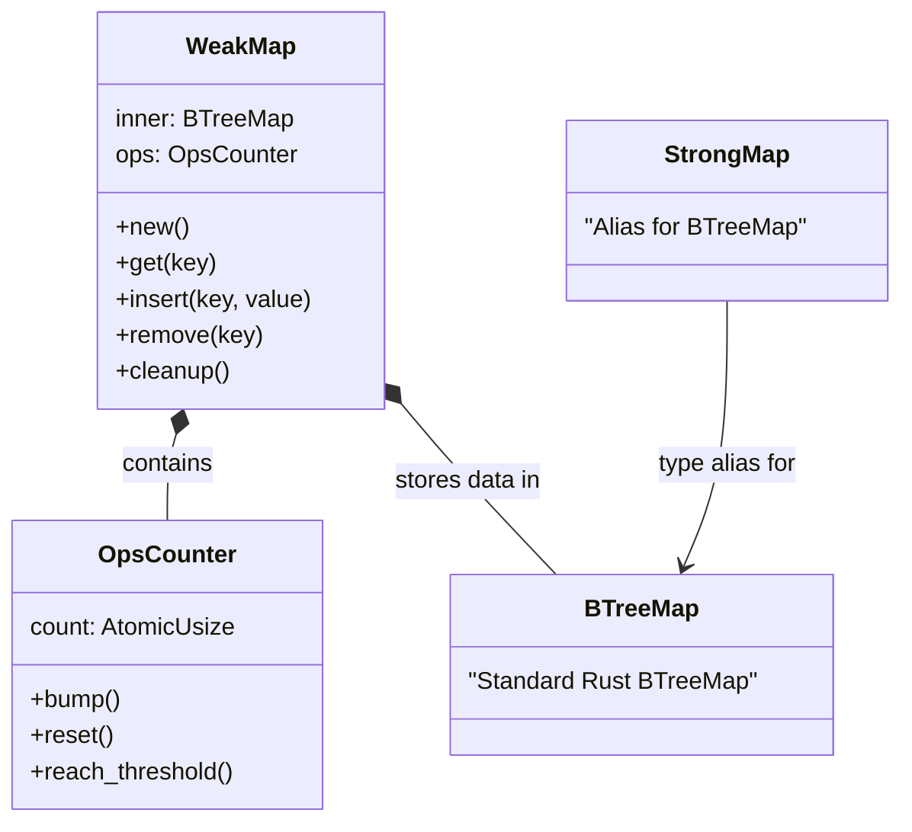
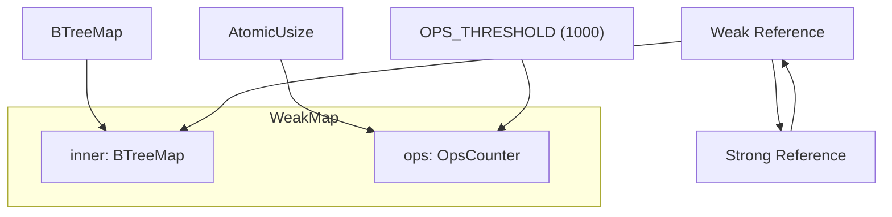
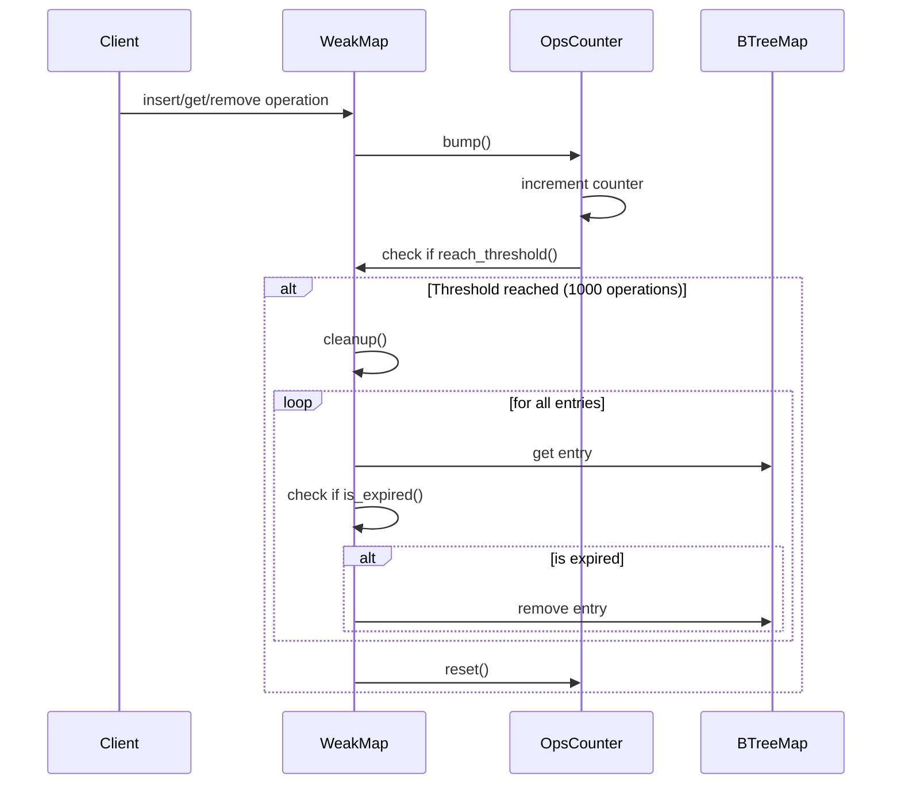
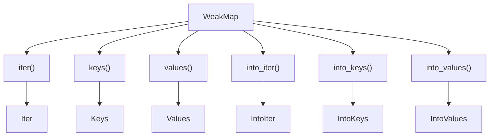
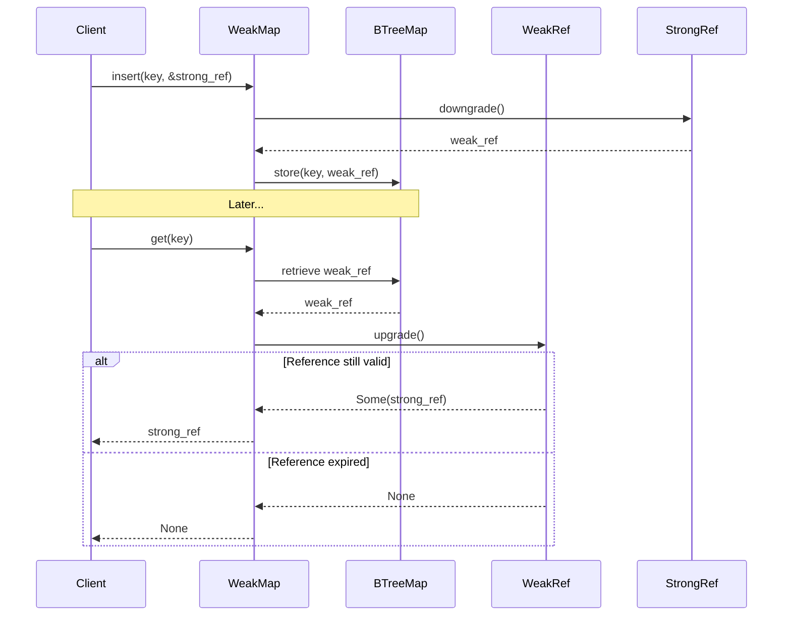

# WeakMap and StrongMap

> **Relevant source files**
> * [src/lib.rs](https://github.com/Starry-OS/weak-map/blob/b19a081d/src/lib.rs)
> * [src/map.rs](https://github.com/Starry-OS/weak-map/blob/b19a081d/src/map.rs)

This document provides a detailed explanation of the `WeakMap` and `StrongMap` data structures, their implementation, and usage within the weak-map library. These structures are core components that enable efficient memory management through the use of weak references. For information about the reference traits that power these structures, see [Reference Traits](/Starry-OS/weak-map/2.2-reference-traits).

## Overview

`WeakMap` is a specialized B-Tree map that stores weak references to values, automatically removing entries when the referenced values are dropped. `StrongMap` is a simpler alias for the standard `BTreeMap` structure. Together, they provide comprehensive solutions for storing mappings with different reference semantics.



Sources: [src/map.rs(L57 - L65)&emsp;](https://github.com/Starry-OS/weak-map/blob/b19a081d/src/map.rs#L57-L65) [src/lib.rs(L9 - L10)&emsp;](https://github.com/Starry-OS/weak-map/blob/b19a081d/src/lib.rs#L9-L10)

## Internal Structure

### WeakMap

`WeakMap<K, V>` is implemented as a wrapper around a `BTreeMap<K, V>` with an additional `OpsCounter` to track operations for cleanup purposes.



Sources: [src/map.rs(L62 - L65)&emsp;](https://github.com/Starry-OS/weak-map/blob/b19a081d/src/map.rs#L62-L65) [src/map.rs(L13 - L16)&emsp;](https://github.com/Starry-OS/weak-map/blob/b19a081d/src/map.rs#L13-L16)

The key features of `WeakMap`:

1. **Inner Storage**: Uses a standard `BTreeMap` to store key-value pairs
2. **Operations Counter**: Tracks the number of operations to trigger periodic cleanup
3. **Weak References**: Values are stored as weak references, allowing them to be automatically collected when no strong references remain
4. **Cleanup Mechanism**: Periodically removes expired weak references after `OPS_THRESHOLD` operations

### StrongMap

`StrongMap` is a simple type alias for the standard Rust `BTreeMap`:

```
pub type StrongMap<K, V> = btree_map::BTreeMap<K, V>;
```

It provides a counterpart to `WeakMap` for cases where strong references are needed.

Sources: [src/map.rs(L57 - L58)&emsp;](https://github.com/Starry-OS/weak-map/blob/b19a081d/src/map.rs#L57-L58)

## Operations Counter

The `OpsCounter` structure manages automatic cleanup of expired references:



Sources: [src/map.rs(L13 - L48)&emsp;](https://github.com/Starry-OS/weak-map/blob/b19a081d/src/map.rs#L13-L48) [src/map.rs(L152 - L169)&emsp;](https://github.com/Starry-OS/weak-map/blob/b19a081d/src/map.rs#L152-L169)

The cleanup mechanism has these characteristics:

* Operations are counted using an atomic counter
* After `OPS_THRESHOLD` (1000) operations, cleanup is triggered
* During cleanup, all expired weak references are removed
* The operations counter is reset after cleanup

## Core API

### Creation and Basic Operations

`WeakMap` provides the following core methods:

|Method|Description|Source|
| --- | --- | --- |
|new()|Creates a new, emptyWeakMap|src/map.rs72-77|
|insert(key, value)|Inserts a key-value pair, storing a weak reference to the value|src/map.rs258-263|
|get(key)|Returns the value corresponding to the key, if it exists and hasn't been dropped|src/map.rs207-214|
|remove(key)|Removes a key from the map, returning the value if present|src/map.rs270-277|
|clear()|Removes all entries from the map|src/map.rs106-109|
|len()|Returns the number of valid (non-expired) elements|src/map.rs177-179|
|raw_len()|Returns the total number of elements, including expired references|src/map.rs113-115|

Sources: [src/map.rs(L103 - L307)&emsp;](https://github.com/Starry-OS/weak-map/blob/b19a081d/src/map.rs#L103-L307)

### Iteration

`WeakMap` provides various iterators, all of which automatically filter out expired references:



Sources: [src/map.rs(L119 - L149)&emsp;](https://github.com/Starry-OS/weak-map/blob/b19a081d/src/map.rs#L119-L149) [src/map.rs(L382 - L623)&emsp;](https://github.com/Starry-OS/weak-map/blob/b19a081d/src/map.rs#L382-L623)

Key aspects of iterators:

* All iterators automatically filter out expired weak references
* Both borrowing and consuming iterators are provided
* Iterators for keys, values, and key-value pairs

## Weak Reference Management

The core functionality of `WeakMap` revolves around its handling of weak references:



Sources: [src/map.rs(L207 - L214)&emsp;](https://github.com/Starry-OS/weak-map/blob/b19a081d/src/map.rs#L207-L214) [src/map.rs(L258 - L263)&emsp;](https://github.com/Starry-OS/weak-map/blob/b19a081d/src/map.rs#L258-L263)

When the original strong reference is dropped (when no more strong references exist):

1. The weak reference in the map becomes expired
2. Future calls to `get()` will return `None`
3. The entry will be removed during the next cleanup cycle

## Conversion Operations

`WeakMap` provides several conversion methods and implementations:

|From|To|Method/Trait|
| --- | --- | --- |
|BTreeMap<K, V>|WeakMap<K, V>|Fromtrait|
|WeakMap<K, V>|BTreeMap<K, V>|Fromtrait|
|WeakMap<K, V>|StrongMap<K, V::Strong>|upgrade()|
|&StrongMap<K, V::Strong>|WeakMap<K, V>|Fromtrait|
|Iterator of(K, &V::Strong)|WeakMap<K, V>|FromIteratortrait|
|Array[(K, &V::Strong); N]|WeakMap<K, V>|Fromtrait|

Sources: [src/map.rs(L86 - L101)&emsp;](https://github.com/Starry-OS/weak-map/blob/b19a081d/src/map.rs#L86-L101) [src/map.rs(L296 - L307)&emsp;](https://github.com/Starry-OS/weak-map/blob/b19a081d/src/map.rs#L296-L307) [src/map.rs(L341 - L380)&emsp;](https://github.com/Starry-OS/weak-map/blob/b19a081d/src/map.rs#L341-L380)

## Example Use Cases

1. **Cache with Automatic Cleanup**:

* Store computation results keyed by input parameters
* Results are automatically removed when no longer referenced elsewhere
2. **Observer Pattern**:

* Track observers without preventing them from being garbage collected
* Automatically clean up references to observers that have been dropped
3. **Resource Pooling**:

* Maintain a pool of resources without keeping them alive indefinitely
* Resources are automatically removed from the pool when no longer in use

## Memory Management Considerations

1. **Memory Leaks**: `WeakMap` helps prevent memory leaks by not keeping values alive when they're no longer needed elsewhere
2. **Cleanup Overhead**: The periodic cleanup process introduces some overhead, but it's amortized over many operations
3. **Reference Counting Overhead**: Using weak references incurs the overhead of reference counting, which is generally acceptable for most applications

Sources: [src/map.rs(L152 - L169)&emsp;](https://github.com/Starry-OS/weak-map/blob/b19a081d/src/map.rs#L152-L169) [src/map.rs(L625 - L660)&emsp;](https://github.com/Starry-OS/weak-map/blob/b19a081d/src/map.rs#L625-L660)

## Performance Characteristics

For more detailed information about performance considerations, see [Performance Considerations](/Starry-OS/weak-map/4.2-performance-considerations).

|Operation|Time Complexity|Notes|
| --- | --- | --- |
|insert()|O(log n)|Plus potential O(n) cleanup once perOPS_THRESHOLDoperations|
|get()|O(log n)||
|remove()|O(log n)||
|len()|O(n)|Linear as it needs to check each entry for expiration|
|raw_len()|O(1)||
|cleanup()|O(n)||

Sources: [src/map.rs(L176 - L179)&emsp;](https://github.com/Starry-OS/weak-map/blob/b19a081d/src/map.rs#L176-L179) [src/map.rs(L158 - L161)&emsp;](https://github.com/Starry-OS/weak-map/blob/b19a081d/src/map.rs#L158-L161)